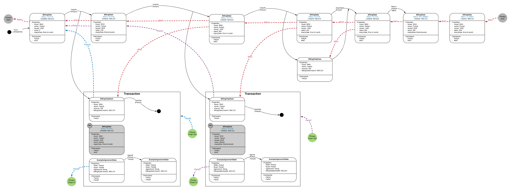
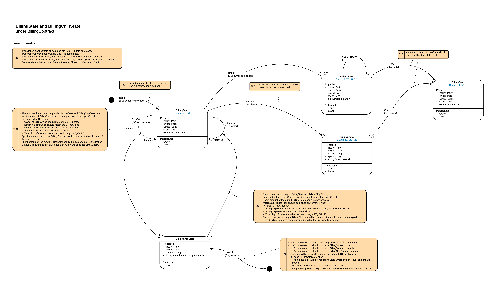

Billing Service
===============

*Contents of this article assume reader's familiarity with the concepts of *Business Networks*. Please see [Corda Solutions website](https://solutions.corda.net/business-networks/intro.html) for more information.*

*Billing Service requires Corda 4 as a minimum version, as it heavily relies on the Reference States.*

Billing Service can be used for billing and metering on Business Networks. Billing Service has a notion of *Billing Chips* that can be included into Corda transactions that participants need to pay for. *Billing Chips* never cross a single transaction boundaries and hence never cause privacy leaks. All *Billing Chips* are attached to their respective *Billing States*, that accumulate the total *spent* amount and can be safely reported back to the BNO without leaking the transaction history where the *Billing Chips* have been involved into. *Billing States Evolution* is depicted on the diagram below:

 

*Please see [Corda Modelling Notation](https://solutions.corda.net/corda-modelling-notation/overview/overview-overview.html) for more information about modeling for Corda.* 

Billing workflow consists of the following steps:
1. The BNO issues *Billing States* to their Business Network members. The BNO can either pre-allocate an amount that a member can spent (bounded state), or leave it empty which would effectively allow a member to spent an unlimited number of *Billing Chips* (unbounded state, can be used for transaction metering). *Billing States* might have an *expiry date*, after which the states become unusable.
2. A member unilaterally (the BNO's signature is not required) *chips offs* one or multiple *Billing Chips* from their *Billing State*. Chipping off increments the *spent* amount of the associated *Billing State*. 
3. A member includes *Billing Chips* as inputs to the transactions that they need to pay for. Paid-for transactions never contain *Billing States* as an inputs and hence *Billing States* don't carry any private transaction history. However, valid *Billing States* must be included as *reference inputs* to guarantee that expired, revoked or returned states can not be used (explained in the further steps). *Developers must have a logic in their contracts code that verifies that each of the required participants had included enough of the Billing Chips*.  
4. In the end of the billing period the BNO requests the members to return their *Billing States*. The members attach back all *unspent Billing Chips* to their *Billing States*, which decrements the *spent* amount. After that, the members *return Billing States* to the BNO. Returned *Billing States* and their *Billing Chips* can not be used to pay for transactions anymore.  
5. The BNO bills the members based on the reported *spent* amounts. After all obligations are settled, the BNO unilaterally *closes* all returned states. *Billing Service doesn't solve the settlement problem - explained below.*
6. The BNO can also unilaterally (a member's signature is not required) *revoke Billing States* as a result of a governance action. Revoked *Billing States* and their *Billing Chips* can not be used to pay for transactions anymore.

*Billing State Machine* is depicted on the diagram below:



What Billing Service is **not**:
* Billing Service is not a tokens framework. The service was designed to solve billing and metering problems in particular and is not intended to be used beyond these areas. Consider using [Corda Tokens SDK](https://github.com/corda/token-sdk) as a general tokens framework. 
* Billing Service doesn't solve teh settlement problem. Consider using [Corda Settler](https://github.com/corda/corda-settler) for settlement of obligations.

# How It Works

## DataModel

The data model is represented with `BillingState`, `BillingChipState` and `BillingContract` [classes](https://github.com/corda/corda-solutions/blob/billing-service-implementation/bn-apps/billing/billing-contracts-and-states/src/main/kotlin/com/r3/businessnetworks/billing/states/BillingContract.kt).

`BillingContract` governs the evolution of both of the states. It supports the following commands:
* `Issue` - to issue a `BillingState`.
* `Return` - to return a `BillingState` in the end of the billing period.
* `Revoke` - to revoke a `BillingState` as a result of a governance action.
* `Close` - to close a `BillingState` when obligations are settled.
* `ChipOff` - to chip off `BillingChipState` from a `BillingState`.
* `AttachBack` - to attach back *unspent* `BillingChipStates` to their `BillingState`.
* `UseChip` - to use `BillingChipState` inside a business transaction.
 
`BillingState` can exist in one of the following statuses:
`ACTIVE` - states that can be used to pay for transactions
`RETURNED` - states that are returned to BNO in the end of billing period. Can not be used to pay for transactions.
`REVOKED` - states that have been revoked by BNO as a result of a governance action. Can not be used to pay for transactions.
`CLOSED` - states that have been revoked by BNO as a result of a governance action. Can not be used to pay for transactions.

All `BillingChipStates` are linked to their `BillingStates` via linear ids.

## Billing State Issuance

A `BillingState` can be issued via `IssueBillingStateFlow`. The flow should be called by BNO.

```kotlin
class IssueBillingStateFlow(
    private val owner : Party, // the party to issue the BillingState to
    private val amount : Long, // Max amount of Billing Chips that can be chipped off (for bounded states). Set to 0L for unbounded spending.
    private val expiryDate : Instant? = null // Billing State expiry date. All transactions that involve Billing States with expiry dates set must include Time Window. 
)
```

After the flow is executed `BillinSgtate` will be stored in the vaults of BNO and the state owner. 

## Chipping Off

As was mentioned before, `BillingState` itself should not be included as input into any paid-for transactions. Instead, `BillingState` owners are meant to chip off `BillingChipStates`, which then can can be included into the actual business transactions.

`BillingChipState` can be chipped off via `ChipOffBillingStateFlow`. The flow should be invoked by members. Chipping off doesn't require BNO's signature.  

```kotlin
class ChipOffBillingStateFlow(private val billingState : StateAndRef<BillingState>, // reference to the Billing State to chip off from
                              private val chipAmount : Long, // actual amount of the Billing Chips. ChipOffBillingStateFlow can chip off multiple BillingStateChips in one go. All Billing Chips 
                                                            // will be of the same amount.
                              private val numberOfChips : Int = 1, // number of BillingChipState to chip off. The total chip-off amount will be equal to numberOfChips * chipOffAmount
                              private val timeTolerance : Duration = TIME_TOLERANCE // time tolerance for the transaction Time window. Used if the billingState has an expiry date
                              ) 
```

## Using Chips

`MemberDatabaseService` is a convenience `@CordaService` that helps to query `BillingChipsStates` from the vault:

```kotlin
class MemberDatabaseService {
    // returns BillingState by its linear id
    fun getBillingStateByLinearId(linearId : UniqueIdentifier) : StateAndRef<BillingState>?
    // returns all ACTIVE BillingStates for the issuer 
    fun getBillingStatesByIssuer(issuer : Party) : List<StateAndRef<BillingState>>
    // returns all unspent Billing Chips for the Billing State  
    fun getChipsByBillingState(billingStateLinearId : UniqueIdentifier) : List<StateAndRef<BillingChipState>>
    // returns all unspent Billing Chips for the issuer 
    fun getChipsByIssuer(issuer : Party) : List<StateAndRef<BillingChipState>> 
}
```

When including `BillingChipStates` to business transactions, make sure that:
1. Your contract contains verification logic to check that each participant has included enough of Billing Chips as transaction inputs.
2. Each participant has added `BillingChipStates` as inputs when building transaction.
3. There is a `BillingStates` added as a reference input for each `BillingChipState`.  
4. There is a `UseChip` command for each of the paying participant.

## Returning BillingState

In the end of the billing period, BNO should request members to return their `BillingStates` via `RequestReturnOfBillingStateFlow`:

```kotlin
class RequestReturnOfBillingStateFlow(
    private val billingState : StateAndRef<BillingState> // BillingState to request return of
    )

```

To request a party to return all of their `BillingStates` use `RequestReturnOfBillingStateForPartyFlow`:

```kotlin
class RequestReturnOfBillingStateForPartyFlow(
    private val party : Party // party that is required to return their BillingStates
    )
```

When returning the states, each member would automatically attach all of *unused* `BillingChipStates` back to the `BillingStates`.

## Revoking BillingState

To revoke a `BillingState` as a result of governance action, BNOs can use `RevokeBillingStateFlow`. Revocation doesn't require member's signature.

```kotlin
class RevokeBillingStateFlow(
    private val billingState : StateAndRef<BillingState> // BillingState to revoke
    )
```

To revoke all `BillingStates` for a party use `RevokeBillingStatesForPartyFlow`.

```kotlin
class RevokeBillingStatesForPartyFlow(
    val party : Party // party to revoke the states of
    )
```

## Closing BillingState

After `BillingState` obligations are settled, the `BillingState` can be closed via `CloseBillingStateFlow`.

```kotlin
class CloseBillingStateFlow(
    private val billingState : StateAndRef<BillingState> // BillingState to close
    )
```

