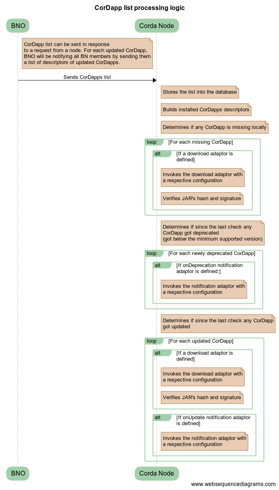

# CorDapp distribution service

DOCUMENT MANAGEMENT
---

## Document Control

| Title                | Ledger Synchronisation Service                            |
| -------------------- | ------------------------------------------------------------ |
| Date                 | 18 June 2018                                                |
| Author               | Ivan Schasny |
| Distribution         | Design Review Board, Product Management, Solutions Engineering, Platform Delivery |
| Corda target version | OS                                                   |

## HIGH LEVEL DESIGN

### Glossary

* *SE* - Solutions Engineer
* *BN* - Business Network
* *BNO* - Business Network Operator. A well-known party on the network.
* *CDS* - CorDapp Distribution Service
* *CZ* - Compatibility Zone

### Overview

This proposal describes the architecture of a reference implementation for the CorDapp Distribution Service.

### Background

Decentralised platforms have introduced some operational challenges, one of which is a coordinated distribution and installation of software updates. Deploying an update to the whole BN simultaneously might be not feasible, unless all the nodes in this BN can be shut down in the same to perform an upgrade. Such *maintenance windows* would not work in the case when a single node is involved into multiple BNs, with unrelated governance structures. This design introduces a concept of CorDapp Distribution Service which aims to tackle these issues.

### Scope

Design a reference implementation of CorDapp, that would allow Business Network Operator to distribute CorDapp updates to the members of their Business Network.

In-scope:
* Distribution of CorDapp updates to the Business Network
* Revocation of CorDapps from the Business Network

Out of scope:
* CZ on-boarding. This design document assumes that a user already has a valid CZ certificate.
* Initial node setup. CorDapps to on-board to a BN, such as [Business Network Membership Service](https://github.com/corda/corda-solutions/blob/master/bn-apps/memberships-management/design/design.md) and CorDapp Distribution Service, will have to be distributed in some other way.
* Installation of updates. To install an update, a node needs to be switched into the *flows draining mode* and then restarted. Both of the operations would require a human intervention and can't be automated at the moment.
* Distribution of the platform updates. It will be a responsibility of *node administrators* to make sure that their version of Corda is above the `minimumPlatformVersion` from the [Network Parameters](https://docs.corda.net/network-map.html#network-parameters).

### Timeline

* Projects, which go live on Corda in 2018 are asking to have a reference implementation available *asap*.
* This solution will evolve over time. We need to get more feedback about usage patterns which might result in future design changes.  

### Requirements

* BNO should be able to distribute CorDapp to the BN members
* BNO should be able to deprecate CorDapp from the BN
* BNO should be able to promptly notify BN members about a CorDapp deprecation  / update availability

### Assumptions

* The user has a valid CZ certificate
* The user has been on-boarded to the Business Network via the [Business Network Membership Service](https://github.com/corda/corda-solutions/blob/master/bn-apps/memberships-management/design/design.md)

### Target solution

The proposal is to implement CorDapp distribution service at the CorDapp level, for the following reasons:
* Ease of  integration with other BN services, such as [Business Network Membership Service](https://github.com/corda/corda-solutions/blob/master/bn-apps/memberships-management/design/design.md), [Ledger Synchronisation Service](https://github.com/corda/corda-solutions/blob/master/bn-apps/ledger-sync/design/design.md)
* Ability of BNs to tweak the implementation for their needs
* This approach would also ease an installation and integration of the BNO applications into the existing enterprise infrastructures, as it would require less integration points with not-flow based internal systems.

Why not to perform distribution on CZ level, via some centralised solution like Network Map or Doorman? Simply because some Business Networks might be uncomfortable with sharing their proprietary code with third party services.

#### CorDapps list

On start, each node will be pulling down a list of CorDapps which it **must** have installed to be able to transact on the BN. This list will be distributed by BNO via Corda flows. BNO will be notifying each member about any update to it. The proposed data structure:

```
{
  "cordapps" : [
    {
      "vendor" : "com.accenture",
      "name" : "accenture-states",
      "currentVersion" : "1.2",
      "minimumVersion" : "0.9",
      "hash" : "aldsdjfsjdfjksdf",
      "vendorCertificate" : "blahblahblah",
      "distribution" : { // specifies the way, how the CorDapp is distributed.
        "type" : "flows" // for example this application can be downloaded via Corda flows, which are provided with the CDS implementation
      }
    },
    {
      "vendor" : "com.accenture",
      "name" : "accenture-flows",
      "currentVersion" : "1.3",
      "minimumVersion" : "1.0",
      "hash" : "jfbasvdbascdbvac",
      "vendorCertificate" : "blahblahblah",
      "distribution" : {
        "type" : "web", // this CorDapp can be downloaded via HTTP
        "url" : "http://my-super-cdn"
      }
    },
    ...
  ]  
}
```

CorDapp descriptor contains some generic information about a CorDapp, such as its `vendor`, `name`, `currentVersion`, `minimumVersion`, the `hash` of the jar file as well as the `vendorCertificate`, which the CorDapp jar can be validated with. `MinimumVersion` defines the minimum supported version of the CorDapp on this Business Network. `MinimumVersion` can be bumped by the BNO if a critical vulnerability has been discovered or if a new version of the CorDapp is not backward compatible.

Each CorDapp definition can be associated with a *distribution mechanism*. *Distribution mechanism* defines how a CorDapp **can** be downloaded, however it wouldn't enforce a node to perform any particular **action**. *Node administrators* will be able to specify what to do in a response to a new update availability or a minimum version bump. For example this could be such things as to send an email or to raise a warning on the monitoring system or to download a CorDapp into a local folder and etc. This configuration will be done on a *node level* (described in the further sections), as it might vary from a node to node even within a single BN. It will be up to *node administrators* to configure their CDS CorDapps and to find the right balance between automation and their internal security policies. More about automations is described in the further sections.

BNO will not able to enforce a node to install updates. *Node administrators* should consider updating their CorDapps if a newer version is available and **must** update CorDapps if their version gets below the `minimumVersion`. Prompt installation can be achieved by utilising *download adaptors* and *update callbacks*, which are described in the further sections.

CorDapps should be designed to be backward compatible. Corda provides mechanisms for [flow versioning](https://docs.corda.net/head/upgrading-cordapps.html#flow-versioning), [contract and state upgrades](https://docs.corda.net/head/upgrading-cordapps.html#contract-and-state-versioning), [states evolution](https://docs.corda.net/head/serialization-default-evolution.html) and [contract constraints](https://docs.corda.net/head/api-contract-constraints.html) at the platform level out-of-the-box.

#### Distribution mechanisms

*Distribution mechanisms* are defined by BNOs and should be matched 1-to-1 with the *download adaptors* on a node's side (described in the further sections) for automatic downloading of CorDapp updates. Implementations of *download adaptors* should be provided by the BNO with their CDS implementation. *Distribution mechanisms* will be pluggable and extensible. Each CorDapp can be associated with its own *distribution mechanism*, such as *Corda flows*, *http*, *ftp* and etc. BNOs will be able to define their own *distribution mechanisms* if they are missing from the standard implementation. *Distribution mechanisms* are uniquely defined by a *name* and might also have a custom configuration parameters, such as *download url*, *authentication parameters* and others.

To distribute a new CorDapp update, BNO will need to:
* manually prepare and put the jar to a *distribution location*, i.e. copy to some folder on their filesystem, upload to a CDN and etc. The distribution location is defined by the *distribution mechanism*, which the BNO has associated with the CorDapp.  
* update the CorDapp's descriptor to point to the new *distribution location*. This will be done via Corda flow. The flow will update CorDapp descriptors as well as will send notifications about new update availability to the BN members.

Both of the steps can be triggered in an automated way from BNO's build pipeline if required

Increment of a CorDapp's minimum version will be done via Corda flows as well, which will also send notifications about new update availability to all BN members.

Notifications will contain descriptors of all updated CorDapps. *Node administrators* will be able to set up their nodes to automatically download an update, to send en email to node admins and etc. in response to a new update availability, by utilising *download adaptors* and *update callbacks*, which are described in the further sections.

BNO will be storing CorDapp descriptors in their database.

The CDS implementation will *not* match CorDapp descriptors against the actual jar files in *distribution locations*. It will be a responsibility of a BNO's *node administrator* to keep those in sync.

#### Download adaptors

On a node's side, the *node administrator* will be able to associate a *distribution mechanism* (by its name) with a *download adaptor*. *Download adaptors* will have to implement a standard interface, which will be provided with the CDS. The *download adaptors* will be responsible for downloading a CorDapp based on the *distribution mechanism's* configuration and the *local CDS configuration*, specified by the *node administrator*. The proposed *CDS configuration* structure:
```
{
  ...
  "distribution" : {

    "web" : {
      // This will associate MyCdnDownloadAdapter with the "web" distribution mechanism.  
      // MyCdnDownloadAdapter will be invoked against each CorDapp update with "web" distribution type.
      // MyCdnDownloadAdapter will be provided with the distribution mechanism's configuration (such as downloadUrl)
      // as well as with the download adaptor configuration, which is specified below
      "downloadAdaptor" : "com.my.adapters.MyCdnDownloadAdapter",

      "configuration" : { // this is the custom configuration, which will be passed to the MyCdnDownloadAdapter
        "authentication" : { }, // some custom auth parameters
        "downloadFolder" : "/home/corda/updates/",
        ...
      },
    },
    ...
  }
  ...
}
```
If some *distribution mechanism* is not associated with any *download adaptor* - then no CorDapp updates with this *distribution mechanism* will be downloaded. *Node administrators* might choose to not to configure any *download adaptors* if they would like to perform download manually.

Jar signatures will be verified by default after a *download adaptor* finishes to download.

#### Update callbacks

*Node administrators* will be able to associate custom *update callbacks* with the events of the following types:
* `onUpdate`. The *update callback* will be invoked when a new update of a CorDapp is available.
* `onDeprecation`. The *update callback* will be invoked when an installed version of a CorDapp is below the `minimumVersion` from the CorDapp descriptor.

*Update callbacks* will have to implement a standard interface, which will be provided with the CDS implementation.

*Update callbacks* might be responsible for doing such things as sending an email or dropping a message to MQ and etc. Developers will be able to implement their own *update callbacks* and to integrate them with their internal monitoring / alerting systems.

Proposed configuration for update callbacks:
```
{
  ...
  "callbacks" : {
    "onUpdate" : {
      "callback" : "com.my.adapters.SendEmailViaSMTPCallback",
      "configuration" : {
        // some custom configuration
      }
    },
    "onDeprecation" : {
      "callback" : "com.my.adapters.RaiseIssueOnMonitoringDashboardCallback",
      "configuration" : {
        // some custom configuration
      }
    }
  },
  ...
}
```

Similarly to *download adaptors*, *notification callbacks* might define their custom local configuration.

*Node administrator* will be responsible for switching the node into *flows draining mode*, installing updates and restarting the node manually, in response to the notifications they receive from the CDS.

#### CorDapp structure

All CorDapps should contain a standard CorDapp descriptor inside their `META-INF` folder, with such information as *vendor*, *name* and *version*. This information will be used by the CDS CorDapp to match the installed CorDapps version against the CorDapp descriptors from the BNO.

CorDapps would have to be signed via standard java signing mechanism if their signature needs to be verified.

#### CorDapps descriptors processing logic

.

### API extension points

* Custom *update callbacks* which can be integrated into internal systems
* Custom *download adaptors*
* Custom *distribution mechanisms*
