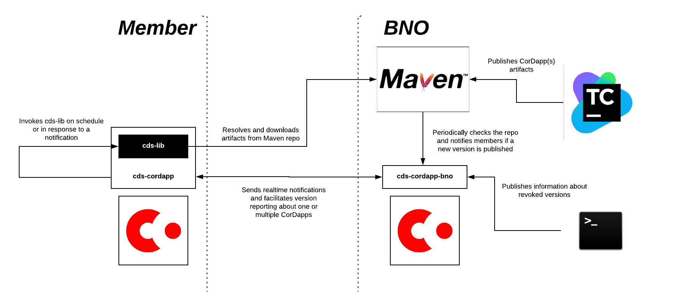

# CordApp distribution service (CDS)

DOCUMENT MANAGEMENT
---

## Document Control

| Title                | Ledger Synchronisation Service                            |
| -------------------- | ------------------------------------------------------------ |
| Date                 | 17 May 2018                                                |
| Author               | Ivan Schasny, Mike Hearn |
| Distribution         | Design Review Board, Product Management, Solutions Engineering, Platform Delivery |
| Corda target version | OS                                                   |

## HIGH LEVEL DESIGN

### Goals

The following requirements have been gathered from various internal discussions within R3 and from [groups.io mailing lists](https://groups.io/g/corda-dev/message/190?p=,,,20,0,0,0::relevance,,updates+distribution,20,2,0,22686107):

* Notification of new CorDapp version availability
* Revocation of a specific CorDapp version
* Download of a specific CorDapp version
* BNO should be aware of what version of the CorDapp each BN member is running
* A node should be able to subscribe to a repository channel and be aware of it's synchronicity
* CorDapp may refuse to work if out of Sync
* Release channels
* Should be integratable into CI/CD pipelines
* Should support upgrade descriptions

### Non-goals:

* CDS will not provide functionality for automatic updates installation. Node administrator will still have to stop-upgrade-restart their nodes manually.
* CDS is not intended to be used to update the platform itself.
* How to design a CorDapp that supports upgrades is out of scope of this design document. Information about flow versioning, states evolution and contract constraints can be found on the [Corda Docs](https://docs.corda.net)

### Target solution

#### General CorDapp distribution mechanism

The proposal is to distribute CorDapps via standard Maven repository mechanism. This would allow BNOs to benefit from the existing rich Maven infrastructure. CorDapp distribution will be performed on per Business Network basis. BNOs will need to host a Maven repo as a part of their infrastructures. This is not envisaged to become a bottleneck: a lot of open source repositories are available there on the market and usually corporates already have Maven repositories running as a part of their software stack anyway, so they are expected to be familiar with the process.

[Maven Resolver](https://wiki.eclipse.org/Aether) will be used on the client side as a library for programmatic dependency resolution. Maven Resolver supports pluggable transports and is shipped with `HTTP(s)` transport available out-of-the-box. To ease an integration into the existing enterprise infrastructures, the proposal is to provide a bespoke implementation of *Maven transport over Corda flows*. This would allow corporates to deploy CDS on-premises without having to reconfigure firewalls to allow HTTP traffic.

CDS will support standard Maven Artifact naming notation `<groupId>:<artifactId>[:<extension>[:<classifier>]]:<version>`. CDS will utilise Maven classifiers that will allow publishing CorDapps targeting different hardware / software configurations.

CDS will not initially support a concept of *release channels*. Release channels can be simulated by using multiple Maven repositories (a repo per channel). Users can sync different remote repositories to different local locations and then manually install a desired version of CorDapp to their nodes. Users will have to have a node-per-environment anyway, so this approach is not envisaged to become a bottleneck.

Reusing Maven infrastructure will also enable a seamless integration into the existing CI/CD pipelines.

However, Maven doesn't support some of the required features, such as realtime notifications, revocations, version reporting and some others. To address these requirements CDS will be shipped with a CorDapp that will provide the above-mentioned functionality on top of Maven Resolver.

CDS will be shipped as 2 components:
* **CDS library (cds-lib)** - a wrapper around Maven Resolver, that will be handling all heavy-lifting, such as artifact resolution and downloading. The library will also include custom transport implementations.
* **CDS CorDapp (cds-cordapp)** - a CorDapp that will provide scheduling, notification, revocation and reporting functionality on top of the `cds-lib`.

CDS can be used as a CorDapp or as a standalone library. High level architectures are outlined below.

**CDS as a CorDapp**


**CDS as a library**


There are no strict limitations around following one architecture or the other. BNs can mix and match depending on their requirements. For example BNO might prefer to notify members via email and then they can pull down artifacts manually at the later date.

##### cds-lib

`cds-lib` will be used to pull down one or more versions of CorDapp(s) from a remote repository. The library will be embeddable into a third-party software or usable as a standalone from a command line. This will give BNs flexibility to utilise CDS in the best way to fit their requirements.

`cds-lib` will be configurable via system properties and via external configuration file.

`cds-lib` will support the following transports:
* *HTTP(s)*. Available in Maven Resolver out-of-the-box with proxy- and repository- level authentications support.
* *Corda Flows*. Transport implementation that allows transferring files over Corda Flows.
* *Corda RPC*. Its essentially the same as *Corda Flows*, with the difference that the *RPC* version can be used if `cds-lib` is invoked from outside of a Corda node.

Preferred transport will be overridable via custom property. *HTTP(s)* transport will be used by default.

`cds-lib` is CorDapp agnostic and can be used to pull down any type of artifacts from any Maven2 compatible repository.

##### cds-cordapp

`cds-cordapp` will provide the following functionality on top of the `cds-lib`:

* Scheduled state for BN Members to periodically sync down their local CorDapp repositories with the BNO repository.
* Flows for BNO to notify BN members about new CorDapp version availability. BN members will be able to setup custom integration hooks via API extensions points, such as to send an email, download a CorDapp and etc.
* Flows for BNO to notify BN members about CorDapp version revocations. If a version of CorDapp was revoked, BN members are expected to manually update their nodes with the latest not-revoked version ASAP.
* Flows for BNO to collect reports from BN members about CorDapp versions installed on their nodes. Only versions of CorDapps related to *this* Business Network should be reported. CDS will rely on the information provided in CorDapp `MANIFEST` files until a better API is available.
* Flows for BN members to manually request a list of revoked CorDapp versions from BNO.
* Flows to optionally notify members if they've got not latest or revoked versions of CorDapps installed on their nodes.

Under the hood, `cd-cordapp` will be calling `cds-lib` for all Maven-related interactions.

Full Maven coordinates will be used for all CorDapp related notifications, i.e. new version availability or revocation.  

In the Business Networks where members host nodes by themselves, BNO can only do their best to encourage the members to upgrade by notifying them via CDS or sending them an email, but ultimately it will be up to a member to decide on whether they would like to upgrade or not. Members with stale CorDapp versions might loose their ability to transact on the BN if the CorDapp is not backwards compatible.

CDS will not provide any automations around database or environment evolution. These procedures should be defined by a CorDapp vendor.

##### Using cds-lib as a standalone

`cds-lib` will be invokable from a command line. CLI invocation could look like:

```
# Will pull down a single version of cordapp and its dependencies
> java -jar cds-lib.jar
    -Dcordapp="com.my.company.name:corda-name:1.0"
    -DremoteRepo="https://my-company-repo.com"
    -DlocalRepo="/path/to/my/local/repo"
    -Dtransport="rpc"
    -Dconfiguration="config.properties"

# Will pull down all versions of cordapps and their dependencies
> java -jar cds-lib.jar
    -Dcordapp="com.my.company.name:corda-name:[0,)"
    -DremoteRepo="https://my-company-repo.com"
    -DlocalRepo="/path/to/my/local/repo"
    -Dtransport="http"
    -Dconfiguration="config.properties"

```

Command line parameters will take precedence over the configuration file.

Exact configuration parameters will be documented during the implementation phase.

#### Implementation details

The proposed solution will require implementation of the following components:

* Custom Maven Resolver transports over flows and RPC. This will require the following interface to be implemented, which should be fairly straightforward to do:
```
public interface Transporter
    extends Closeable
{
    int classify( Throwable error );
    void peek( PeekTask task ) throws Exception;
    void get( GetTask task ) throws Exception;
    void put( PutTask task ) throws Exception; // Not required
    void close();
}
```
* Wrapper around Maven Resolver, with support of CLI interface and custom configuration parameters.
* `cds-cordapp` with the functionality, described in the previous sections.

#### API extension points

* TODO
