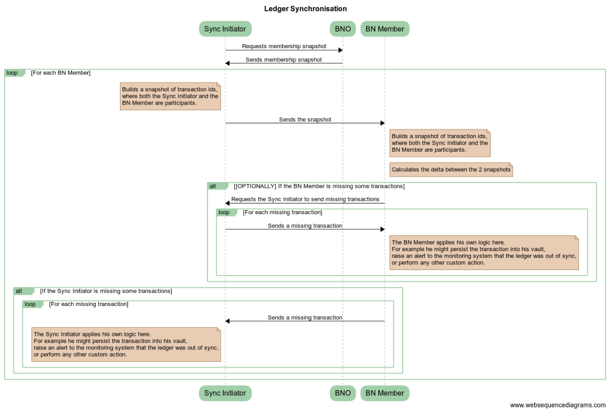

# Ledger Synchronisation Service

DOCUMENT MANAGEMENT
---

## Document Control

| Title                | Ledger Synchronisation Service                            |
| -------------------- | ------------------------------------------------------------ |
| Date                 | 17 May 2018                                                |
| Author               | Ivan Schasny, Dave Hudson |
| Distribution         | Design Review Board, Product Management, Solutions Engineering, Platform Delivery |
| Corda target version | OS                                                   |

## HIGH LEVEL DESIGN

### Glossary

* *SE* - Solutions Engineer
* *BN* - Business Network
* *BNO* - Business Network Operator. A well-known party on the network.
* *BNMS* - Business Network Membership Service
* *CZ* - Compatibility Zone

### Overview

This proposal describes the architecture of a reference implementation for the Ledger Synchronisation Service.

### Background

Blockchain platforms allow users to recover their data from other peers in the case of a disaster. By design, Corda doesn't have a global ledger and hence doesn't provide a data recovery solution at the platform level. Including data recovery mechanism into Corda ecosystem, would allow BN members to benefit from blockchain-like data recovery guarantees in the conjunction with Corda privacy out-of-the-box.

### Scope

Design a reference implementation of CorDapp, which would allow BN members to recover their states and transactions from each other.

In-scope:
* Recovery of states and transactions by a BN member from other members.

Non-goals:
* Recovery of confidential identities.
* Recovery of self-issued, not transacted `OwnableStates`.
* Recovery of flow checkpoints.
* Recovery of the well-known keypair.

### Timeline

* Projects, which go live on Corda in 2018 are asking to have a reference implementation available *asap*.
* This will be an evolvable solution. We need to get more feedback about usage patterns which might result in future design changes.  

### Requirements

* A BN member should be able to recover his states and transactions from other peers after a disaster.
* A number of times customers flagged a question whether Corda allows to verify that the network is in sync. I.e. whether each BN member is in consensus with other members about the transactions he has been involved into.

### Assumptions

* It's assumed that the BNO and the BN members have been on-boarded using the standard JIRA-based Doorman identity mechanism
* It's assumed that the BNO CorDapps will be distributed using the current manual means of distribution (eg. copying relevant jar file to nodes cordapps directory)
* BNO discovery is an "out-of-bounds" mechanism (eg. details of a BNO are explicitly provided to a participant node and must be configured as reachable in their node configuration)
* Synchronisation initiator is a valid member of the BN he is trying to recover the data from.
* BN membership management is done via the [Business Network Membership Service](../membership-service/design/design.md).
* BN members are acting honestly by sharing a *common* part of the ledgers with their counterparts on request.

### Target solution

The proposed solution is - to implement the Ledger Synchronisation Service at the Corda application level, where participants communicate to each other via Corda Flows. This would allow a seamless integration with other BNO applications, such as [Business Network Membership Service](../../membership-service/design/design.md), and would also enable Business Networks to tweak the implementation to fulfil their particular requirements, which are envisaged to vary from a case to case. For example some BNs might require participants to obtain an explicit permission of the BNO *(signed ticket)* before they can start data recovery. Such logic can be easily implemented on top of the reference implementation.

As Corda ledger is *subjective* from each peer's point of view, it'd be not feasible to recover the whole of the ledger from a single peer, unless this peer is aware of all of the transactions on the BN (which is possible but highly unlikely). The proposed solution is to perform data recovery on *p2p basis*, where one node - the *synchronisation initiator*, would be responsible for synchronising a *common* part of its ledger (*states and transactions*) with each BN member separately. The *synchronisation initiator* would be requesting each peer to send him transactions where *both of them* have participated in.

The Ledger Synchronisation Service is envisaged to be used:
* By a BN member to recover his transactions from other members after a disaster. Data recovery is supposed to be triggered by the *affected node*, as a part of its disaster recovery process. To prevent a node from transacting while the data recovery is in progress, the node can be started with only a Ledger Synchronisation CorDapp installed on it, and then restarted with all CorDapps when the data recovery is finished. Alternatively, database level locks or any other external distributed locking system can be used. The *data recovery* flow would acquire a lock when the ledger synchronisation is started and would release it when its finished. Other flows should refrain from starting while the lock is acquired. The synchronisation lock can be manually acquired by the system administrator even before the node is started. Such prevention mechanisms might be included into the reference implementation in the future if required.
* By a BN member, as a diagnostics tool, to make sure that he is in consensus with the rest of the Business Network about the transactions he has been *involved into*. This would be particularly useful when a member would want to verify that his local vault has not been tampered with, or that he has not missed any transactions. This diagnostics can be run by every BN Member on a scheduled basis, for example once per day. BN Members can use *API Extension Points* to implement their custom actions, such as raising an alert to the monitoring system, if they find some transaction being missing from their vaults.

Ledger synchronisation is supposed to be performed *per Business Network*, i.e. if a node participates in multiple Business Networks, then it would have to recover its data from each of the Business Networks separately. These rules can be enforced inside of the Ledger Synchronisation Service implementation. Different Business Network should be providing their own implementations of Ledger Synchronisation Service. A single node would have multiple implementations of the Ledger Synchronisation Service installed if it participates in multiple Business Networks.

The following actors have been identified:

* *BNO*.
* *Synchronisation Initiator*. A node, which wants to synchronise its data with other BN members.
* *BN Members*. All other BN members.

.

Limitations by design:

* Confidential keypairs would require a separate recovery mechanism.
* It's impossible to recover self-issued, not transacted `OwnableStates`, as they would exist in the vault of the owner only.
* In a highly unlikely event, if *all* transaction participants loose some transaction data from their vaults, this transaction would become unrecoverable.
* Data recovery might potentially take a long time, in the case if the ledger is big or if some of the nodes are unreachable.
* Flow checkpoints can't be recovered, as they are not shared with the counterparts. In the case of disaster all in-progress flows would be lost. Note: this is not a consensus issue as flows are used to collaboratively create transactions ready for signing. So the loss of a flow can not lead to loss of ledger consensus between parties.

### API extension points

* Integration with monitoring systems to report about missing transactions
* Mechanisms, preventing a node from transacting while the synchronisation is in progress
* BNO's signed permissions (tickets) for data recovery
