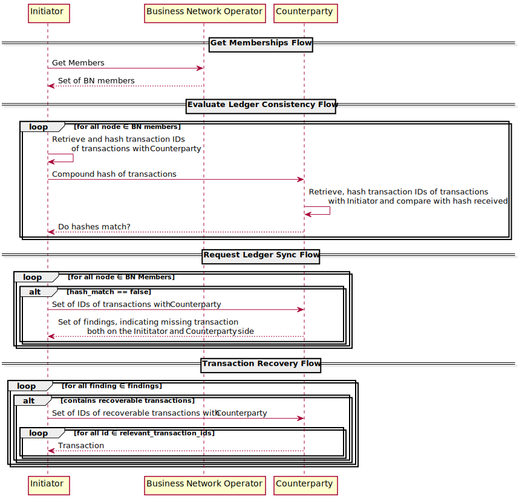

===================
Ledger Sync Service
===================

!!! Please see `corda-v4 <https://github.com/corda/corda-solutions/tree/corda-v4/bn-apps/cordapp-updates-distribution>`_ branch for Corda 4.0-ready implementation. !!!

The ledger sync service is a collection of three flows, designed to recover contract transactions shared with nodes in a `business network <../memberships-management>`_.
The intended use case is to validate the integrity of a node for monitoring and reporting purposes mainly.
The actual recovery of transaction should be a last resort if other resiliency techniques are exhausted, particularity taking into account the fact the types of transactions that are recoverable are a subset of all possible types of transactions.

Flows can be composed in a four-step process from the perspective of a node that suspects the vault has lost integrity.
The flows can be utilised in the following way:

1. Determine potential counter parties by `querying the business network operator <../memberships-management/membership-service/src/main/kotlin/net/corda/businessnetworks/membership/member/GetMembershipsFlow.kt>`_.
2. `Evaluate pairwise if the ledger is consistent <ledger-sync-service/src/main/kotlin/net/corda/businessnetworks/ledgersync/EvaluateLedgerConsistencyFlow.kt>`_ with regards to the transactions the counter party holds.
3. If inconsistencies are flagged, the counter party can be `queried for a more detailed report <ledger-sync-service/src/main/kotlin/net/corda/businessnetworks/ledgersync/RequestLedgersSyncFlow.kt>`_ based on which both the parties can take further action (such as notifying the BNO) or recover the transactions found.
4. Transaction IDs can then be used in the `transaction recovery flow <ledger-sync-service/src/main/kotlin/net/corda/businessnetworks/ledgersync/TransactionRecoveryFlow.kt>`_ to recover individual transactions from counter parties.

How to add Ledger Sync Service to your project
----------------------------------------------

Add the following lines to ``repositories`` and ``dependencies`` blocks of your ``build.gradle`` file:

.. code-block::

    repositories {
        maven {
          url 'http://ci-artifactory.corda.r3cev.com/artifactory/corda-solutions-releases'
        }
    }

    dependencies {
        cordapp "net.corda.businessnetworks:ledger-sync-service:1.0"
    }

