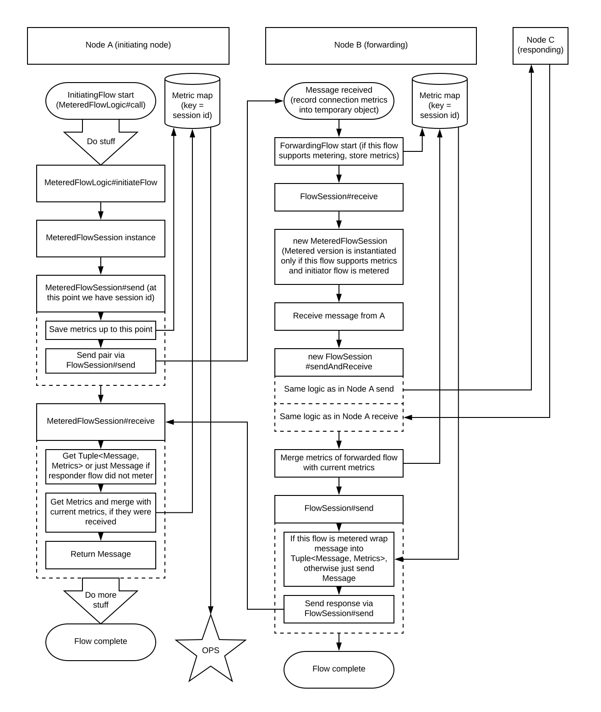

# Application level metric collection


## Document Control

| Title                | Application level metric collection |
| -------------------- | --- |
| Date                 | 12 June 2018 |
| Author               | Romans Markuns |
| Distribution         | Design Review Board, Product Management, Solutions Engineering, Platform Delivery |
| Corda target version | OS |


## Epigraph

*"You can't control what you can't measure"* - Tom DeMarco, Controlling
Software Projects (1982)


## Glossary

* *TX* - Transaction


## Overview

The goal of this project is to provide CorDapp developers with unified way to
measure use-case agnostic parameters of their applications, e.g: performance
statistics, transaction chain parameters, data consumption rates, etc.

Note that initial stages of implementations will only consider basic performance
statistics of CorDapp flow - network, database and computation latencies.
Depending on demand and provided solution, this design might be extended to
provide a framework to exchange use-case specific metrics, which is currently
out of scope.

Before diving into design, it is worth to emphasise that application level
metrics are different from single node metrics in distributed application
context. In distributed application program flow spans multiple machines over
network, and it is possible to have poor application performance with nodes
that perform outstandingly. That can be caused by unstable network, node cache
invalidation, incorrect transaction batching, suboptimal flow sequence, etc.


## Scope

In-scope:
* Definition of application level metrics
* Design of inter-node metric collection protocol
* Corda node instrumentation
* Metric in-memory storage design and configuration

Out-of-scope (not MVP):
* Metric aggregation inside single node or across nodes
* Metric export to ready solutions (e.g. Prometheus)
* Metric export format
* Metric visualization


## MVP deliverable

MVP must give users the following metrics:
* Active flow time, e.g. time to create, verify or sign tx on initiator and
responder side
* Time taken to checkpoint flow at each stage
* Time taken to communicate each message to another node
* Time taken to notarise (for MVP notaries must be treated as black boxes,
including their network latencies)
* Latency of each individual database query/transaction


## Assumptions

The following assumptions were made while writing this design:
* All network parties are willing to collaborate and share metric data
* Metric collection will be on in production environment


## Current situation

Current Corda nodes expose some metrics that might be used for application level
analysis.

#### Flow durations

By providing custom log4j configuration to node it is possible to fetch flow
durations from logging events.

Simple log4j configuration would produce a log file with:
```
09:26:28.970 - Calling flow: ...
09:26:28.998 - Calling subflow: net.corda.core.flows.FinalityFlow@4d80934
09:26:29.008 - Calling subflow: net.corda.core.flows.NotaryFlow$Client@1566bb37
09:26:29.012 - sendAndReceive ...
09:26:29.029 - Initiating flow session with party ...
09:26:29.348 - Received ...
09:26:29.350 - Subflow finished with result ...
09:26:29.353 - Subflow finished with result SignedTransaction(id=...)
09:26:29.377 - Flow finished with result OK
```

Whilst good to have, these logs are not fit for application level metrics due to:
* they are too granular to understand network/database latencies
* they require all parties to have correct node logging file and Appender
implementation that would parse logging events and forward them through network

#### JDBC timings

One can instrument current Corda JDBC driver with logger. That can be done with
following steps:
1. Build Corda node with spy dependency, e.g. p6spy
1. Change node.conf to have following lines:
```json
"dataSourceProperties" : {
    "driverClassName" : "com.p6spy.engine.spy.P6SpyDriver",
    "jdbcUrl" : "jdbc:p6spy:h2:file:"${baseDirectory}"/persistence;..."
}
 ```
3. ...
1. Profit in form of spy.log file:
```
1528464750425|0|statement|connection 1|select legalident0_.node_info_id ...
```

This also requires correct configuration from all nodes and on top of that does
not tie JDBC statements to a particular flow/transaction.

#### Network connection information

Network latencies can be calculated from ActiveMQ advisory topics:
```
AdvisorySupport.getMessageDeliveredAdvisoryTopic()
AdvisorySupport.getMessageConsumedAdvisoryTopic()
```


## Existing solutions

There are multiple open-source tools available that provide out-of-the box
protocol instrumentation for metric transfers from one node to another. Here are
two most notable ones (being popular and representatives of 2 different
architectures):
* Jaeger
* Zipkin

#### Jaeger

Jaeger metric collection consists of 3 main blocks:
1. Instrumented code in node application
1. Jeager-agent - a side-car process that lives along application and serves
as metric aggregation point before they are send asynchronously to centralised
storage
1. Centralised metrics storage

Biggest advantage of such system is that metric collection overhead has less
impact on application performance as it does not instrument protocols (does
not transfer metrics as part of inter-node communication).

Biggest drawback of this is that metric storage is centralized and in Corda
context that would require one of the parties to be responsible of collecting
and sharing metrics with *everyone* inside business network. Such architecture
seems more suitable for distributed application that is a set of microservices
inside one organisation.

#### Zipkin

Zipkin approach is slightly different as it allows sending metrics node-to-node
which gives more flexibility as of where metrics can be stored. Zipkin metric
collection consists of:
1. Instrumented code in node application
1. Instrumented protocol (currently HTTP, Kafka and Scribe are supported out of
the box) that allows sharing metrics in peer-to-peer fashion
1. Zipkin-collector - a side-car process that lives along application that
serves as metric forwarding point before they are stored (there is option to
store metrics locally with the node)
1. Metrics storage - local or centralized

This approach eliminates need for centralised metric storage, but comes at
cost of additional communication overhead. For example to exchange metrics
via HTTP, Zipkin attaches headers with common request identifier and bundled
metrics to HTTP packets send between nodes.

The biggest advantage of Zipkin is out-of-the box support of most popular
protocols, which unfortunately does not include AMQP.


## Target solution

As Corda is distributed system hosted by multiple independent parties,
Zipkin-style architecture is more preferable. However doing more close analysis
it becomes apparent that facilities provided by tracing solutions are already
inherent part of Corda TX, namely unique identifier and custom payload. Thus it
is possible that monitoring information may travel together with messages in a
peer-to-peer/propagate as needed fashion that Corda is famous of. This removes
necessary side infrastructure and communication overhead that otherwise is
incurred when using ready solutions available.

The proposed solution tries to capitalize on existing implementation of Corda.

The idea was taken of Corda Commands that are capable of holding arbitrary data
inside. However Corda commands cannot be used as metric transport solution. This
is due to a fact, that while transactions are frequently passed to receiving
nodes they do not send whole transaction back (e.g. CollectSignaturesFlow
receives only party signatures and assembles them with transaction locally).

That said the proposed solution is to have instrumented versions of FlowLogic
and FlowSession that would wrap inter-node messages into data structure that
will contain unique TX identifier and metrics.

Data flow diagram of envisioned solution:


Current design does not impose particular implementation of metric storage.
Ideally we would want to define interface for metric storage and allow to inject
user implementation into instrumented FlowLogic/FlowSession. We must however
provide at least basic in-memory metric storage and a pluggable Corda service
to read collected metrics.

Metrics sampling strategy can be achieved by adding this data structure to
subset of flow instances, which allows for complex sampling algorithms if
necessary (e.g. meter only flow instances involving specific party).


## Timeline

Proposed solution is expected to cover all medium/long-term use cases.
