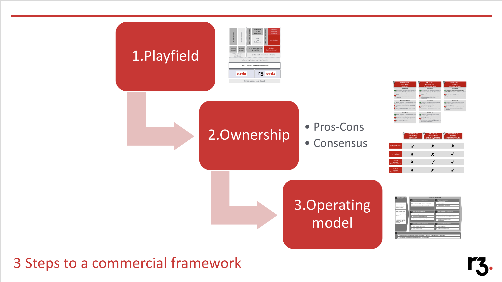
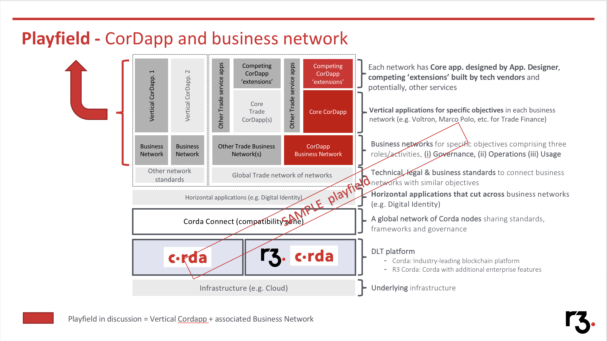
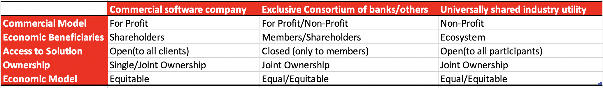
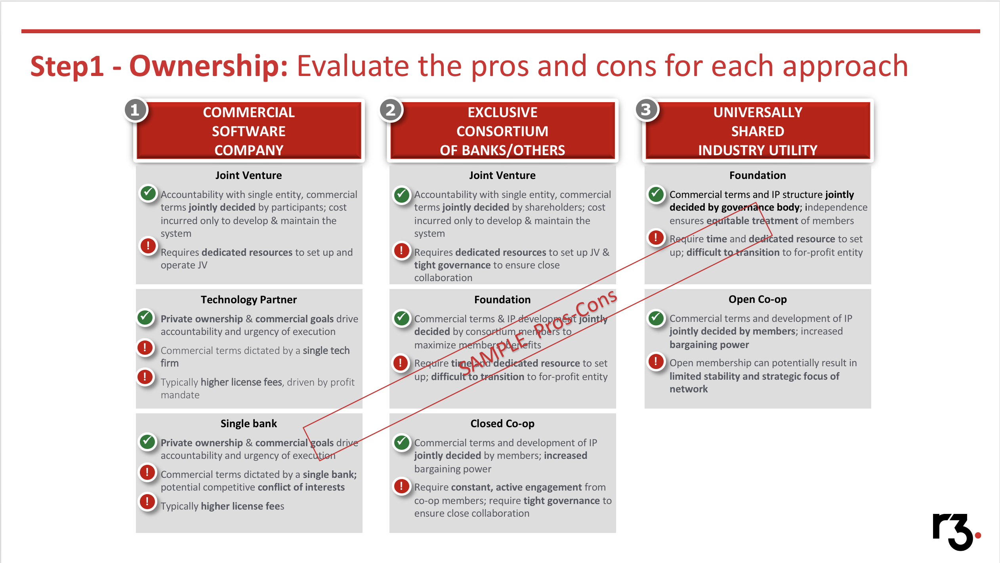
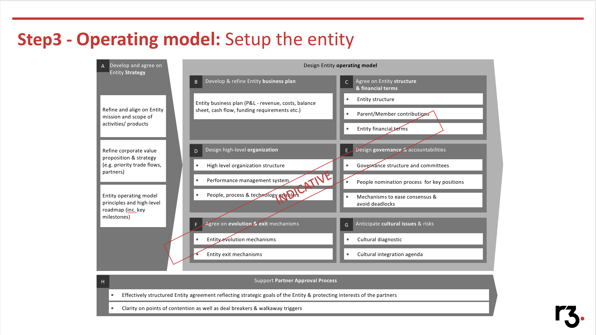

Commercial Framework
=====================


Introduction
------------

In 2016, the design concepts for Corda were described for the first time in Mike Hearn's technical whitepaper https://docs.corda.net/_static/corda-technical-whitepaper.pdf.  It was to be decentralised global database, providing a platform for decentralised application development.

The paper describes the concept of "CorDapps" (Corda Distributed Applications) and how these might be constructed, but did not attempt to describe very much more detailed thinking.

Building and managing distributed applications is, however, more involved than just creating software: In a CorDapp, information and/or assets are exchanged, or transacted, between participants because they represent
something meaningful to each of them, but how are those meanings determined, on what basis, and by whom? We address this in the CorDapp Business Network section.

In a nutshell: Business networks for specific objectives comprising three roles/activities;

(i) Governance
(ii) Operations
(iii) Usage.



Further, increasingly CorDapps are starting to have 'CorDapp extensions'. Even though the word CorDapp can denote a top of the stack application, we are seeing these CorDapps emerge as platforms in their space and allowing others to build applications on top.

In other words some CorDapps have increasingly explored the opportunity to become a middleware across their playing field. In such a case 'CorDapp Extensions' become the top-of stack user-facing application. e.g. <TBD:insert generic description of MP and example of another potential-app build on top of TIX platform/APIs>

To summarise overall there could be 4 roles;

- CorDapp Business Network Governor
- CorDapp Business Network Operator
- Core CorDapp
- CorDapp Extensions

It might be that one-entity might play more than role among these.




Overview
--------

The importance of the Commercial framework topic is evident in the fact that corporate governance and the ownership structure of companies and initiatives is currently characterised by change processes as the economies of the world becomes more and more globally integrated.

Commercial framework and ownership structures are also of major importance in corporate governance because they affect the incentives of ecosystems, participants, managers, and thereby the efficiency of firms.

The structure is also characterised by the distribution of equity with regard to votes and capital, but also by the
types of the equity owners. A classic reference is Jensen and Meckling (1976), who discussed the nature of agency costs associated with outside claims on the firm.

The increased volatility of corporate commercial  portfolios observed in recent years has led to renewed interest in ownership framework structures, especially with respect to multinational enterprises.

As the economies of the world become more and more distributed as well as globally integrated, such issues will become more
prominent and will affect our understanding of the interweaving systems of corporate relations, through which formal and invisible networks of power are established (Heubischl, 2006).

Commercial frameworks are an important means for governance as well as power structures. Likewise, for interlocking directorships, share
ownership may provide influence and control over a third party. Recently there has been considerable interest in the corporate governance practices of modern corporations and it is better to be cognizant of the choices available as well as the impacts as early as possible.

Superficially, our problem is not particularly new. Companies and consortiums have brought people together to transact value since centuries! Our target problem here is a group, or network, of independent parties that want to use Corda to transact something of value to each, and as we're transacting
something valuable then this almost inevitably implies a commercial, or business, purpose.

3 broad constructs of ownership exist:

(1) A Commercial Software Company (e.g.Microsoft, SAP, Oracle) operates to:

- Function: Create a commercially driven leading software company with a superior offering (and other services)
- Objective: Maximise economic value for the software company and its shareholders

(2) An Exclusive Consortium of banks/others (e.g. Star Alliance, One world):

- Function: Create a commercial/ non-profit exclusive consortium of banks/ others who own and manage the application(s) & business network
- Objective: Maximise value (economic or other) for each member of the consortium

(3) A Universally shared industry utility (e.g. TCP/IP, SWIFT):

- Function: Create a utility that is shared industry-wide for all ecosystem participants
- Objective: Maximise adoption of the utility by the entire ecosystem, with first-mover advantage


As one can see from above the objective of maximisations are very different among the 3 options outlined: it can be observed that a 'Commercial software company' and 'Universally Shared model' lie quite apart on the spectrum. To aid the decision in above one can see 5 factors:
- Commercial Model
- Economic Beneficiaries
- Access to Solution
- Ownership
- Economic Model


For example, in our broad view:



It can be evident from above that the primary success factors for each above will be quite unique as well:
(1) Commercial software company: Commercial excellence i.e. Attractive value proposition (solution, pricing etc.) delivered with a focused sales, delivery & servicing model

(2) Exclusive consortium of corporate/FIs: ‘Winning consortium’ i.e. Speed and effectiveness of attracting the top Trade banks and creating network effects

(3) Universally Shared industry Utility: Industry alignment i.e. Broader industry alignment and adoption of VoltronX standards, facilitated by regulatory endorsement


Typically, below are the 3 broad constructs of ownership with 8 choices, to further the processes while choosing the appropriate model:

(1) Commercial software company:

- Joint Venture: A new for-profit entity with shareholder funding and board membership. Here typically the JV or the new firm owns the IP, selects members of business network and manages the platform
- Technology Partner: CorDapp is owned and maintained by the technology partner, and is licensed out to FIs/Corporates and other stakeholders in the CorDapp business network
- Single corporate/FI: CorDapp is wholly owned and managed by a single corporate/FI. Owner holds IP and exclusive right to provide access to other banks and service providers on the platform

(2) Exclusive Consortium of corporates/FIs:

- Joint Venture: New for-profit entity to maximize value to members with shareholder funding and board membership. JV / new firm owns the IP, selects members of business network and manages the platform
- Foundation: A non-profit entity with a select set of members providing funding and given board membership.The Foundation owns IP, selects new members and manages the platform
- Closed Co-op: Corporate/FI consortium founded Co-op with specific membership requirements, Voting rights & profit sharing (if any) based on contribution of each co-op member (e.g. Star Alliance)

(3) Universally shared industry utility:

- Foundation: A non-profit entity with all members providing funding and given board membership. Entity owns IP, selects new members and manages the platform
- Open co-op: Co-op of banks & non-banks which jointly manages IP and aims to get new members to join. Voting right and profit sharing based on contribution of each co-op member (e.g. SWIFT)

With above overview, below principles and practices would help in the above choices as well as setting up the commercial framework for your CorDapp!

Principles and good practices
-----------------------------
All the 4 roles of 'CorDapp Business Network Governor', 'CorDapp Business Network operator', 'Core CorDapp' and the 'CorDapp extensions' would have potentially different choices among commercial-models. A coherent consensus among the choices by all the 4 role-players will be necessary for everyone to come together and transact.


Practice / Step 1
``````````````````````

**Evaluate the pros and cons for each (among 8) approaches for Ownership**

This needs to be done by each of the 4 role-players individually. A really simple template of this can be as below attached.



Practice / Step  2
``````````````````````

**Reach consensus among the stakeholders and establish the ownership approach**

Each stakeholder share their preferences and reach consensus among them. A really simple template of this can be as below attached.

.. image:: CommercialFramework_4.png
  :width: 600px
  :height: 400px
  :align: center

Practice / Step  3
``````````````````````

**Finalise the Operating model by setting up the entity.**

A really simple template of this can be as below attached.





Templates
---------
Include any document templates here.  Link to the source file in the master location.  NO POWERPOINT, ever.

====================  ======================  ===============  ============
Document              Purpose                 Owner            Last Updated
====================  ======================  ===============  ============
Filename / link here  Short text description  Owner name here  Date here
Filename / link here  Short text description  Owner name here  Date here
Filename / link here  Short text description  Owner name here  Date here
====================  ======================  ===============  ============

Examples
--------
Include any client examples here to make it more real.  Any examples should be uploaded and linked to in PDF format – always mark files with the IP licence attached (i.e. r3 internal, r3 consortium, public).

====================  ===================================== ==================================  ====================================
Document              Why its good                          Key lessons                         IP / Distribution Rights
====================  ===================================== ==================================  ====================================
Filename / link here  Describe why this is a good example   Key things you would not do again!  public / r3 consortium / r3 internal
Filename / link here  Describe why this is a good example   Key things you would not do again!  public / r3 consortium / r3 internal
Filename / link here  Describe why this is a good example   Key things you would not do again!  public / r3 consortium / r3 internal
====================  ===================================== ==================================  ====================================
