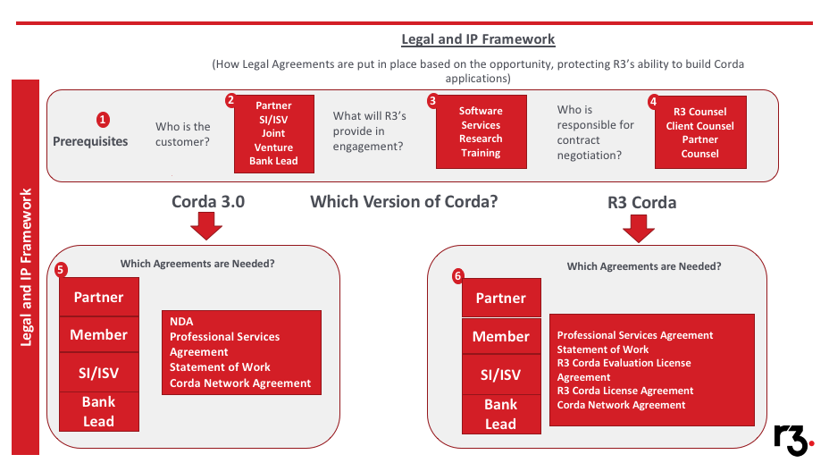
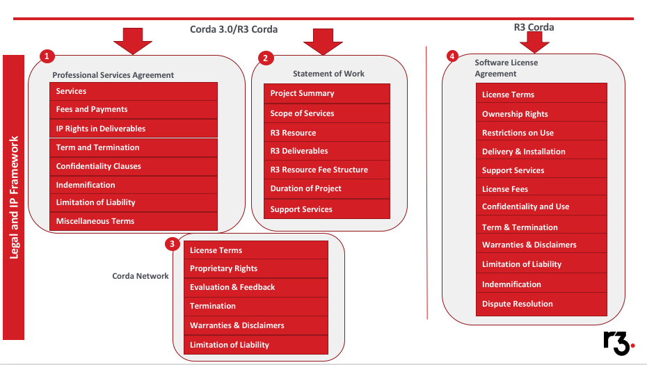

[R3 INTERNAL] Legal and IP Framework
====================================

Overview
--------

The purpose of this section of the framework is to understand how R3 deals with Legal and Intellectual Property Agreements that are
put in place with Partners, SI's and Members

In addition we will review the R3 Legal Document Suite, and the typical use cases for which each artifact is most appropriate.

List of Legal/IP Artifacts
--------------------------

* Non Disclosure Agreement
* Professional Services Agreement
* Statement of Work
* R3 Corda License Agreement
* R3 Corda Evaluation License Agreement
* Code of Business Ethics (potentially sent by Partner, SI, ISV as requirement for engagements)

History
-------

Projects executed prior to the establishment of Global Collaborative Laboratory were done under the Advisory Services Agreement.

Once GLC was created all subsequent engagements were undertaken with members signing a Master Services Agreement (MSA).

There were some select projects that involved the participation of technology vendors e.g. Axoni which used Technology Provider Agreement (TPA).

Upon the release of Corda in November 2016 the landscape changed, GLC went away and we now view legal agreements thru the lens of Corda Open Source vs Corda Enterprise.

The different agreements needed depending on which version of Corda is used will be discussed in more detail below.

Principles and Good Practices
-----------------------------

When determining the type of agreements that should be entered into there are a few things to take into consideration.

Principle 1 - Determine Type of Engagement
```````````````````````````````````````````
The first prerequisite in determining the appropriate agreement is the type of customer engagement:

* Partner
* SI/ISV
* Joint Venture
* Bank Lead

The relationship R3 has with parties to a legal agreement will determine the nature and type of agreement:

* Partner developing their own product
* Member developing IP within a POC
* Systems Integrator developing IP on behalf of their client
* Determine what constitutes contributed IP
* Determine what constitutes developed IP
* Determine ownership of contributed and developed IP

Principle 2 - Determine Services Supplied
`````````````````````````````````````````
The next prerequisite is determining what R3 will be supplying in the engagement, as each of these may require separate agreements.

* Software
* Services
* Research
* Training

Principle 3 Determine Key Parties
`````````````````````````````````
At this point it is worth pointing out, though this may seem obvious, who are the key parties responsible for contract negotiation:

* R3 Counsel
* Client Counsel
* Partner Counsel

While the Services team are active in ensuring there is ongoing communication between the legal teams, final sign off must be completed by our attorneys.
If there is a business decision needed to finalize a legal agreement then that can be channelled appropriately to a member of the R3 Management Team.

Principle 4 - Determine Corda Version
`````````````````````````````````````
Corda Open Source vs Corda Enterprise

Corda Open Source engagements typically require the following agreements in place:

* Non Disclosure Agreement
* Professional Services Agreement
* Statement of Work

Corda Enterprise engagements typically require the following agreements in place

* Professional Services Agreement
* Statement of Work
* R3 Corda Evaluation License Agreement
* R3 Corda License Agreement



Principle 5 - Determine IP Requirements
```````````````````````````````````````
Here we will discuss the types of IP involved and the different considerations given to each. At the outset
we should establish basic goals from an R3 perspective. Fundamentally we want to:

1. Ensure R3 has rights to IP from all projects where possible to enhance the Corda Platform
2. Ensure R3 has the ability to develop commercial products on Corda platform which may be similar to those where R3 has no rights to IP.
3. Ensure material liability is at a minimum.

Pre Existing or Contributed IP
``````````````````````````````
It is quite common for a  Parter/Vendor will bring in what is known as contributed or "pre-existing IP" i.e. technology components that existed
before Corda and which are not owned by R3. R3 does not usually seek any rights/claims to pre-existing IP.

An example would be an FX matching algorithm developed by a Partner which uses Corda to produce a 'golden copy' of a matched FX trade. R3 did not develop
this functionality prior to the engagement hence has no rights to the IP for that functionality.

Developed IP
````````````
R3's fundamental approach to IP agreements is to have an unrestricted license to all developed IP during the course of an engagement.

The reason for this is simple, R3 wants the right to be able to take what is learned in every engagement and
determine if a platform component should be added as a result of that learning.

For example, if a specific RDBMS is used for the Corda Vault during the course of an engagement,
and changes are needed to Corda to facilitate the use of that RDBMS, then R3 will want the ability to
port those changes to the platform so they become an integral part of the product.

Non Exclusivity
```````````````
One of the most crucial clauses in any R3 IP agreement is that of Non Exclusivity. After the sections around IP ownership, this is arguably
the next most important clause to take into consideration.

This clause has one major purpose, which is to safeguard R3's right to engage in similar business, opportunities etc whether or not they be
similar to or competitive with an existing R3 engagement.

It is intended a form of protection against a case of IP infringement being brought against the company. This is a sample extract of the clause:

R3 may carry on existing businesses, seek or make other business opportunities or investments, enter into
new lines of business and/or develop or market new or existing products or services in any jurisdiction
or territory or with any third parties whether or not the same as or similar to or competitive with any
Services, Deliverables or any other services provided or deliverables developed pursuant to this
Agreement, provided always that in doing so it does not breach any of its obligations hereunder.

General Terminology
-------------------





Terms Specific to R3 Corda Software License Agreement
`````````````````````````````````````````````````````

License Grant
`````````````

R3 grants Licensee a worldwide non-sub-licenseable,non-transferable license to R3 Corda.
Licensees have right to develop API's & Linked Applications

Ownership Rights
````````````````

Licensor owns all right, title and interest, including IP to R3 Corda Software. Licensees agree not to alter proprietary markings. No reverse engineering of Corda is permitted. 

Restrictions on Use
```````````````````

Licensee agrees to avoid unauthorized access to Corda Software and prevent unlawful distribution.

Confidentiality and Use
```````````````````````

Licensee agrees not to disclose any confidential information between parties inclding all non-public records, books, contracts, reports, instruments, computer data and other data.
In general the only time confidential information can be divulged is when parties are compelled to do so by laws. 

Terms and Termination
`````````````````````

Provides details on the length of the agreement and the reasons for possible termination of license by R3.


Templates
---------

The following are the most recent documents available from R3 Legal.

=======================================  ===============================  ===============  ============
Document                                 Purpose                          Owner            Last Updated
=======================================  ===============================  ===============  ============
https://r3share.mohso.com/dl/9SrRcFLbYb  Non Disclosure Agreement         R3 Legal         Feb 2018
https://r3share.mohso.com/dl/5hXWTZI0FN  Professional Services Agreement  R3 Legal         Mar 2018
https://r3share.mohso.com/dl/2Mno8Q9VRU  Statement of Work                R3 Legal         Apr 2018
https://r3share.mohso.com/dl/oEZEn8KVbe  Enterprise License Agreement     R3 Legal         Mar 2018
https://r3share.mohso.com/dl/fe6iazT57n  Enterprise Evaluation Agreement  R3 Legal         Feb 2018
=======================================  ===============================  ===============  ============

Examples
--------

=======================================   ===================================== ==================================  ====================================
Document                                  Why its good                          Key lessons                         IP / Distribution Rights
=======================================   ===================================== ==================================  ====================================
https://r3share.mohso.com/dl/09ryJFddnZ   Excellent example of Services SOW to  Engage in project where R3 gained   Non R3, Client Owned
                                          support SI Partners                   little in terms of IP or $$
https://r3share.mohso.com/dl/btQs6umnQx   Details IP ownership and Non          Engage in project where R3 gained   Non R3, Client Owned
                                          Exclusivity                           little in terms of IP or $$
=======================================   ===================================== ==================================  ====================================

