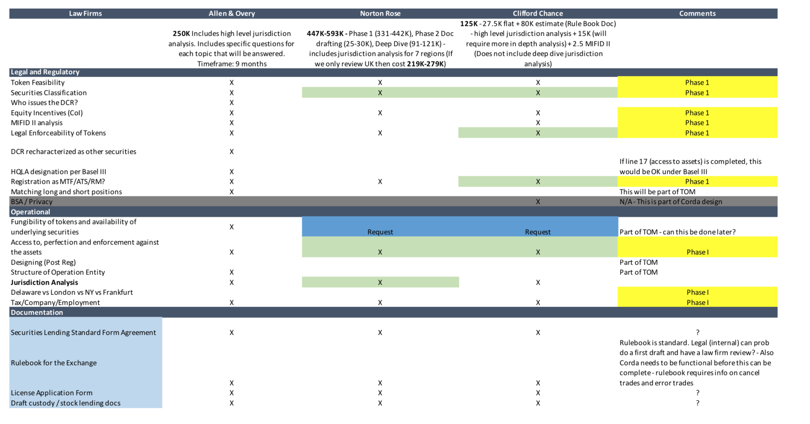
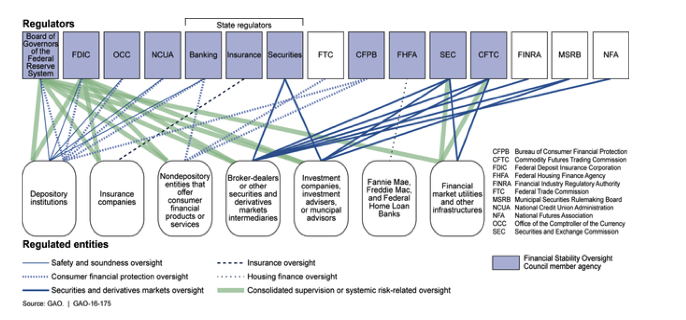
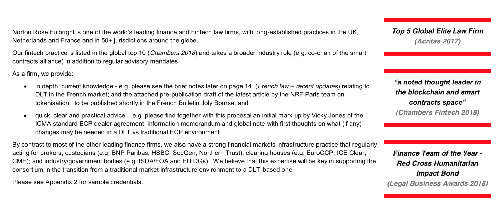
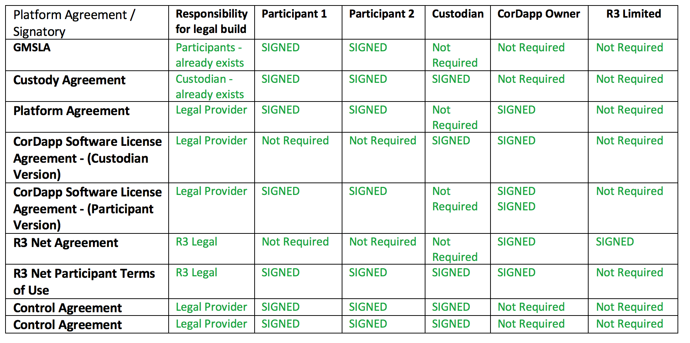

[R3 INTERNAL] Legal
===================


Overview
--------

This section discusses how to build the legal architecture for your CorDapp solution.

Based on the experience of numerous previous projects these are considered pre-requisites:

- Establish proposed product.
- Establish business case.
- Establish commercial model.
- Establish operating model.
- Establish proven technology solution.
- Test (i.e. gain feedback on) all of the above with market participants i.e. users who ultimately will help generate revenue for the platform (or achieve alternative objectives).


Principles and good practices
-----------------------------

Principle / Practice 1
``````````````````````

**Establish clear business case and justification for legal expense**

- This is hopefully an output from (1).
- Be clear on why you need to hire a legal provider e.g. to support tokenization of assets on DLT.
- Be clear on why the expense needs to be incurred now rather than later e.g. “it’s needed now to ensure participants can use the intended platform in 12 months time”.


Principle / Practice 2
``````````````````````

**Obtain funding solution for legal expense**

- Establish who will pay the bills for the legal provider.
- Example funding solutions include:

 - Cash investment from one or more stakeholder (e.g. consortium members or working group or single product company or technology provider).
 - Legal provider expenses paid in the form of equity of a company (e.g. CorDapp builder).
 - Note: there is usually correlation between the IP owner and the funding solution.

- Establish the minimum and maximum amount you are prepared to pay for the services described in the RFP.
- Confirm whether additional taxes (like UK VAT) will be payable e.g. based on jurisdiction of the paying entity.

Example of Comparison Matrix



Principle / Practice 3
``````````````````````

**Create RFP**

- There are plenty of tips / guides / training materials out there on how best to write an RFP, here are a few:

 - https://www.grfcpa.com/resources/articles/how-to-create-an-effective-rfp.
 - https://www.wikihow.com/Write-a-Proposal.
 - https://www.banyanrfp.com/2013/06/structuring-an-rfp-for-legal-services-the-basics.

- Be as clear as possible e.g. describe measures-of-success or artifacts that you expect to exist at the end of the engagement.
- Ensure deliverables deal with:

 i) Key elements of the product operating model e.g. token feasibility, classification of asset tokens, who issues the token, legal enforceability of tokens, fungibility of tokens, access to, perfection and enforcement against the assets, privacy rights of participants.
 ii) Any settlement finality required with respect to assets changing ownership via DLT.
 iii) Regulatory licensing requirements e.g. for financial services (if applicable) MIFID reporting, CSDR, MTF, anti-trust rules etc… that are relevant to the product being built (see separate section on Regulatory).
 iv) Jurisdictions – which jurisdictions should be considered in scope for the legal architecture that you intend to be built.
 v) Documentation that you think will be needed to support the intended operating model of the CorDapp e.g. platform rulebook.
 vi) Timing / Phasing requirements – when certain documentation is needed by e.g. for a pilot transaction or a platform launch.
 vii) Any upfront guidance on liability provisions / levels, data usage requirements.
 viii) Clarity on signatures i.e. who needs to sign which documents (see table below).

- Provide any over-riding guidance or principles e.g. “the pilot documentation should be done in a way that’s consistent with the end-state platform legal architecture”, or “existing GMSLA documentation between participants should be unchanged”.
- Be clear on whether you expect the legal provider to be part of the legal negotiation process required to get the end-product signed by all parties to the legal documentation (if the answer is no, then be clear on who will play this role).
- Be clear on how the legal provider will be paid for their services (pre previous section).




Principle / Practice 4
``````````````````````

**Create shortlist of legal providers for RFPs (request for proposal)**

- Consider past experience and existing relationships from working with legal providers.
- Consider market reputation of legal providers.
- Consider recommendations.
- Consider expertise levels and how well they match the operating model of your CorDapp e.g. knowledge of similar DLT solutions, of relevant knowledge of asset ownership transfer solutions on DLT.
- Consider complexity / depth of product expertise required to build the architecture to support the CorDapp and operating model.
- Consider jurisdictional expertise of legal provider for the CorDapp product e.g. you may want to build for one region first, so which legal providers have expertise in that region?
- Agree a suitable size of shortlist e.g. 5 providers.

Example Excerpt from Potential Provider



Principle / Practice 5
``````````````````````

**Engage legal providers**

- Send RFP to shortlist of legal providers.
- Try to meet legal provider team face-to-face e.g. via multi-hour workshop to explain the goals of the product, the operating model, the RFP and what is expected of them.
- Clarify / answer any questions legal providers may have about scope.


Principle / Practice 6
``````````````````````

**Negotiate**

- Negotiate a better price / discount.
- Emphasise value of any potential follow-on work.


Principle / Practice 7
``````````````````````

**Select legal provider**

- Clearly determine stakeholder or group of stakeholders that need to make decision.
- Ensure all stakeholders have a voice and are part of decision making process.
- Factors to consider:

 - Price.
 - Any upfront discounts (in view of follow-up work).
 - Timeline.
 - Reputation / experience.
 - Detail of quote i.e. how much effort they put into the quote, and their understanding of the piece of work.
 - Desire / willingness of legal provider to do the work.

- Use a score sheet on the above points to record the reasons behind the collective decision.

Principle / Practice 8
``````````````````````

**Assign project manager to oversee engagement with legal provider**

- Don’t rely on legal provider to do this role, because the project manager is in effect ensuring the deliverables are met on behalf of the stakeholders (who are paying for the legal provider services).
- Ideally establish single point of contact with the legal provider – often easiest if this person is also the project manager.
- Role of project manager:

 - Set priorities with law firm on behalf of client.
 - Manage / communicate change to deliverables.
 - Provide status to stakeholders.
 - Ensure value for money is being achieved for the client.
 - Establish communication strategy with legal provider e.g. weekly calls, additional workshops etc….
 - Ensure deliverables met on time.
 - Agree invoice schedule and manage budget with the legal provider.

- Agree more detailed set of deliverables with legal provider early on in the engagement and use that to provide and communicate status during the engagement. For example, use a tracking table like the one below which summarises:.

 - All legal documents that need to be built.
 - Who needs to sign each one.
 - Status of each document being built - from a readiness perspective, negotiation perspective, and signature perspective.
 - If multiple legal providers are required, then add a column to clearly state (for benefit of all parties involved) which legal provider is building each document – establishing clear accountability and ownership.

- Ensure legal documents are signed by the right people within each organization (sometimes the wrong person initially signs within an organization, which can delay things) - ask each party to provide list of authorized signatures for each document.





Principle / Practice 9
``````````````````````

**Negotiation of legal provisions with entities that will sign the legal documents**

- This can sometimes be a protracted phase of the project, involving lengthy backwards and forwards between parties regarding the detail of the provisions laid out in the legal agreements.
- Ensure everyone understands who is overseeing this phase and acting as the conduit between negotiating parties - often this role is played by the project manager, but that doesn’t have to be the case.


Principle / Practice 10
```````````````````````

**Wrap-up workshop**

- Review all deliverables and agree which ones have been delivered vs. deferred vs. any changes in scope along the way.

 - This may be a requirement for releasing final payment funds to the legal provider.

- Review lessons learnt along the way.
- Review any next steps or further potential pieces of work for the legal provider.


Examples
--------

=======================================  ===================================== ==================================  ====================================
Document                                 Why its good                          Key lessons                         IP / Distribution Rights
=======================================  ===================================== ==================================  ====================================
Filename / link here                     Describe why this is a good example   Key things you would not do again!  public / r3 consortium / r3 internal
Filename / link here                     Describe why this is a good example   Key things you would not do again!  public / r3 consortium / r3 internal
=======================================  ===================================== ==================================  ====================================
