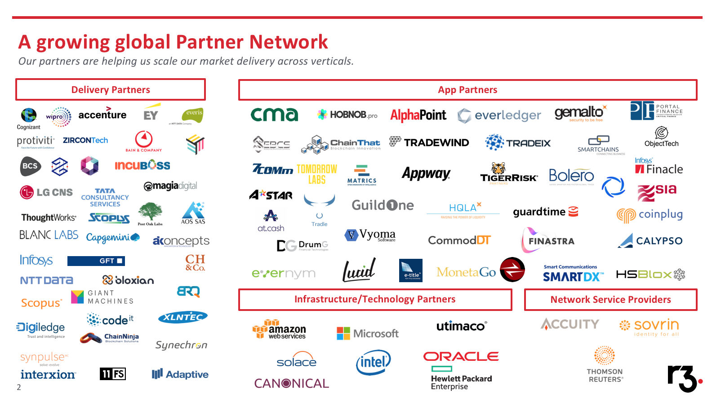
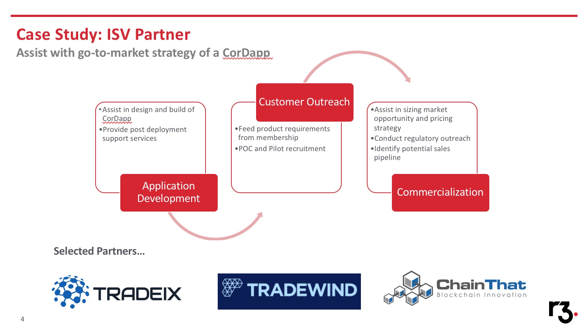
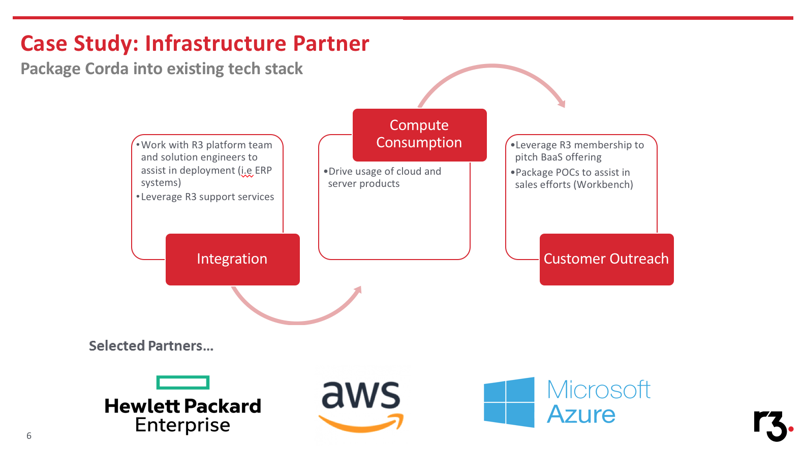
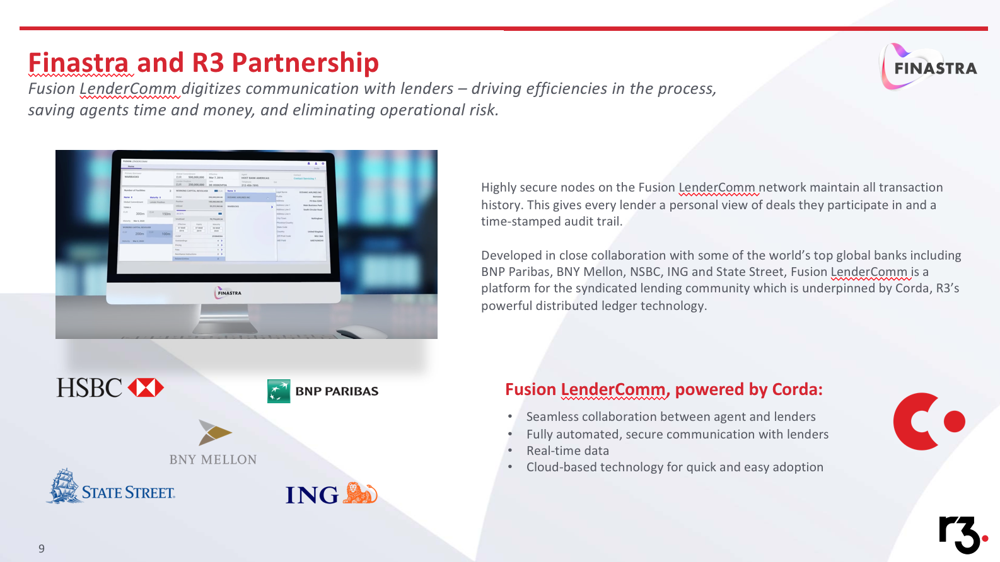
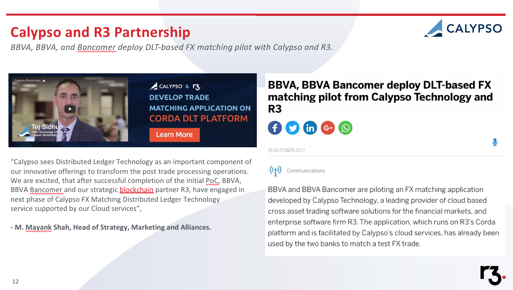

Partner Selection
=================

Overview
--------
The Partner Selection framework is an important element of R3's delivery framework as it enables a consistent and scalable approach to connecting consumers and producers and supports the build out of an ecosystem for Corda solutions.

Types of Partners & scope for this framework include:

- Technology partners providing key infrastructure, platforms and services for Corda and clients
- Systems integrators (SI) delivering proof-of-concepts, pilots and production solutions for clients on Corda
- Consulting firms advising their clients on the business potential of DLT and Corda
- Software vendors (ISV) building end-user applications on Corda
- Network Service Providers

Corda Partner Network
---------------------

Over the past 18 months R3 have build up an extensive partner list as shown below. 



Principles and good practices
-----------------------------

The Partner selection framework can be split into four distinct components: 

- Initial Partner Scoping
- Partner Shortlist Creation 
- Partner Engagement & Partner Selection and Onboarding

Initial Partner Scoping
```````````````````````

Typically, the R3 Services Delivery Manager for a project should work with project participants (the clients) as the single point of contact to define the project’s partnership needs & selection criteria i.e. given the CorDapp value proposition, what partner type/s are required to fulfil the roles in the Business Network.

Besides the core actors transacting in the network, typical roles include:

- Business CorDapp Builder
- Business Network Designer 
- Business Network Operator  
- Business Network Governor 

There may be more roles required and these can be fulfilled by a single or multiple entities. Note: See the Business Network section of the Delivery Framework for more detailed descriptions of these roles.

The maturity stage of a project should be considered before initiating the Partner selection process i.e. is it right time to engage, is there clear client demand for the proposition and intent to support any resource/funding required for this as a commercial product.
Note that if the demand for a partner is initiated from a outside of the R3 Services project portfolio, that group should engage directly with the R3 Partner team via partner@r3.com.

Below are some case studies which help demonstrate the various ways in which R3 can engage with our partners depending on the use case.


**ISV Partner**



**Delivery Partner**

.. image:: C3.png
  :width: 900px
  :height: 500px
  :align: center

**Infrastructure Partner**



Partner Shortlist Creation
``````````````````````````

**Creating a Partner shortlist**

Typically, the R3 Services Delivery Manager for a project should engage the R3 Partner team to provide a project briefing and request for a partner (via partner@r3.com), who will then assign a single point of contact for the opportunity.
The R3 Partner contact will determine an initial appropriate partner shortlist based on 4 key criterion: 

- Corda Proficiency 
- Domain expertise 
- Geographic footprint 
- Reputation and track record of successful delivery

Once this initial partner shortlist has been refined & agreed with project participants, the R3 Partner contact will provide introductions to key contacts at shortlisted partner organisations to the R3 Services contact for the project.
The R3 Partner team will typically source partners from R3’s existing partner network. In the instance where the R3 Services team (on behalf of the clients) want to shortlist a partner not in R3’s existing network, the Partner team will first lead the onboarding of that Partner into the R3 partner network.

**Leveraging the R3 Ecosystem**

The R3 Ecosystem (http://ecosystem.r3.com/) is a flourishing community that brings R3 partners and members together with a shared focus on moving blockchain applications into commercial deployment, and changing finance and commerce from within.

There are a number of relevant R3 Ecosystem components that can be used in relation to Partner selection:

- Discoverability – Contains a Partner Directory, finding out who is in R3’s Partner Ecosystem.
- Services Marketplace – Contains information on specific Partner offerings based on client needs for a solution.
- Solution Explorer – Contains existing Partner demos & leveragable components.

Note that the R3 Ecosystem is a public website and will not be the full content or nature of the relationship with a partner. It is recommended to be used as an initial tool in shaping a partner shortlist but is not intended to replace the role of the R3 Partner team in the process.

Partner Engagement
``````````````````

**Secure NDA with shortlisted Partners**

Partners in R3’s existing network will have NDAs in place already (as part of their on boarding). For any shortlisted partners not in the R3 Partner network, an NDA should be secured before any initial engagement is held. Typically, the R3 Legal team (legal@r3.com)

**Engage & brief shortlisted partners**

The R3 Services Delivery Manager should lead project briefing sessions with shortlisted partners, potentially with the support of a lead client (if established).

The project briefing should provide a comprehensive overview of the project goals, scope and proposed partner role. Clear expectations should also be set at this stage regarding the scope and timelines for shortlisted partners to pitch for the work and provide documented proposals back to the project group (unless another agreed output is agreed). Providing as much clarity here will typically ensure more consistent partner proposals that can be evaluated.
If there is significant disparity between the partner proposals received at this stage, some follow clarifications with the potential partners should take place ahead of the selection process.

Partner Selection and Onboarding
````````````````````````````````

**Determine decision approach**

The R3 Delivery Manager should work with the project participants to agree a lightweight decision approach in order to evaluate partner proposals and make an ultimate decision on a partner. Typically this involves an agreed scoring criteria for partner proposals, with each project participants (& potentially R3) receiving a vote in the process.
Some example projects in the R3 Services portfolio that have successfully selected a partner include:

- Project Marco Polo – CorDapp builder partner
- Project Voltron – Business Case partner
- Project Euro Debt - Legal & Reg partner

Note that traditional RFP routes for partner selection are considered out of scope for this process, although this selection route can be explored at this stage if project participants prefer.

**Run chosen Partner selection process**

The R3 Services Delivery Manager should facilitate the chosen partner selection process & establish clear decision points and inputs required at each stage.

**Communicate decision to all parties**

The R3 Services Delivery Manager should facilitate the partner selection outcome to both the chosen partner and any unsuccessful partners.

**Partner on boarding**

If this hasn’t been discussed and if required, commercial agreement discussions with the chosen partner should commence at this stage.

Once an agreed commercial agreement has been established, all required legal agreements to govern the overall relationship should be put in place at this stage.

**Highlighted examples of successful R3 Partnerships**


Finastra



Calypso




