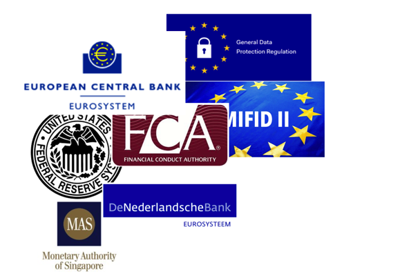
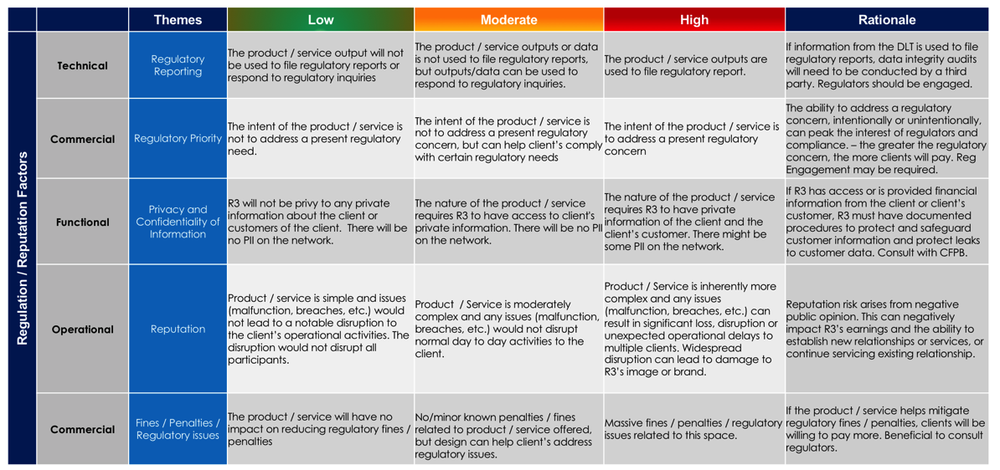

[R3 INTERNAL] Regulatory
========================


Overview
--------

How to build the regulatory approval framework for your CorDapp solution.

**This are the pre-requisites:**

- Establish proposed product
- Establish business case
- Establish commercial model
- Establish operating model
- Establish proven technology solution
- Proof test (i.e. gain feedback on) all of the above with market participants i.e. users who ultimately will help generate revenue for the platform (or achieve alternative objectives





Principles and good practices
-----------------------------

Principle / Practice 1
``````````````````````

**Perform a regulatory risk assessment for your CorDapp**

- Perform a risk assessment to determine higher / lower regulatory touchpoints

 - For example, use the risk assessment scoresheet below (developed by R3) 
 - High risk projects are generally more likely to require a regulatory strategy
 - Some CorDapp owners have also used a third-party risk assessment provider like www.riskbusiness.com to assess the overall operational risk benefits to clients using the CorDapp

- Characteristics to consider:

 - Types of clients (retail vs. institution)
 - Complexity vs. simple product
 - Whether any licenses are required for the CorDapp solution
 - Competition
 - Which jurisdictions and countries are in scope for the platform
 - Whether tokenized assets need to move across jurisdictions
 - Which existing regulated products are involved in the CorDapp operating model e.g. existing master agreements
 - Which associated governing bodies help to govern these existing products e.g. ISMA, ICMA
 - Whether the operating model will involve central banks in any way e.g. CBDC or to help pledge assets to a central bank
 - Legal characterization – of key parts of the operating model e.g. tokens
 - Qualification of the system - trading venue, clearing and/or settlement system, or none of the above
 - Regulatory governance of the business network for your CorDapp
 - Understanding what AML/KYC and other financial crime obligations apply
 - Concurrent regulatory changes e.g. GDPR, Brexit
 - Cybersecurity / data privacy / record retention: i.e. what information will be recorded on the blockchain
 - Any regulations that may prevent the solution from going live



Principle / Practice 2
``````````````````````

**What - identify any regulations that your CorDapp will help participants meet**

- This will likely be part of the business case for building the CorDapp e.g. “a collateral token application may help participants meet their LCR regulatory requirements, as well as various collateral margin regulations related to OTC derivatives, and therefore reduce capital costs for participants of the platform”
- Is the CorDapp aiming to disrupt an existing marketplace which itself is subject to regulatory oversight?
- How will regulatory integration benefit users of the platform e.g.

 - Reduce operational cost
 - Reduce regulatory fines
 - Reduce technology costs
 - Reduce regulatory reporting costs
 - Reduce operational / technology risk
 - Increase regulatory transparency e.g. is there value in CorDapp having a regulatory observation node to observe transactions on a real-time basis?

- Will the CorDapp will be used to produce regulatory reports on behalf of clients - if information from the DLT is used to file regulatory reports, data integrity audits will need to be conducted by a third party, and regulators will likely need to be engaged
- Is the intent of the CorDapp is to address a present regulatory need or concern - The ability to address a regulatory concern, intentionally or unintentionally, can peak the interest of regulators and compliance
- Are there massive fines / penalties / regulatory issues related to the intended market place of the CorDapp - if the product / service helps mitigate regulatory fines / penalties, then regulators should also be consulted
- Review these regulatory benefits (along with the business case of course) with potential participants to take onboard their feedback as early as possible

Principle / Practice 3
``````````````````````

**What - identify oversight regulators for your CorDapp solution** 

- Identify regulatory agencies that will oversee this solution (if any):

 - Local and global regulation(s)
 - Example regulations include: GDPR, SFTR, CSDR, Consumer regulations (TILA, UDAAP), exchange regulations (e.g. MTF etc…), MIFID II, LCR, BIS, BASEL III, Dodd-Frank, PFMI, IFRS9
 - Add list of regulators here from Neepa?

- R3 regulatory affairs has excellent expertise in this area and can help

 - R3 engages with over 100 national and international regulatory bodies and central banks around the globe, within the various jurisdictions in which R3 members are domiciled, to discuss the impact DLT will have on, and how DLT can be leveraged to support, regulators’ current and future needs
 - For example, the diagram below gives an overview of product regulators in the U.S. 

.. image:: C4.png
  :width: 700px
  :height: 400px
  :align: center

Principle / Practice 4
``````````````````````

- Establish who involved in the operating model needs to adhere to which regulations:

 - CorDapp builder / owner
 - Users of the CorDapp solution e.g. LCR for banks / clients
 - Third-party / infrastructure providers e.g. CSDR for custodians
 - Commercial banks, technology providers, central banks
 - Technology solution providers


Principle / Practice 5
``````````````````````

**Based on the impacted regulations, determine if regulatory functionality should be embedded in the CorDapp technical design, operating model, or if a new business case should be developed**

- If yes, then revise technical design / operating model or business case 


Principle / Practice 6
``````````````````````

- Form your strategy based on the conclusions of the previous steps
- Determine who you should form your strategy with:

 - Just yourself i.e. CorDapp owner / builder?
 - With client regulatory affairs teams?
 - With any infrastructure providers or third-parties who are helping to build the CorDapp solution?
 - With R3 Legal and Regulatory Affairs Team to help define the regulatory outreach strategy?
 - Consider whether it makes sense to establish a regulatory outreach working group with any of the above groups
 - Determine whether a legal provider can also help aspects of the regulatory outreach strategy

- Determine list of regulators to communicate with, and measures-of-success for each regulator (examples include):

 - Prioritise by intended roll-out by jurisdiction 
 - Seek feedback from regulators
 - Review, whilst avoiding any negative feedback
 - Will regulators provide approval? Generally regulators unlikely to approve a product because they don’t wish to be seen as favouring any particular market provider

- Determine communication strategy:

 - How to communicate with regulators e.g. via customers, directly, or otherwise
 - When to communicate with regulators

  - Early on to help shape the solution design?
  - A bit later after the solution has been proven e.g. via a first live transaction, or later still when there’s something closer to production to show them?

 - How often to communicate with regulators? Some more frequently than others?
 - Involve regulators directly in project(s) / tests / pilots / live transactions along the way?
 - Determine in advance what regulator will want to know about a new ‘blockchain’ solution? e.g. 

  -  Benefits of doing this on a blockchain vs normal means? 
  -  What happens in the event of a defaulting participant who can no longer honour their obligations?
  -  How safe are any assets represented on blockchain?

- Fully document your regulatory outreach strategy so that everyone involved is aware of roles and responsibilities 
- R3 regulatory affairs has excellent expertise in this area and can help


Principle / Practice 7
``````````````````````

**Execute your regulatory outreach strategy**

- Record / document all meetings with regulators, including agreed follow-ups and timing of follow-up meetings
- Based on any feedback from regulators, be prepared to modify specifications if it makes sense to do so

Principle / Practice 8
``````````````````````

**Continue to re-assess and execute your regulatory outreach strategy after CorDapp launch**

- Repeat earlier steps if required


Examples
--------

=======================================  ===================================== ==================================  ====================================
Document                                 Why its good                          Key lessons                         IP / Distribution Rights
=======================================  ===================================== ==================================  ====================================
https://r3share.mohso.com/dl/KI8SIiYKHh  Describe why this is a good example   Key things you would not do again!  public / r3 consortium / r3 internal
Filename / link here                     Describe why this is a good example   Key things you would not do again!  public / r3 consortium / r3 internal
Filename / link here                     Describe why this is a good example   Key things you would not do again!  public / r3 consortium / r3 internal
=======================================  ===================================== ==================================  ====================================

