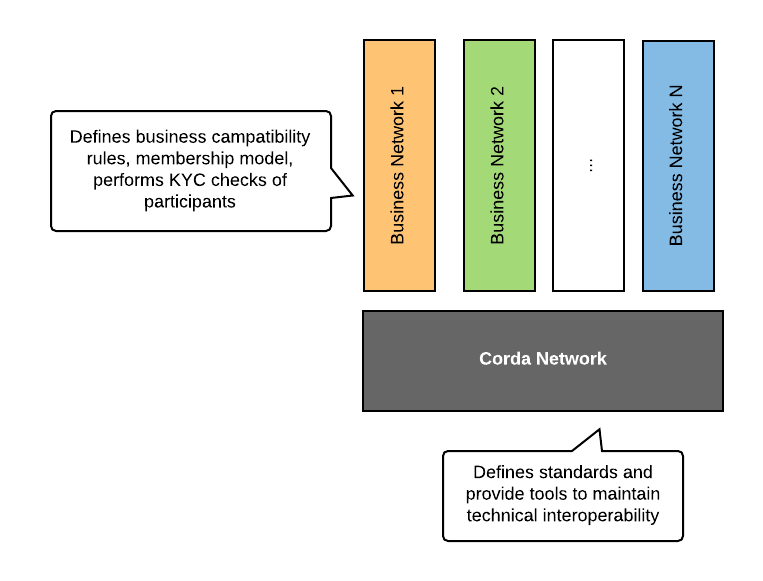
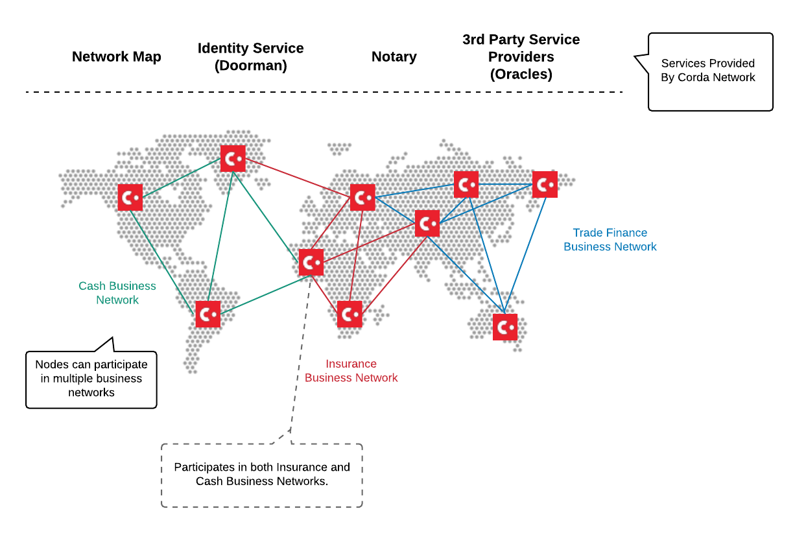
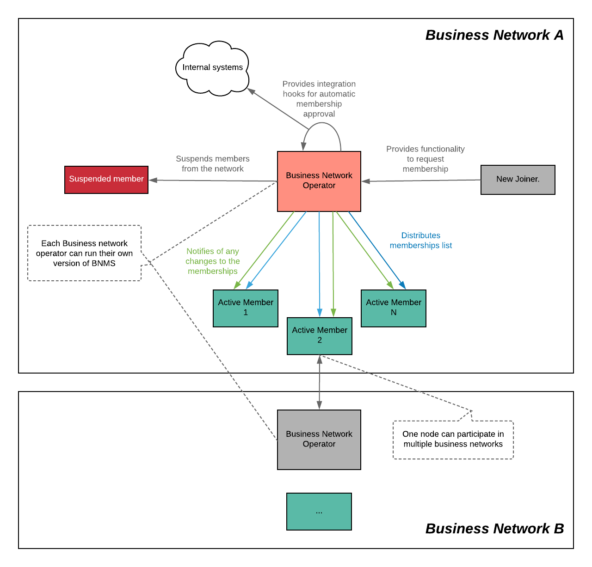

Business Network Operator Software
==================================

Business Networks is a powerful concept that enables application developers to build their own governance, membership and software distribution models on top of Corda Network. Such design allows multiple independent Business Networks to coexist and to interoperate within a single global shared environment.

Corda doesn't not provide functionality to manage Business Networks at the platform level, as different different Business Networks are envisioned to have different views on governance and membership models which might require some heavy customisations on a case by case basis.

Instead, Business Network should can be managed at the CorDapp level, giving the Business Network Operators flexibility to implement their particular requirements and to build custom integrations with their internal systems.

Software, described in this article is provided as reference implementations. While it can be used as-is, Business Network Operators are free to fork the repositories and to add their custom functionality.

For more information about the business network please refer to `this <../business-network>`__ section of the website.

Business Network Membership Management
^^^^^^^^^^^^^^^^^^^^^^^^^^^^^^^^^^^^^^

Each node on Corda Network is identified by a certificate, which includes its well-known ``X500Name`` and a Public Key. Corda Network guarantees global name uniqueness and enforces rules onto certificate structure, however participants don't undergo any additional checks (such as KYC) which might be mandatory for some business cases.

while Corda Network defines standards and provides tools to maintain technical compatibility and discoverability of the nodes, all business-level checks and membership have to be carried out at the Business Network level.

The main idea behind such split is to empower different Business Networks to implement their own governance, membership and operational models while also allowing *cross business-network* transactions, as all of the nodes within Corda Network are technically compatible with each other.

*Cross business-network transactions* can enable a secondary market for assets and would allow to perform atomic cross-asset swaps between different Business Networks participants, such as cash vs. shares for example.

Functionality to manage memberships on Business Networks is provided by Business Network Membership Service (BNMS):

* On-board new members to a business network.
* Suspend members from a business network.
* Distribute membership list to the business network members.
* Association a custom metadata (such as role, email address, phone number etc.) with membership states.
* Participate in multiple business networks for a single node.

BNMS assumes the existence of a special node - Business Network Operator (BNO), that carries an administrative role, without participating in actual business transactions.

