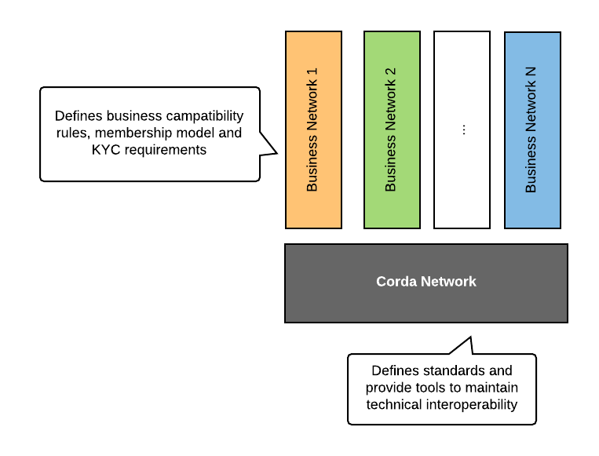
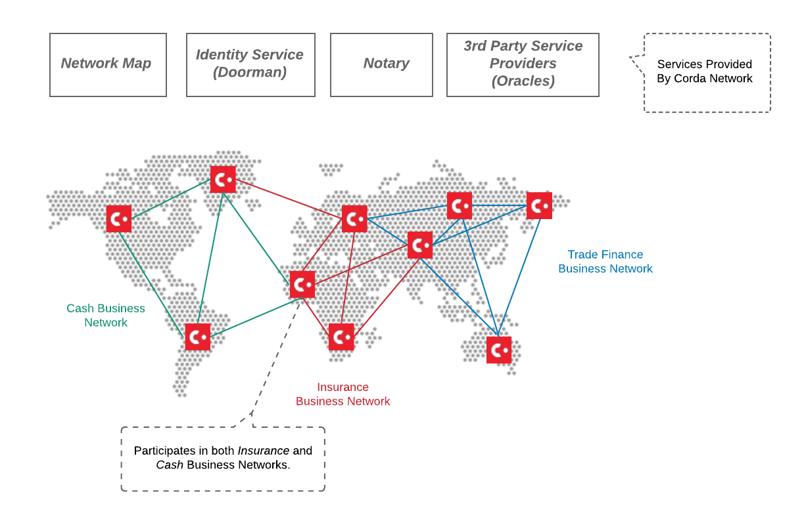
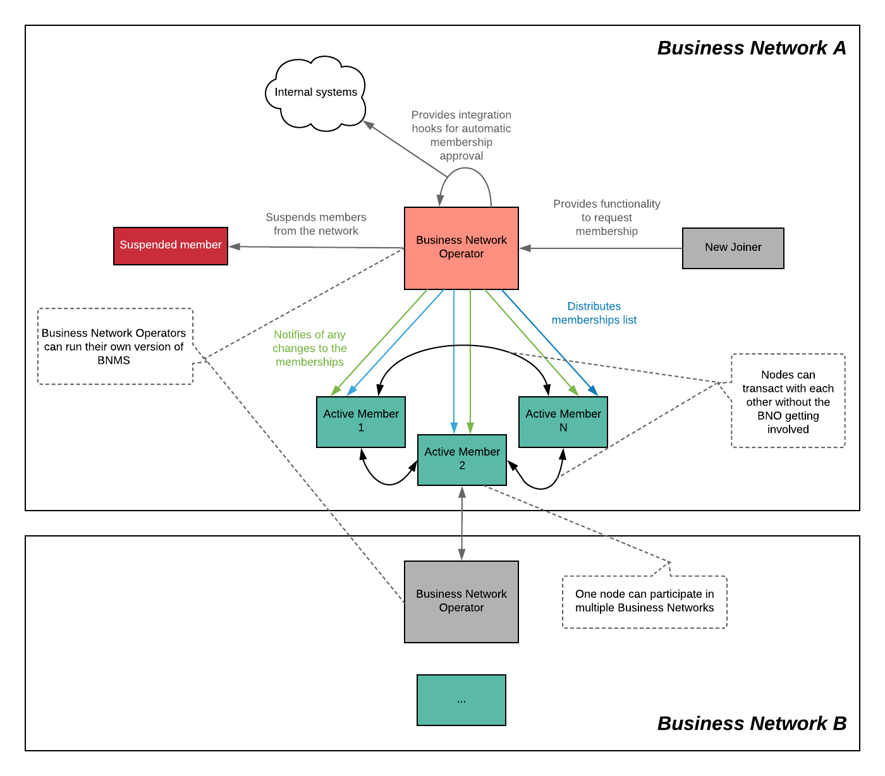
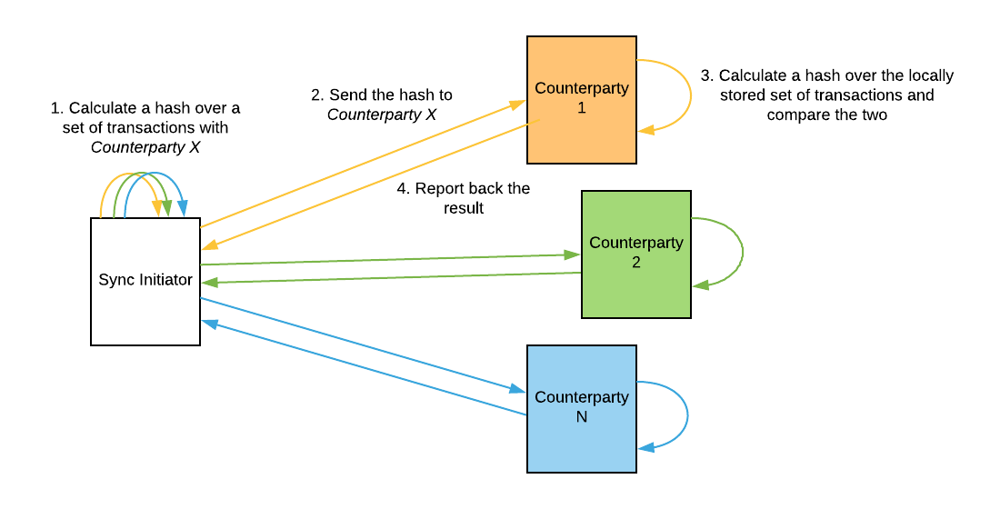
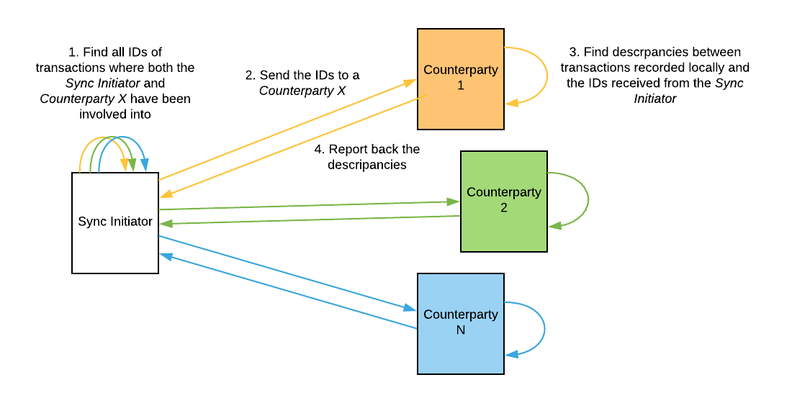
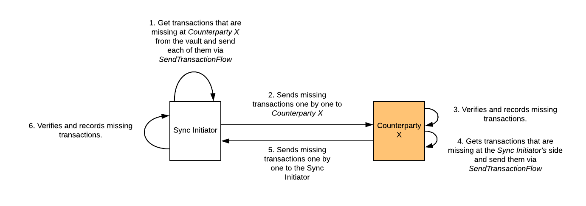

Business Network Operator Toolkit
=================================

Business Networks is a powerful concept that enables application developers to build their own governance, membership and software distribution models on top of the Corda Network. Such design allows multiple independent Business Networks to coexist and to interoperate within a single global shared environment.

Corda does not provide functionality to manage Business Networks at the platform level, as different Business Networks are envisioned to have different requirements for governance and membership models which might require some heavy code customisations on a case by case basis.

Instead, Business Network can be managed at the CorDapp level, giving the developers flexibility to implement their particular requirements and to build custom integrations with internal systems.

*Business Network Operator Toolkit* contains implementations of the following services:
* `Business Network Membership Service`_
* `Ledger Synchronization Service`_
* CorDapp Distribution Service

All implementations provide integration hooks and can be used as-is, however developers are free to fork the repository and to add customisations if needed.

For more information about the Business Networks concept please refer to `this <../business-network>`__ section of the website.

Business Network Membership Service
^^^^^^^^^^^^^^^^^^^^^^^^^^^^^^^^^^^

Each node on the Corda Network is identified by a certificate, which includes its well-known ``X500Name`` and a Public Key. While the Corda Network guarantees global name uniqueness and defines certificate structure, the Corda Network participants don't undergo any additional checks (such as KYC) which might be mandatory for some business cases.

The Corda Network defines standards and provides tools to maintain *technical compatibility* and *discoverability* of the nodes. All business-level processes, such as membership management, have to be carried out at the Business Network level.

The main idea behind such split is to empower different Business Networks to implement their own governance, membership and operational models while also allowing *cross business-network* transactions, as all of the nodes within the Corda Network are technically compatible with each other.

*Cross business-network transactions* enable a secondary market for assets and would allow participants to perform atomic cross-asset swaps between different Business Networks, for example *Cash vs. Securities*.

*Business Network Membership Service (BNMS)* provides the following functionality to manage memberships on Business Networks:

* On-boarding of new members to a Business Network.
* Suspending existing members from a Business Network.
* Distributing of a membership list to the Business Network members.
* Association of a custom metadata (such as role, email address, phone number etc.) with membership states.
* Participation in multiple Business Networks by a single node.

BNMS assumes the existence of a special node - *Business Network Operator (BNO)*, that carries out an administrative role, without participating in actual business transactions.

Implementation of the service, detailed technical docs and examples can be found `this <https://github.com/corda/corda-solutions/tree/master/bn-apps/memberships-management>`__ section of the repository.

Ledger Synchronization Service
^^^^^^^^^^^^^^^^^^^^^^^^^^^^^^

Unlike other blockchain platforms, Corda is peer-to-peer and the data is shared on the need-to-know-basis only. Corda transactions are not broadcasted to all peers on the network, but are rather shared with only those peers who participate in the transaction directly (unless a different logic has been specified by a CorDapp). That allows Corda to achieve a strong privacy in conjunction with typical blockchain guarantees such as state immutability, traceability and others. While broadcasting of transactions can be implemented at the CorDapp level, that would contradict fundamental Corda design.

Corda Ledger is subjective from each peer point of view, meaning that parties store only those transactions, which they have participated in. In the case of a disaster recovery, typical blockchain platforms would allow to restore the whole of the ledger from any peer on the network as everyone sees everything. In Corda the same can be achieved by contacting each peer separately and restoring only a part of the ledger, where the both of the parties have participated in. Such functionality is provided by *Ledger Synchronization Service*.

Ledger synchronization can be initiated by any peer on the network (*sync initiator*). It works in three distinct steps that are described below. Each next step is optional. For example some of the usecases might be fine with just identifying which transactions are missing while the others might require to actually restore the missing data.

Verify hashes over transactions with the counterparts
-----------------------------------------------------

During this step, to each counterparty the sync initiator calculates and sends a hash over a set of transactions where the both of the parties have been involved into. Upon receipt, counterparts performs the same calculations at their side, verify whether the hashes match and send the result back to the requester. For the hashes that didn't match, the sync initiator can alert the node administrator via API extension hook. *At the end of this step, the sync initiator knows with which parties he has got discrepancies in the transaction sets.*

Identify which transactions are missing
---------------------------------------

To each counterparty identified on the previous step the sync initiator sends a snapshot of IDs of transactions where both of the parties have been involved into. Upon receipt, counterparts compare the set of transactions ids from the requester with their local vault and report back: a. which transactions are missing at the sync initiator's node b. which transactions are missing at a counterparty's node. *At the end of this step, the sync initiator knows what is the exact difference in the transaction sets with each counterparty.*

Recover missing transactions
----------------------------

Counterparts exchange missing transactions with each other.

Corda Nodes use SQL databases to store their data and rely on persistent message queues for guaranteed message delivery. In some cases, network participants find beneficial to be able to check whether their view on the ledger is consistent with the network. This might be useful to make sure that no messages have been lost on their way (for example due to message queues being purged from the files system) or that the local database haven't been tampered with.

Ledger Synchronization Service allows to perform such checks, as illustrated on the picture below.

