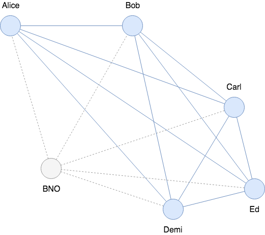

Business Network Operator Node
==============================
While business networks exist within `Compatibility Zones <https://docs.corda.net/setting-up-a-corda-network.html>`_. that define the underlying protocols and a common identity scheme, the business networks themselves have standards, policies and procedures of their own that must be enforced and while we seek to decentralise these functions where possible, there is usually a need for a trusted entity that provides certain services to the network.  This is the role of the business network operator node.

A business network operator (BNO) node provides the functions and services required to enforce the
agreed network policies and support it's ongoing operation and evolution.  The BNO node is a network participant with it's own identity and exposes it's services via standard Corda APIs.  However, generally speaking, the BNO does not participate in business transactions which are conducted directly between network users.  This arrangement is depicted in the following diagram:

Business Network Operator Services
----------------------------------
The set of services that a business network operator provides and the how they work vary by application requirements.  However, the following sections discuss some typical services that may be required:

Membership Management
^^^^^^^^^^^^^^^^^^^^^
Compatibility zone membership only provides a base identity for a Corda node.  In most cases a further level of access control is required which may include additional processes such as registration, licensing and KYC/AML checks.  The exact requirements are must be determined from the network policies but the process of allowing nodes to enter and transact on a network will be performed by the BNO node.

For an example membership management service see [link].

Master Data Management
^^^^^^^^^^^^^^^^^^^^^^
A common requirement for business networks is to maintain a set of shared master data that pertains to the application domain and made available to all participants.  This data may be served via an API or messaging system or stored on ledger and governed by one more contracts.

Authorisation
^^^^^^^^^^^^^
Depending on the network policies, certain activities such as vault synchronisations or upgrades may require authorisation from the network operator.

Monitoring & Reporting
^^^^^^^^^^^^^^^^^^^^^^
For commercial, operational or regulatory reasons it is often a requirement to monitor and/or report on network level metrics.  For example, an operator may want to monitor network health by tracking operational metrics such transaction volumes and latency.  It may also choose to bill it's members (periodically or on-demand) by tracking transactions across the network.  In any case, the network can be designed to reveal as much or as little about the transactions as appropriate.

Announcements & Signalling
^^^^^^^^^^^^^^^^^^^^^^^^^^
Certain network level events such as planned maintenance, outages and upgrades must be communicated to all network users.  In many cases, traditional communications channels may suffice but in some cases it may be appropriate to use a BNO service to distribute such information such that it can be integrated into the application itself.

Software Distribution
^^^^^^^^^^^^^^^^^^^^^
Although distribution of CorDapp jars and other shared dependancies can be done via traditional means, it may be appropriate to integrate this into the network itself.
