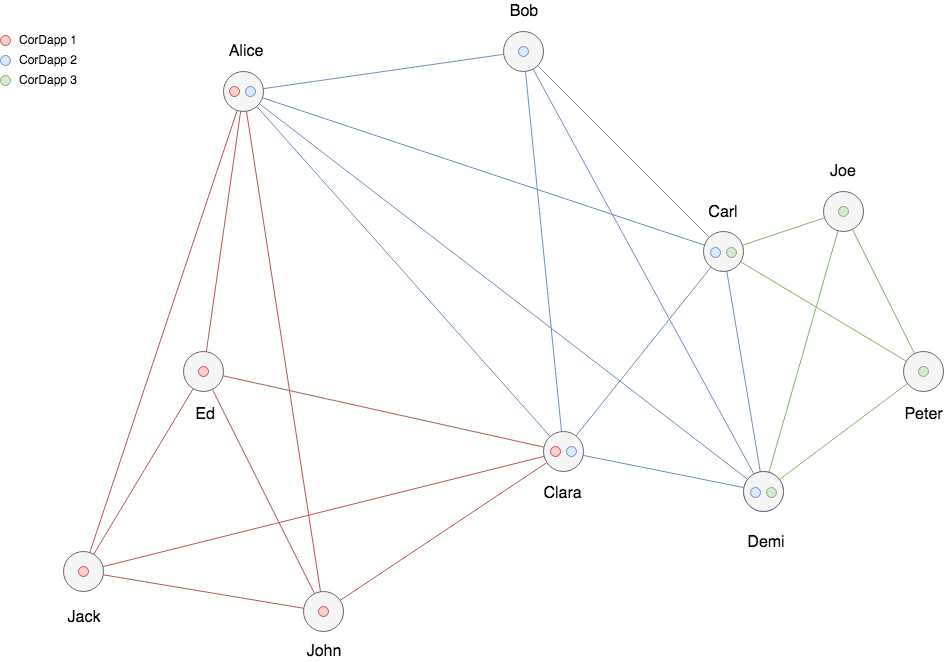

Interoperability
----------------
Our vision for Corda is a platform that allows the universal interoperability of public networks but with the privacy of point-to-point communication.  The Corda Network provides a global and openly governed environment with strong identity and privacy assurances, whereas business networks enable parties known to each other to execute transactions following agreed upon business processing in an efficient and trusted manner.

Our architecture supports interoperability among business networks. Since Corda nodes support the loading of multiple CorDapps, it is possible for a node to participate in multiple business networks simultaneously whilst still conforming to the policies and processes that each defines.

This is important as it facilitates atomic transactions across different asset types which is a core element of R3's overall vision.  The following diagram illustrates this:

Here we see a three interoperable business networks with assets and contracts defined in three separate node plugins (CorDapps).  Alice, Carl, Demi and Clara are participants in multiple networks whilst the remaining parties are only involved in one.

We can make the following observations:

 - The networks are (potentially) independently operated and governed.
 - Each network enforces its own access control policies and processes.
 - Multi-assets transactions are validated by contracts in multiple CorDapps.
 - The owners of each node make their own determination about which business networks they choose to participate.

