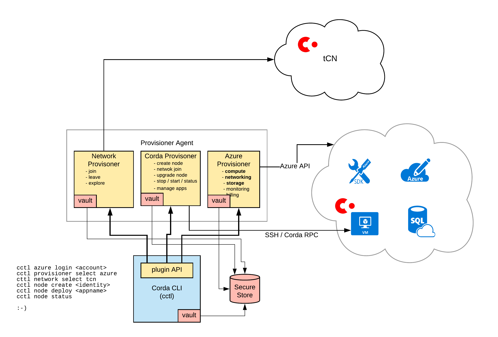

=========================
Runtime Environment
=========================

*Note, largely copy - pasted from my original design docs - needs to be edited*

Technically the environment consists of:

- the cctl command line tool

- a "plugable" vault for storing the sensitive information needed to interact with other systems, usernames, password, token, keys and so. *Note that this NOT storing the Node's keys*

- a suite of "providers" that interact with the underlying systems. There would a set for each cloud stack. Although each of these could ultimately be very platform specific, the expectation is that initially these leverage existing cross platform tools like Terraform, Kubernetes, Ansible and possible even plain old ssh.

Below is a high level architecture diagram

These tools should be distributed using the standard packing tools for the three main platforms

- Linux (Ubuntu)

- OSX

- Windows

Providers by their nature will be tend to be harder to install. They have dependencies on sometimes
complex software stacks, vendor specific libraries and external setup for the creation of accounts and keys.
So a default install would be restricted to a small set of common, lightweight provisioners. This set might be:

-  ``local`` - native OS calls via Java API

- ``docker``       - managing & running containerised corda services

- ``simple-azure`` - basic Azure services. This would be engineered for the simplicity of install and setup, and wouldn't understand how to provision the "enterprise" grade services such as key vaults, app monitoring, directory integrations and billing.

The ``cctl`` tool would be written in a language designed for building lightweight platform
specific binaries, like Go, Rust or C++. *(Rust is the current preference)*

Providers
=========

At first it might sound like each provider would need to be dedicated stack, built from scratch.
But it is envisaged that there are a collection of more fine grained providers, for example a networking
provider that allocates and manages IP address & ports. Building a set of fine grained providers at the right level
will be crucial to ultimate success of the tool and will need some careful design. As an example,
one issue is that the platforms and API provide different level of abstraction, for example with Docker
we worry less about allocating the basic building blocks of CPU, memory and disk than we do when
connecting to Azure via its basic IaaS APIs.

See also the section on the Provider API

API Style
=========

The API style follows that of Docker, some key points being:

- commands that create resources return the ID of the resource created

- an explicit named param for each option

- sensible defaults for options, so that the commands can be quite succinct in many cases

- when specifying resources, the commands accept either a user allocated name or the internal id

- any complex data is returned as a JSON string

Concepts
========

Each of the key concept is a top level command in the name space.

cctl business-network (bn)
--------------------------

Consortium level management of business network, e.g. setting policies,
joining and revoking membership.
See [business-network](commands/BusinessNetwork.md) for more detail.

cctl distributor
----------------

Determine the mechanism and rules for distributing new and updated CorDapps
to the nodes. See [distributor](commands/Distributor.md) for more detail.

cctl network
------------

Find, create and manage Corda Networks. See [network](commands/Network.md)
for more detail.

cctl node
---------

Create and manage nodes. See [node](commands/Node.md)
for more detail.

cctl provider
-------------

The provider command list and selects providers

::

  Usage:	cctl provider command [ARGS]

  Manage and select available provider. Available commands
  ls      - list available providers
  select  - select the active providers
  inspect - more details about a specific providers

cctl <provider-name>
----------------------

This is custom extension point for any provider specific commands or settings. For example a
simple Azure provider (one that is using the basic REST API for portability) might be something like.

::

  Usage:	cctl simple-azure command [ARGS]

  View and manage the configuration of the Simple Azure provider. Available commands
  inspect      - view all configuation
  region       - change the deployment region
  tenantid     - specify the tenant id for billing etc.

cctl system
-----------

The system command provide basic system wide status and management,
 and is conceptually the same as 'docker system'.

Plugin API
==========

Building a Plugin API at the right level of abstraction will need care. The example of
`Git <https://git-scm.com/docs>`_, where more complex command can be built from simpler "plumbing" commands is probably a
good start point.

The API should have the following characteristics:

1. Command Style
----------------

It is built from smaller commands that:

- take a set of known parameters

- return simple data structures

- run synchronously and either succeed or fail.

2. Technology Neutral
---------------------

It should be easy to define the API in the mainstream programming languages. It shouldn't assume any particular
transport protocol or wire format, however for ease of deployment the use of common technologies is preferred.

3. Unix style stream separation
-------------------------------

Unix makes the distinction between stdio and error streams. We should probably also add "info" for status, warnings etc.
This distinction might well be hidden from developers through their usual tools (like the java Logger). And simple
clients may well just combine them all into one stream for logging. But by keeping the streams separate at an
API layer, as the more advanced integration and tooling is built the basic separation is already in place.

