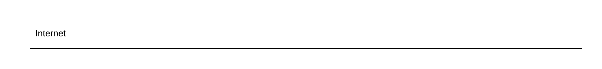
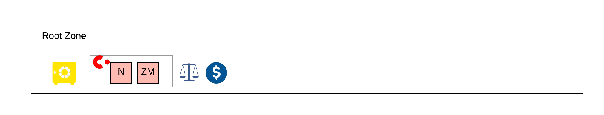
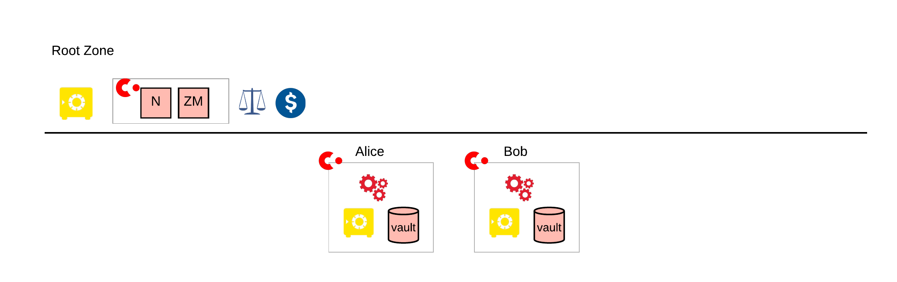
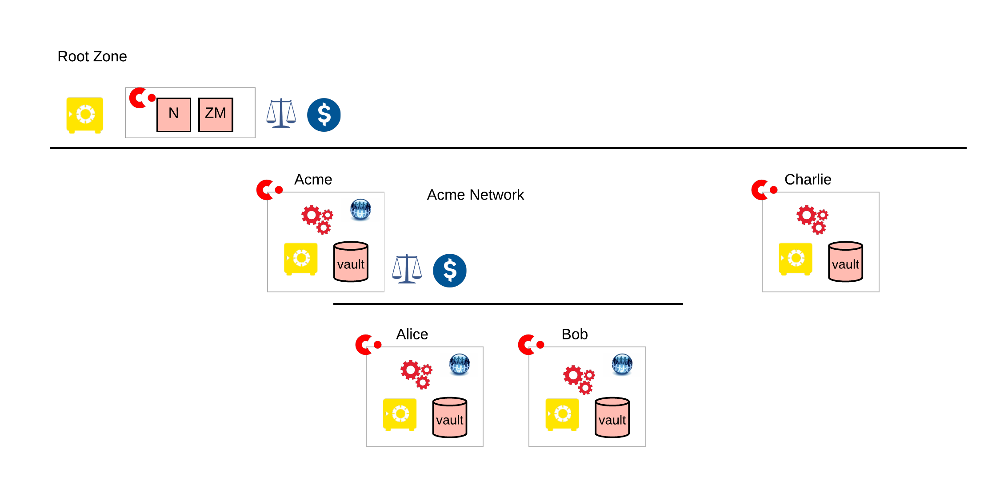

=========================
Zones, Networks and Nodes
=========================

Start with a single line horizontal line. This represents all the computers and devices attached to the Internet.
It’s a very long line, but on this diagram it is shrunk to the width of an A4 page.

Now we need to define a set of services that will let us create real transactions with Corda and attach these to our line.

- A Safe for the root set of keys from which all signatures are built

- A Notary to complete transactions

- A Zone Manager (see below)

- Some agreed rules as to how the services in the Zone should be used. This would normally include

   * the relevant the legal conditions.
   * how the Zone will be funded. This could be a commercial or community model.

The Zone Manager will allow us to add and remove Nodes and provide a directory of the available nodes. In earlier versions of Corda these
were known as the Doorman and the Network Map.

Our line now looks something like.

 
Root Zones are fundamental. It is impossible to directly transact on Corda between Root Zones. Through the independent “Corda Foundation” R3 sponsors three Root Zones for the typical “dev - test - production” cycle. You don’t have to use these. But two good reason you might want to consider them are:
Cost - It is expensive to setup and run a production quality Root Zone
Network Effect. In the DLT / Blockchain space, the more Nodes that communicate the more valuable it is. At the same time, the larger the Network,  the greater the privacy and security concerns become. As you will see later, it is possible to set the balance that is right by the right use of Sub zone, Networks and CorDapp design.

If we take a simple example of Alice Agency and Bob Bank wanting to transact, what do they need to?. There are three things 

- They each need to setup Corda Nodes

- The Nodes need to join the Root Zone

- The Nodes need to have the CorDapps they wish to use.

When this is done, our diagram now looks like the one below.

  
There are two Corda Nodes attached to the Zone. Look inside a Corda Node and you will see:

- A Safe to keep the Node’s private keys

- A Vault database. This is a regular SQL database holding the list of signed transactions held by the vault

- The CorDapp deployed to the Node

- The Corda Runtime environment
 
These are attached to the Internet, which is not a safe place. So a secure deployment would have additional firewalls
between the Node and the Internet and possibly also between the internal components, depending on an
organisation’s policy. If there is a lot of traffic or high availability requirements the components will be clustered
in some way. And finally, the keys need a good Safe. This could be an area of the file system that is strictly controlled,
but this a never as secure as some type of external device (this can be hardware or software).

More typically, rather than Alice and Bod deciding bilaterally to transact, they will join a larger Network. Note these
are typically referred to a Business Networks or Consortiums, but for simplicity we just refer to them as Networks.
These will provide common services, including:

- A maintained set of CorDapp to use

- Some higher level software, like a web portal and API integrations

- Their own legal agreements and funding models

- Some form of membership service that restricts transactions between Nodes that are members of the network
Optionally, their own instance of core services like Notaries.

So the diagram now looks like:

 
Alice and Bob are now part of the Acme Network, which is using the standard Business Network Membership Service to
control access (there are other alternatives discussed later), and has setup a Corda Node just to
run this CorDapp. The Acme Network has it own rules and fees, set independently of the rules in the
Root Zone (though it must still conform the rules and fees governing the zone.
Charlie has joined the Root Zone but cannot directly transact with Alice and Bob as he is not part of the Acme Network.

For simplicity these diagrams don’t show the lines joining Zones, Networks and Nodes. By implication every service can
talk (they are all on the Internet) and every Corda Node can potentially transact with any other
(they are all under same trust hierarchy). The Acme Network now has some restrictions, and though the overall intent is
quite obvious, it is not immediately clear from this diagram just how these restrictions are enforced within the various
layers. As we progress we will introduce more detailed concepts to describe these more clearly.
For example, the Bob Bank node may decide that there should an additional physical firewall rules to restrict Internet traffic
from just trusted Nodes (Alice), in case there is a flaw in the application level checks. This additional “belt and braces” approach
is common in secure environments.
