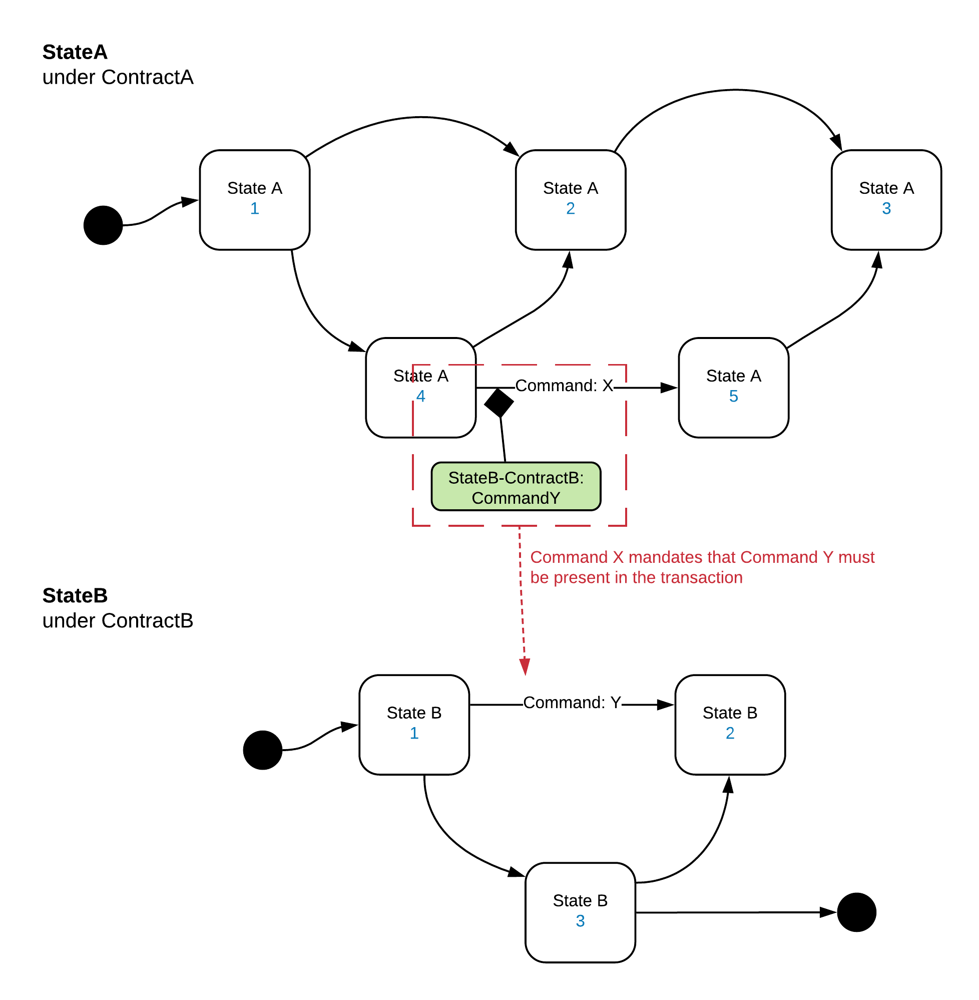

---------------------
Coupling Via Commands
---------------------

The proposed approach is to tie two or more transitions together across two or more States or instances of the same State by linking their Commands. Diagrammatically:

.. image:: ../resources/complexity/CMN2_C_Command_coupling_1.png
  :width: 60%
  :align: center

The linkages are expressed through the Transaction Level Constraints.

For the modelling, we can’t draw arrows to tie commands together, it would quickly make the model unreadable and restrict the linkages we could represent, especially if linkages could be to many different States. Instead, we reference the linked Command from the Command which is imposing the restriction.

The interpretation of this diagram is that any transaction that has StateA under ContractA invoking Command X, will not be valid unless there is a StateB under ContractB invoking Command Y also in the transaction.

This approach leads to two types of linkage:

1. Single direction Linkage

  As in the diagram above, the restriction is one way, Command X is not valid without Command Y, but Command Y can be invoked without Command X. An example of this might be a DVP transaction. A bond sales might mandate that cash changes hands, but a cash state would not mandate that it can only be used for settling bonds.

2. Two directional linkage

  Where both commands specify that they cannot be invoked without the other one being present in the transaction.
