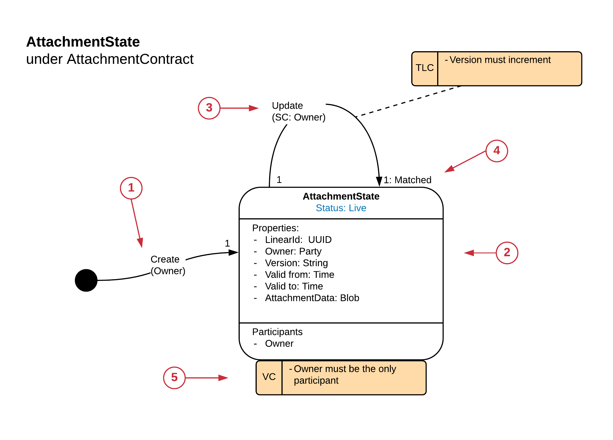
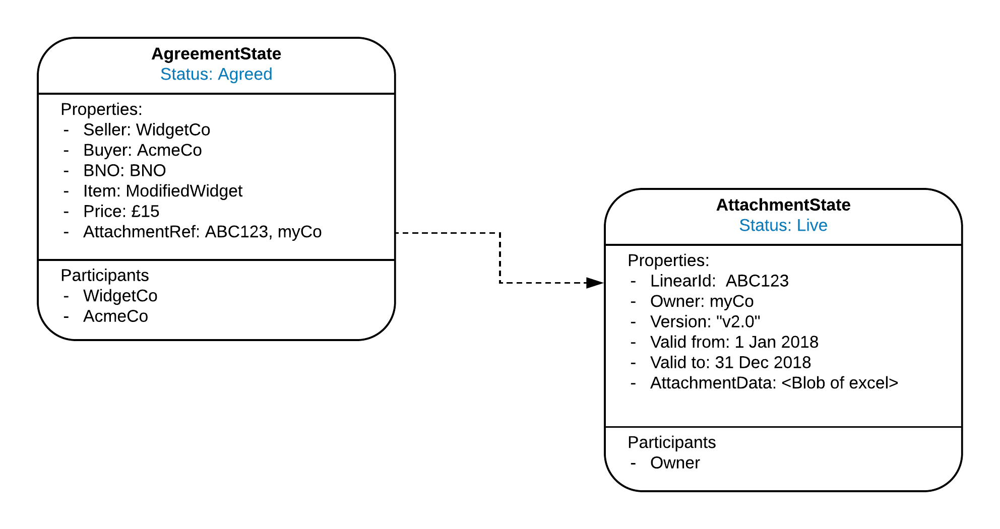

---------------------------------------------
Coupling to a State’s Evolution via Linear Id
---------------------------------------------

A CorDapp may have multiple parts which are related to each other but must evolve independently. This can be achieved by a State holding a reference to the Linear Id of another State’s evolution.

**Example: AttachmentState as self-sovereign reference data**

Two parties may have an agreement which references evolving reference data in the form of an attachment controlled, owned and distributed by a third party C (self-sovereign). The State which represents the agreement holds a reference to the LinearId of the AttachmentState.

The AttachmentState has its own State Machine which ensures the ownership and integrity of the attachment data:

1. Create

  Only the Owner can create the Reference State

2. Properties

  *	**LinearId:** Used by other States to reference this Attachment State.
  *	**Owner:** The owner of the attachment.
  *	**Version:** The version number of the attachment.
  *	**Valid from:** the date the attachment is valid from.
  *	**Valid to:** The date the attachment is valid until.
  *	**Attachment data:** The binary representation of the attachment, alternatively this could be a hash over a document.

3. Update

  Signing Constraint dictates that only the Owner can change the State.

4. Multiplicity Constraints

  'Matched' multiplicity constraint ensure that the LinearId must not change as it would break the reference links.

5. Visibility Constraint

  The owner is the only participant on the state. The consumers of the attachment would not be participants because if there was more than one consumer they would be visible to each other if they were referenced in the State.

  This does imply that there needs to be a distribution mechanism run by the Owner to distribute the updated states. This could be a push to a list of interested parties when the state changes or an on-demand request from the consuming party when they want the latest unconsumed State.

The AttachmentState would be used as shown in this State Instance diagram:

