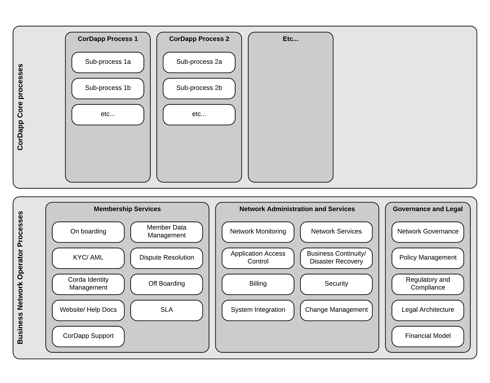

-------------------------------
High Level Process Architecture
-------------------------------
The High Level Process Architecture view is designed to show all processes required to support a CorDapp operating in a Corda Business Network

Points to note:

  * Not all processes will have a technical component
  * Not all processes will be necessary for a Minimum Viable Product (MVP)
  * The processes are arranged in a hierarchical drill down
  * The CorDApp Core Processes will be specific to the particular CorDapp being designed
  * The BNO Processes are a suggested set of processes that a BNO might need to run
  * To show further detail for each white box, use the BPMN view
