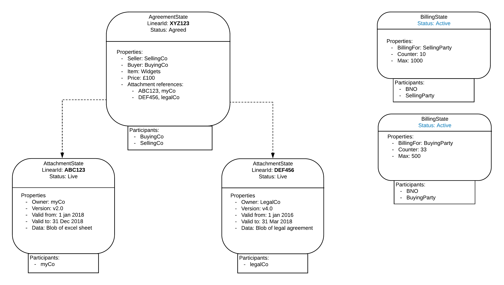
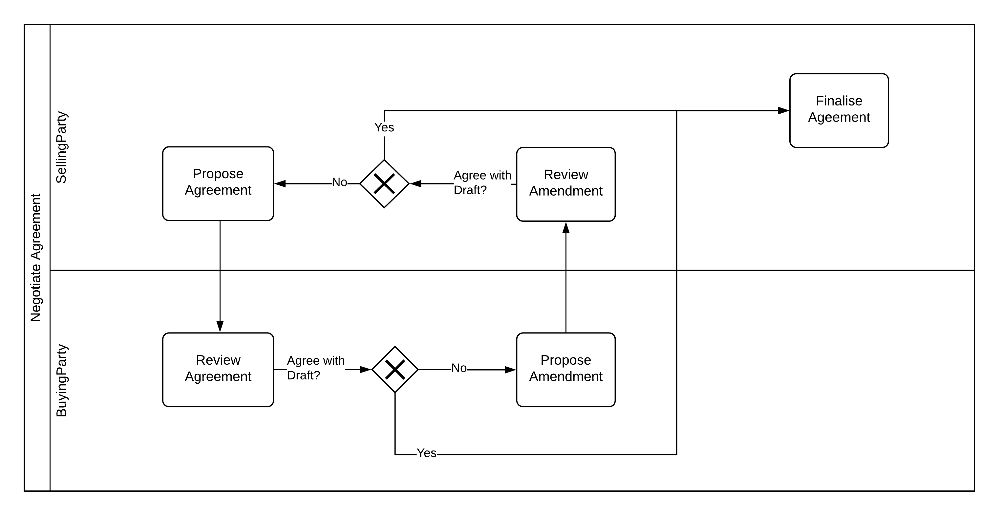
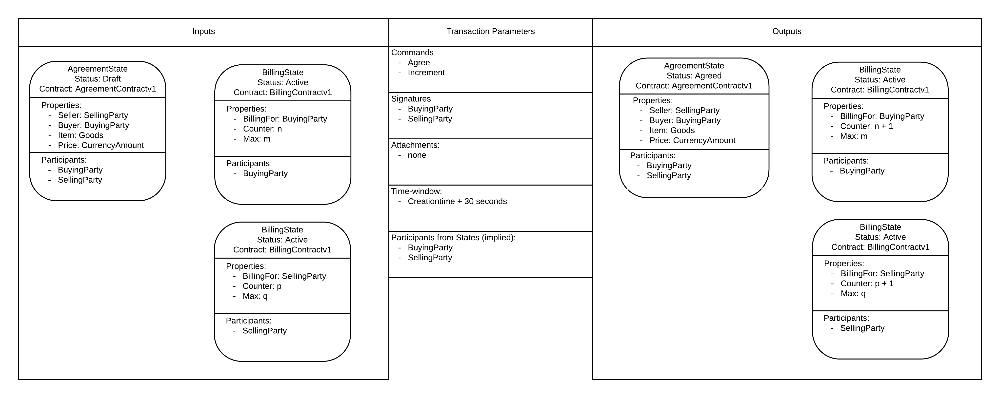

=================================
Introduction to Corda Modelling Notation
=================================

----------------------------
Why Corda Modelling Notation
----------------------------

From working with several of R3’s members and partners, a common challenge is how to write down a Corda design. A CorDapp has a lot of interacting parts: States, Contracts, Flows, Transactions, API’s, Participants, Signers. It’s difficult to capture, and hence reason, about the behaviour of the whole CorDapp.

There is a risk that if inappropriate modelling techniques are used important dimensions of the design could be obscured leading to sub-optimal design decisions. Working on a design when you can’t quite write it down can also cause poor communication and inefficiencies within teams, this can lead to frustration and we want people to be happy using Corda.

There are some specific drivers which have led to the requirement to develop Corda Modelling Notation (CMN)

**1. Standard architecture tools don’t capture CorDapp designs**

  Describing computer application designs is not a new problem, there are many existing techniques for design and architecture. However, Corda introduces some new dimensions that don’t fit with current techniques. Where there may be appropriate techniques, it’s not always obvious which are best to use and they may require modification to get the most out of them.

  The approach taken whilst developing Corda Modelling Notation is to reuse existing architecture and design techniques as much as possible, only extending where Corda brings a new dimension or requires a different view for increased clarity. Much of CMN should look familiar.

**2. CorDapp complexity is increasing**

  CorDapps are becoming more complex. PoCs and Prototypes are great for learning, demoing and establishing the amazing potential of Corda, but when things move to production, as many teams are, complexity and risk will increase. For example:

    * The CorDapp must cater for all eventualities, not just the ‘happy path’. In a PoC you can prove that, say, an asset can move from ‘Party A’ to ‘Party B’. In a production environment, you need to be able to handle dispute resolution, Regulator intervention, payment fails etc… whilst still maintaining the integrity of the application.

    * Corda is designed to operate in an environment where there are Byzantine actors. Users need to be confident enough to allow real value to be put on the CorDapp. They need to know that a nefarious actor cannot steal an asset or manipulate the agreement. Hence, the CorDapp needs to be demonstrably resilient to errors or malicious attack.

    * Production CorDapps are likely to have multiple interacting components, for example in addition to the core CorDapp function, you could have interacting components to provide BNO (Business Network Operator) Billing, BNO whitelisting for participants, Associated Accounting Balances, co-dependent agreements etc…

  All of these, and more, point to an increase in design difficulty, likely beyond the point where it can fit reliably in solely in the developer’s head. We need techniques to be able to communicate and reason about complex CorDapp designs.

**3. Corda has two distinct layers, ignore them at your peril...**

  You can think of a CorDapp as having two distinct layers, the Ledger layer and the Orchestration layer. There are of course, many other parts such as UI, interfaces to other client systems, non-ledger storage etc., but they are left off for clarity.

.. image:: resources/CMN_Cordapp_split.png
  :width: 60%
  :align: center

.

  **The Ledger layer** provides the Distributed Ledger guarantees over common data and common processing logic. It includes the Corda States and the Corda Contracts which govern the evolution of those States through Transactions which update the ledger.

  **The Orchestration layer** coordinates the communications between parties, builds proposed transactions, provides APIs to trigger actions on the ledger.

  There is a very important distinction between these two layers: The Ledger layer is the only part of the CorDapp where you get the Distributed Ledger guarantee of shared data and shared execution logic.

  The Flows and API may be distributed as part of the developed CorDapp and may represent the intended use of the CorDapp, but any party can rewrite the Flow layer to execute any logic they want.

  Put another, exaggerated way, an assets trading CorDapp might be distributed with flows for issuance, transfer, settlement, ie the intended actions. However, just because the CorDapp developers didn’t write a ‘steal all the assets’ Flow doesn’t mean that a nefarious actor can’t write their own. It’s the constraints baked into the Ledger layer which stop the assets being stolen.

  Hence, when describing and reasoning about Corda, it is essential to split out the Ledger layer from the Orchestration layer and consider them separately. The Modelling notation needs to draw a clear distinction between these layers.

--------------------------------
Aims of Corda Modelling Notation
--------------------------------

In summary, Corda Modelling Notation should:

  1.	Allow corda designs to be documented in an accurate, clear and concise way to aid common understanding and reasoning over the design.

  2.	Describes and enables reasoning about key aspects of CorDapp design:

    *	Shared data and state
    *	Shared processing logic
    *	Permissioning (via digital signatures)
    *	Visibility of data to different participants
    *	Security

  3.	Draw a clear distinction between Ledger layer and Orchestration layer functionality.

  4.	Cope with increase Complexity, importantly the modelling notation must not scale in complexity faster than the underlying application that the Model is representing.

  5.	Minimised new modelling techniques by reusing and extending existing architecture and design techniques.

  6.	Allows standardised representation of reusable design patterns, including techniques for managing complexity.

------------------------------
Corda Modelling Notation Views
------------------------------

This section gives an example of each CMN view, see the section dedicated to each view for more details.

**Ledger - State Machine View**

This view is based on the concept of Finite State Machines. It treats each Corda State as being able to be in a finite number of statuses, describe the allowed transitions between statuses and the additional constraints which restrict those transitions.

The emphasis of this view is in articulating all possible evolutions of a given Corda State, enabling reasoning about how undesirable transitions are prevented from occurring.

It does not seek to show how a corda state is intended to evolve, only how it can evolve based on the constraints present in the State and Contract which governs it. For example:

.. image:: resources/CMN_example.png
  :width: 80%
  :align: center

**Ledger - State Instance View**

Although looking somewhat similar to the State Machine View, the States Instance View is instead a snap shot in time of a set of States in a particular status together with how they are linked together. It represents a subset of the total ledger and is independent of how the states came to be on the ledger. It is not trying to communicate controls or transitions, it is a just point in time instance diagram.

**Orchestration - Business Process Modelling Notation (BPMN) View**

The BPMN (Business Process Modelling Notation) view aims to describe the business process. From a CorDapp perspective the purpose of this view is to identify all the possible business events that result in the requirement to update the ledger. For example:

For each Business event that requires a Ledger update, there will be two further views, the transaction instance view and a Flow sequence view.

**Orchestration - Transaction Instance View**

The transaction Instance view shows the specific transaction that will be built for the business event.

It needs to be compatible with the allowed transitions in the Transaction Layer View, but instead of representing all possible evolutions of a State, this is a specific instance of a transition. for example:

**Orchestration - Flow Sequence View**

The Flow Sequence view shows how the Corda Flow frame work is used to correctly form, agree, notarise and distribute the transaction in the Transaction Instance View. For example:

.. image:: resources/CMN_Reduced_sequence.png
  :width: 80%
  :align: center

In the following sections we will build each of these views up from first principles with examples and show how they interact with each other to facilitate the architecture and design process.

---------------------------
Modelling Complexity in CMN
---------------------------

The Modelling Complexity in CMN section considers how to scale complexity in a CorDapp by applying the concepts of high cohesion / low coupling to CorDapp designs.

It proposes splitting the design into modules where individual Corda State types provide related functionality (high cohesion) which are then (loosely) coupled together by one of four mechanisms:

  1)	Flow level coupling
  2)	Commands coupling
  3)	Coupling to a State instance via StateRefs
  4)	Coupling to a state’s evolution via Linear Id
