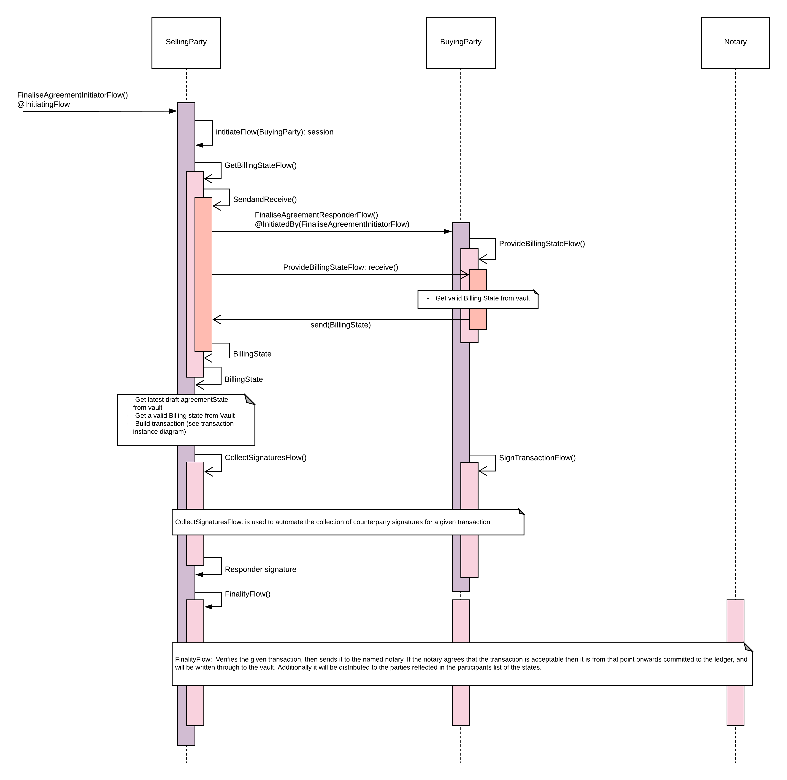

=================================
Corda Modelling Notation Overview
=================================

As CorDapps become more complicated there is a need for CorDapp analysts, designers and developers to be able to document and reason about CorDapp designs. This paper proposes Corda Modelling Notation (CMN), a bespoke modelling notation to represent CorDapp designs.

This page gives an overview of each of the CMN views, the sub pages build up each of the Views step by step.

Modelling Cordapps
------------------

When modelling we can consider Corda as two distinct layers, the Ledger Layer and the Orchestration Layer:

.. image:: resources/CMN_Cordapp_split.png
  :width: 60%
  :align: center

The Ledger layer
~~~~~~~~~~~~~~~~

The Ledger Layer provides the Distributed Ledger guarantees over common data and common processing logic. It includes the Corda States and the Corda Contracts which govern the evolution of those States through Transactions which update the ledger.

There are two views which represent the Ledger layer

**State Machine View**

This view is based on the concept of Finite State Machines. It treats each Corda State as being able to be in a finite number of statuses, describe the allowed transitions between statuses and the additional constraints which restrict those transitions.

The emphasis of this view is in articulating all possible evolutions of a given Corda State, enabling reasoning about how undesirable transitions are prevented from occurring.

It does not seek to show how a corda state is intended to evolve, only how it can evolve based on the constraints present in the State and Contract which governs it. For example:

.. image:: resources/CMN_example.png
  :width: 80%
  :align: center

**State Instance View**

Although looking somewhat similar to the State Machine View, the States Instance View is instead a snap shot in time of a set of States in a particular status together with how they are linked together. It represents a subset of the total ledger and is independent of how the states came to be on the ledger. It is not trying to communicate controls or transitions, it is a just point in time instance diagram.

.. image:: resources/CMN_Instance_view.png
  :width: 60%
  :align: center

The Orchestration layer
~~~~~~~~~~~~~~~~~~~~~~~

The Orchestration Layer coordinates the communications between parties, builds proposed transactions, provides APIs to trigger actions on the ledger.

An important distinction from the Ledger layer is that the Orchestration layer is only a suggested set of functionality distributed from the CorDapp developer. A Party operating on the network can, and likely will, rewrite their Orchestration Layer to implement bespoke functionality. Any Logic which must be guaranteed between the Parties must be encoded in the Ledger Layer.

The Orchestration layer is modelled by three views.

**Business Process Modelling Notation (BPMN) View**

The BPMN (Business Process Modelling Notation) view aims to describe the business process. From a CorDapp perspective the purpose of this view is to identify all the possible business events that result in the requirement to update the ledger. For example:

.. image:: resources/CMN_BPMN.png
  :width: 60%
  :align: center

For each Business event that requires a Ledger update, there will be two further views, the transaction instance view and a Flow sequence view.

**Transaction Instance View**

The transaction Instance view shows the specific transaction that will be built for the business event.

It needs to be compatible with the allowed transitions in the Transaction Layer View, but instead of representing all possible evolutions of a State, this is a specific instance of a transition. for example:

.. image:: resources/CMN_Transaction_instance.png
  :width: 80%
  :align: center

**Flow Sequence View**

The Flow Sequence view shows how the Corda Flow frame work is used to correctly form, agree, notarise and distribute the transaction in the Transaction Instance View. For example:

In the following sections we will build each of these views up from first principles with examples and show how they interact with each other to facilitate the architecture and design process.

Modelling Complexity in CorDapps
--------------------------------

This paper also considers how to scale complexity in a CorDapp by applying the concepts of high cohesion / low coupling to CorDapp designs.

It proposes splitting the design into modules where individual Corda State types provide related functionality (high cohesion) which are then (loosely) coupled together by one of four mechanisms:

  1)	Flow level coupling
  2)	Commands coupling
  3)	Coupling to a State instance via StateRefs
  4)	Coupling to a state’s evolution via Linear Id
