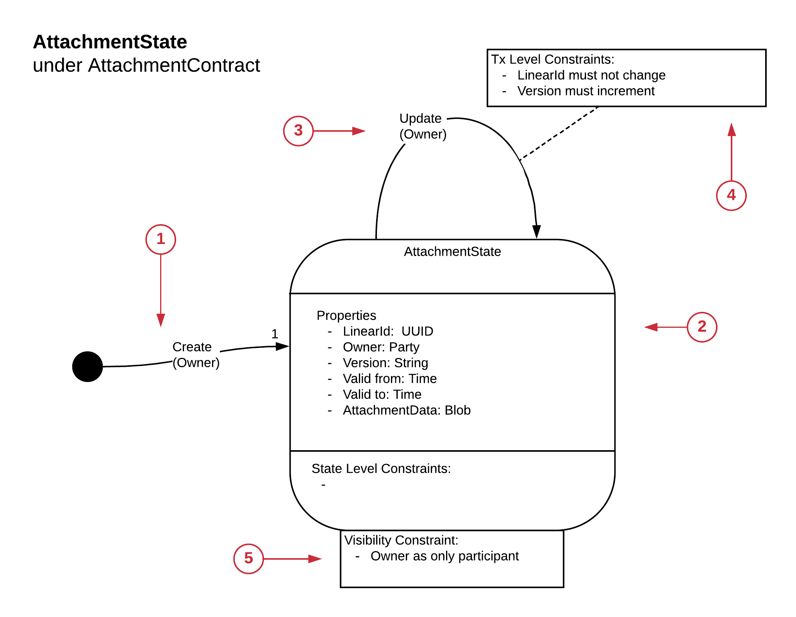
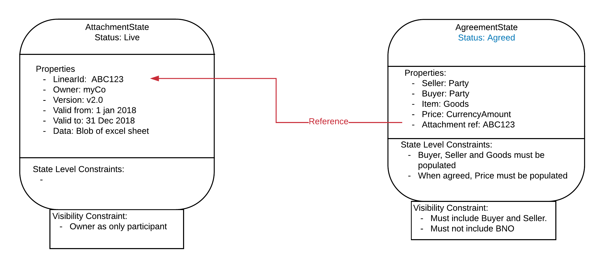

===================
Managing Complexity
===================

So far, we have focused on modelling CorDapps which have a single State type. However, production CorDapps are likely to have more than one type of Corda States interacting with each other.

In order to cope with the increased complexity that multiple state types introduce, we can use the concepts of high cohesion and low coupling. From Wikipedia:

  *	Cohesion refers to the degree to which the elements inside a module belong together.

  *	Coupling is the degree of interdependence between software modules

We can consider each of the Corda States represented by its own State Machine as a module. Hence, to achieve high cohesion the functions performed by the State should all be related. The challenge is to work out how to couple the modules.

There are a number of potential couplings:

  1. Flow level coupling
  2. Commands coupling
  3. Coupling to a State instance via StateRefs
  4. Coupling to a state’s evolution via Linear Id

Note, currently these approaches have not been directly tested in code.

-------------------
Flow Level Coupling
-------------------

This is the loosest form of coupling, there is no coupling at the State Machine level, any coupling is purely done by including the states to be coupled in the same transaction when assembling the transaction in the flows.

Note, using Flow Level Coupling does not provide any guarantees of behaviour at the transaction level.

---------------------
Coupling Via Commands
---------------------

The proposed approach is to tie two or more transitions together across two or more States or instances of the same State by linking their Commands. Diagrammatically:

.. image:: resources/CMN_Coupling_commands_dig1.png
  :width: 80%
  :align: center

The linkages are expressed through the Transaction Level Constraints.

For the modelling, we can’t draw arrows to tie commands together, it would quickly make the model unreadable and restrict the linkages we could represent, especially if linkages could be to many different States. Instead, we reference the linked Command from the Command which is imposing the restriction.

.. image:: resources/CMN_Coupling_commands_dig2.png
  :width: 80%
  :align: center

The interpretation of this diagram is that any transaction that has StateA under ContractA invoking Command X, will not be valid unless there is a StateB under ContractB invoking Command Y also in the transaction.

This approach leads to two types of linkage:

1. Single direction Linkage

  As in the diagram above, the restriction is one way, Command X is not valid without Command Y, but Command Y can be invoked without Command X. An example of this might be a DVP transaction. A bond sales might mandate that cash changes hands, but a cash state would not mandate that it can only be used for settling bonds.

2. Two directional linkage

  Where both commands specify that they cannot be invoked without the other one being present in the transaction.

The following example shows the interaction of two types of Corda State:

  * An Agreements state with which a Buyer and Seller agree the terms of an exchange of goods over corda

  * A Billings state which counts billable transactions so that the Business Network Operator can bill usage on their network without being party to the actual transactions

.. image:: resources/CMN_Coupling_full_example.png
  :width: 100%
  :align: center

By mapping these modules out we can spot a contradiction in the privacy requirements (highlighted in red) the visibility constraints of the AgreementState say that the BNO must not get visibility of the Agreements states. However, when the Redeem Command is invoked on the BillingState corda will resolve the transaction history of the BillingState which will pull in all the previous transactions, those transactions will include the AgreementStates which the BNO is not allowed to see.

(Note, this problem can be resolved by using a prepaid count down BillingState which never gets returned to the BNO, or possibly in the future by SGX validation of the historic chain)

------------------------------------------
Coupling to a State Instance via StateRefs
------------------------------------------

In some cases, a State will need to hold a reference to another specific instance of a state on the ledger. It can do this by including the StateRef in its properties.

The StateRef consists of the hash of the transaction which created the referenced State and the index of the state in the transaction’s outputs, hence from the StateRef any previously state that has been committed to the ledger can be reference. Note, it doesn’t matter if the state is consumed or unconsumed.

If the requestor doesn’t have the state in its vault, a flow will need to be implemented to get the state from a party who does have the state.

This pattern may be useful when a piece of reference data, controlled by another entity needs to be tagged on to the state.

---------------------------------------------
Coupling to a State’s Evolution via Linear Id
---------------------------------------------

A CorDapp may have multiple parts which are related to each other but must evolve independently. This can be achieved by a State holding a reference to the Linear Id of another State’s evolution.

Example: AttachmentState as self-sovereign reference data
~~~~~~~~~~~~~~~~~~~~~~~~~~~~~~~~~~~~~~~~~~~~~~~~~~~~~~~~~

Two parties may have an agreement which references evolving reference data in the form of an attachment controlled, owned and distributed by a third party C (self-sovereign). The State which represents the agreement holds a reference to the Linear Id of the AttachmentState.

The AttachmentState has its own State Machine which ensures the ownership and integrity of the attachment data:

1. Create

  Only the Owner can create the Reference State

2. Properties

  *	**LinearId:** Used by other States to reference this Attachment State.
  *	**Owner:** The owner of the attachment.
  *	**Version:** The version number of the attachment.
  *	**Valid from:** the date the attachment is valid from.
  *	**Valid to:** The date the attachment is valid until.
  *	**Attachment data:** The binary representation of the attachment, alternatively this could be a hash over a document.

3. Update

  Only the Owner can change the State.

4. Constraints

  Also applies constraints to ensure that the LinearId must not change which would break the reference links.

5. Visibility

  The owner is the only participant on the state. The consumers of the attachment would not be participants because if there was more than one consumer they would be visible to each other if they were referenced in the State.

  This does imply that there needs to be a distribution mechanism run by the Owner to distribute the updated states. This could be a push to a list of interested parties when the state changes or an on-demand request from the consuming party when they want the latest unconsumed State.

The AttachmentState would be used as follows:

However, this representation is a little clumsy, it is mixing a view which is designed to show all possible actions with a specific instance of a linkage, we need a different view to represent a snapshot in time of the States and their linkages. For this we need the States Instance View
