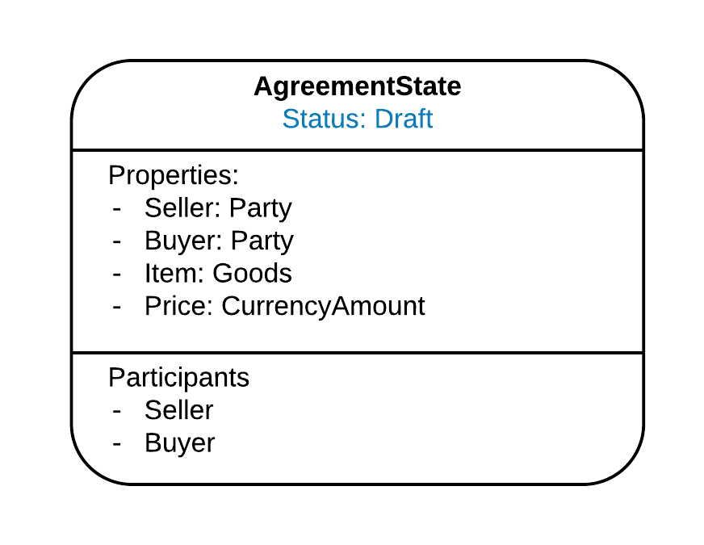
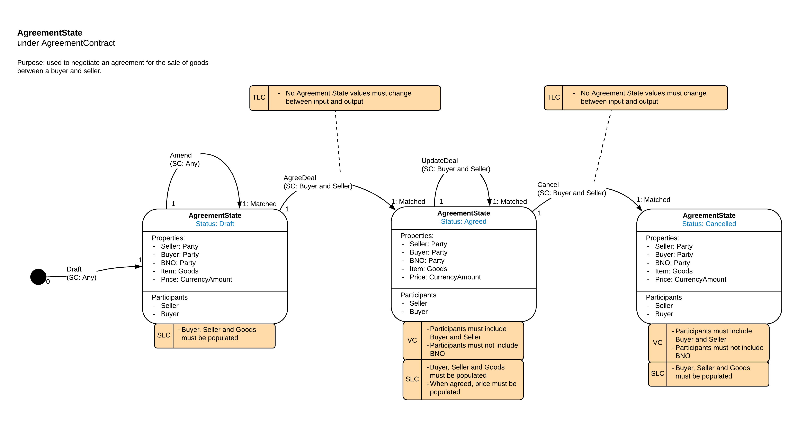
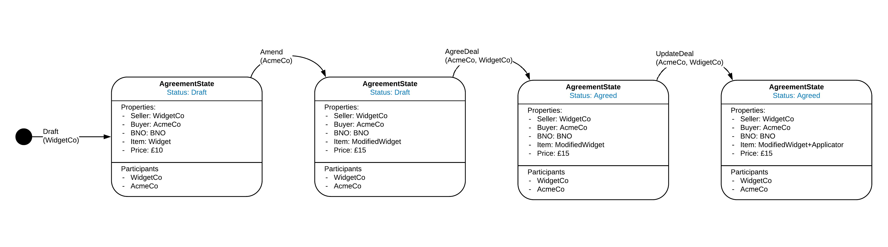
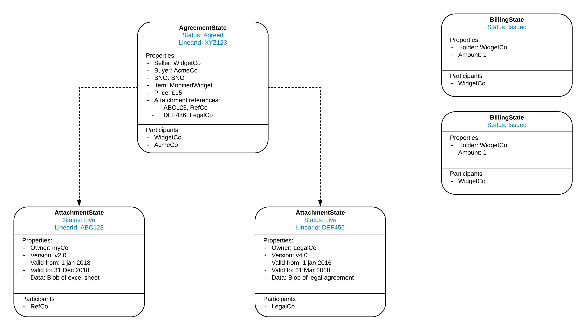
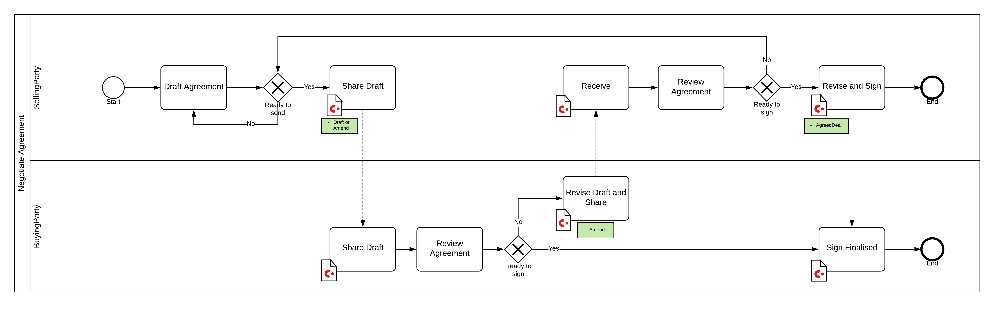
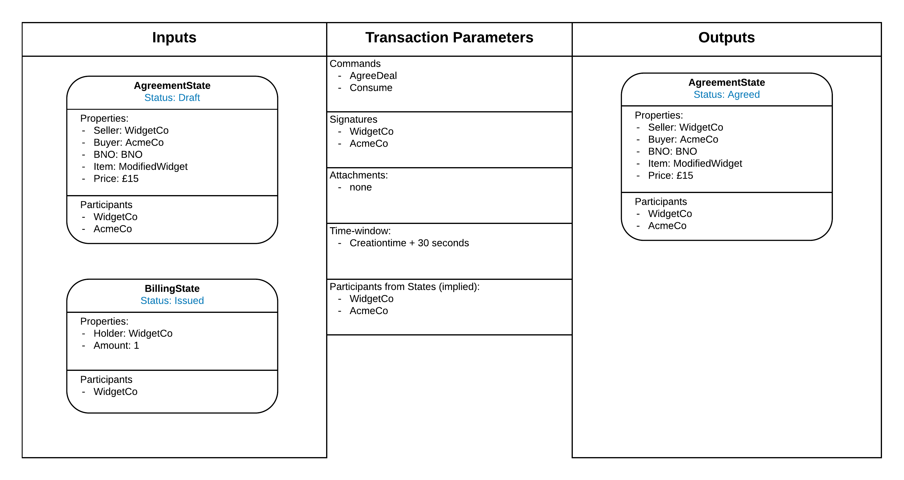
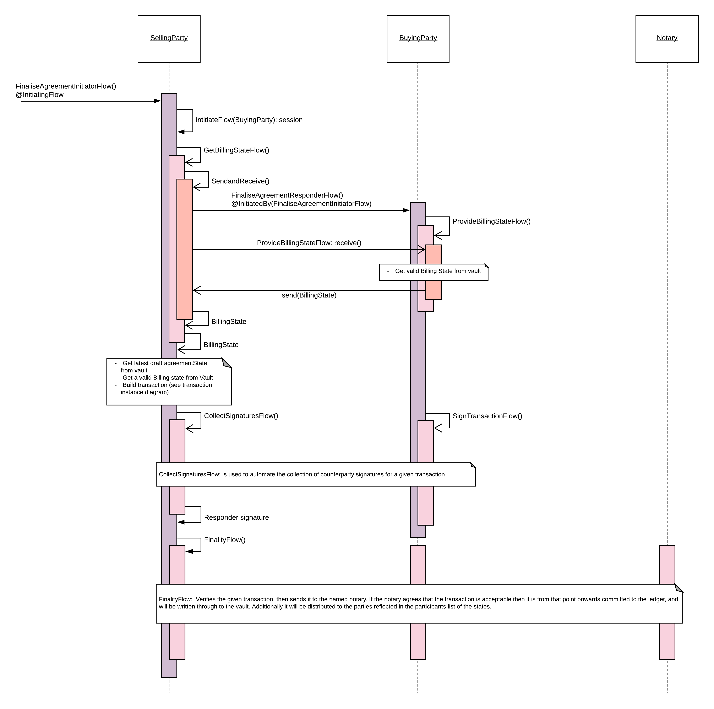

------------------------------
Corda Modelling Notation Views
------------------------------

This section gives an example of each CMN view, see the sections dedicated to each view for more details.

**Representing States**

For the latest version of CMN we have standardised the representation of a Corda State across all the various views. The base representation of a Corda State is as follows and will be used in all three of the Ledger Layer views:

**State Machine View (Ledger Layer)**

This view is based on the concept of a Finite State Machine. It treats each Corda State as being able to be in a finite number of Statuses, describes the allowed transitions between Statuses and the additional constraints which restrict those transitions. The emphasis is in articulating all possible evolutions of a given Corda State, enabling reasoning about how undesirable transitions are prevented from occurring. It does not seek to show how a Corda State is intended to evolve, only how it **can** evolve based on the constraints present in the State and Contract which governs it. For example:

**State Evolution View (Ledger Layer)**

The State Evolution view aims to show how a State may evolve over time. You can think of it as one of many potential paths through the transitions permitted by a State Machine shown in the State Machine View.

**State Instance View (Ledger Layer)**

The States Instance view is a subjective snap shot in time of a subset of States in a node's vault. It shows the state statuses and how they may be linked together and is independent of how the states came to be on the ledger. It is not trying to communicate controls or transitions, it is a just point in time instance diagram.

**Business Process Modelling Notation (BPMN) View (Orchestration Layer)**

The BPMN view aims to describe the business process. From a CorDapp perspective the purpose of this view is to identify all the business events that result in the an update the ledger. For example:

For each business event that requires a Ledger update, there will be two further views, the Transaction Instance View and a Flow Sequence View.

**Transaction Instance View (Orchestration Layer)**

The Transaction Instance View shows the specific Transaction that will be built for the business event. It needs to be compatible with the allowed transitions in the Transaction Layer View, but instead of representing all possible evolutions of a State, this is a specific instance of a Transition. for example:

**Flow Sequence View (Orchestration Layer)**

The Flow Sequence View shows how the Corda Flow framework is used to correctly form, agree, notarise and distribute the Transaction shown in the Transaction Instance View. For example:

For each view please see it's dedicated section for more details.
