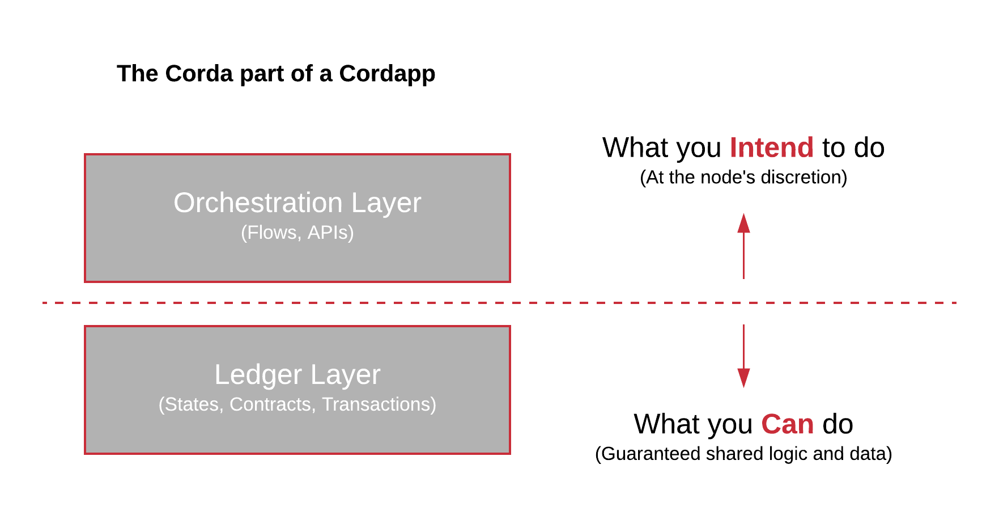

----------------------------
Why Corda Modelling Notation
----------------------------

There are some specific drivers which have led to the development of Corda Modelling Notation (CMN)

**1. Standard architecture techniques don’t capture all aspects of a CorDapp design**

  Describing computer application designs is not a new problem, there are many existing architectural and design techniques. However, Corda introduces some new dimensions that don’t fit with current techniques. In addition, where there may be appropriate existing techniques, it’s not always obvious which are best to use and they may require modification to make them applicable for CorDapps.

  The approach taken whilst developing Corda Modelling Notation was to reuse existing architecture and design techniques as much as possible, only extending where Corda brings a new dimension or requires a different view for increased clarity. Much of CMN should look familiar.

**2. CorDapp complexity is increasing**

  CorDapps are becoming more complex. PoCs and Prototypes are great for learning, demoing and establishing the amazing potential of Corda, but when things move to production, as many teams are, complexity and risk will increase. For example:

    * The CorDapp must cater for all eventualities, not just the ‘happy path’. In a PoC you can prove that, say, an asset can move from ‘Party A’ to ‘Party B’. In a production environment, you need to be able to handle dispute resolution, Regulator intervention, payment fails etc… whilst still maintaining the integrity of the application and the network.

    * Corda is designed to operate in an environment where there are Byzantine actors. Users need to be confident enough to allow real value to be transacted on the CorDapp. They need to know that a nefarious actor cannot steal an asset or manipulate the agreement. Hence, the CorDapp needs to be demonstrably resilient to errors or malicious attack.

    * Production CorDapps are likely to have multiple interacting components. For example, in addition to the core CorDapp function, you could have interacting components to provide BNO (Business Network Operator) Billing, BNO whitelisting for participants, associated accounting balances, co-dependent agreements etc…

  All of these, and more, point to an increase in design difficulty, likely beyond the point where it can fit reliably solely in the developer’s head. We need techniques to be able to communicate and reason about complex CorDapp designs.

**3. Corda has two distinct layers, ignore them at your peril...**

  You can think of a CorDapp as having two distinct layers, the Ledger Layer and the Orchestration Layer. There are of course, many other parts such as UI, interfaces to other client systems, non-ledger storage etc., but they are left off for clarity.

.

  The **Ledger Layer** provides the Distributed Ledger guarantees over common data and common processing logic. It includes the Corda States and the Corda Contracts which govern the evolution of those States through Transactions which update the ledger.

  The **Orchestration Layer** coordinates the communications between parties, builds proposed transactions, provides APIs to trigger actions on the ledger.

  There is a very important distinction between these two layers: The Ledger layer is the only part of the CorDapp where you get the Distributed Ledger guarantee of shared data and shared execution logic. The Flows and API may be distributed as part of the developed CorDapp and may represent the intended use of the CorDapp, but any party can rewrite the Flows in the Orchestration Layer to execute any logic they want.

  Put another, exaggerated way, an assets trading CorDapp might be distributed with Flows for issuance, transfer, settlement, ie the intended actions. However, just because the CorDapp developers didn’t write a ‘steal all the assets’ Flow doesn’t mean that a nefarious actor can’t write their own. It’s the constraints baked into the Ledger Layer which stop the assets being stolen. Hence, when describing and reasoning about Corda, it is essential to split out the Ledger Layer from the Orchestration Layer and consider them separately. The modelling notation needs to draw a clear distinction between these layers.

**4. Privacy is Key**

  A major benefit of Corda over other Blockchains is it's peer to peer nature, participants on the Network who are not party to a transaction do not get sent the transaction. However, there is a subtlety here which is often overlooked but critical to CorDapp design: when a transaction's input States are resolved (checked for provenance) the Corda node will request all the previous transactions in those States' history. Unless designed properly this runs the risk of pulling back trading history which some of the participant's of the current transaction should not see.

  There are mitigations to these potential privacy leaks, such as confidential identities, token tear offs etc ... but these must be actively designed into the CorDapp and the supporting Business Network Services.

  A CorDapp design should be able to prove that their application does not leak privacy. To this end, Corda Modelling Notation aims to provide techniques for modelling and reasoning about privacy characteristics of CorDApps.

**5. Re-read 4, it's really important**
