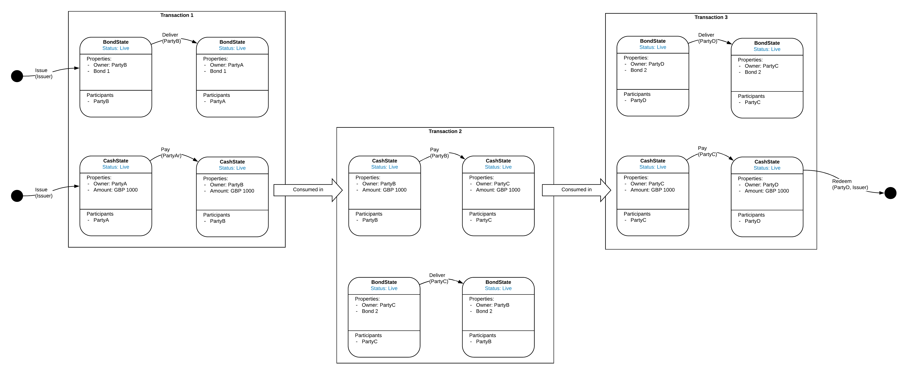
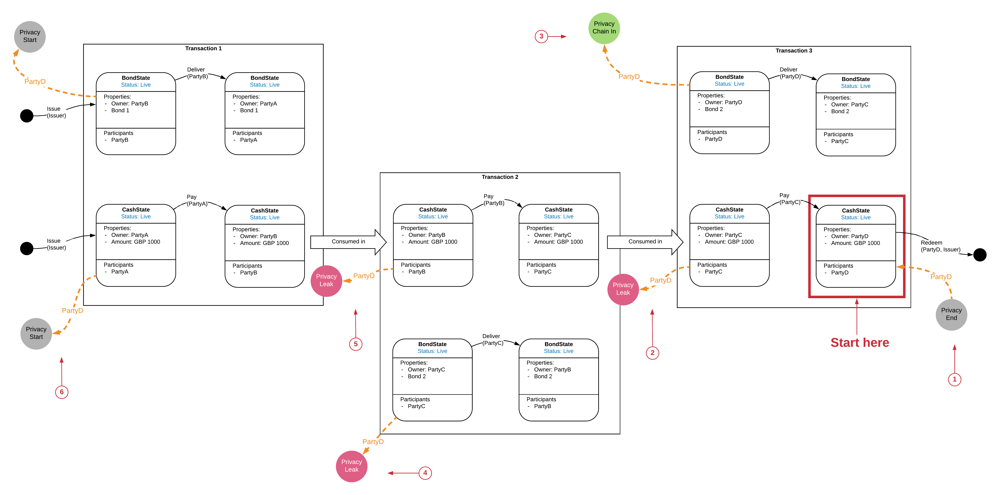
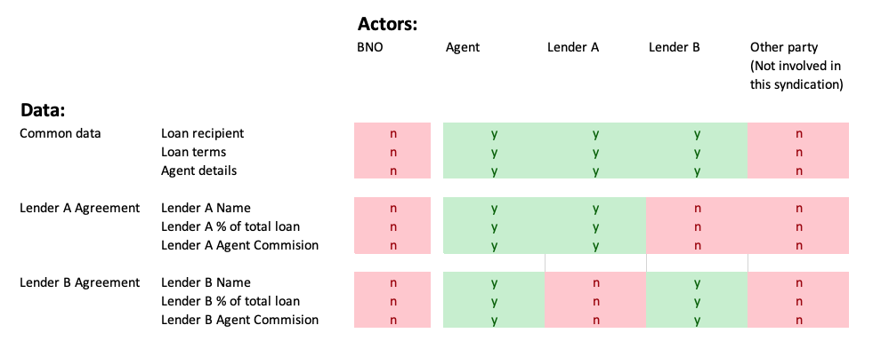
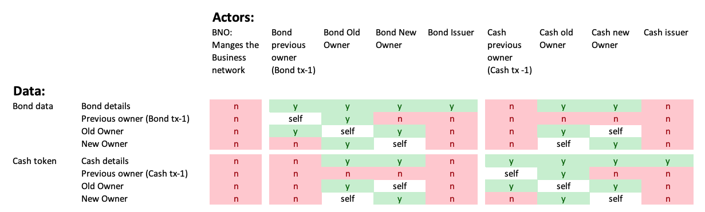

-----------------
Why Model Privacy
-----------------

Privacy is one of the major selling points of Corda. Much is made of it's peer to peer nature and the fact that transactions are not broadcast to the whole of the Network. But there is an important subtlety here: for a transaction to be valid, Parties needs assurance of the provenance of it's input states, this often involves receiving transactions from the historic chain of states leading to the current transaction. Corda has built in functionality to resolve these historic transactions via the ResolveTransactionFlow. However, care needs to be taken when designing CorDapps to ensure that resolution of a transaction doesn't lead to Parties obtaining historic information which they should not get visibility of, for example the transactions of their competitors.

There are mechanisms to preserve privacy such as Confidential Identities and Chain-snipping, and in the future SGX has much to offer, but these need to be actively designed into CorDapps. A CorDapp designer needs to be confident in the privacy characteristics of the application. In order to be able to reason about privacy we need a mechanism for analysing Privacy in the context of Corda. The CMN privacy overlays aim to meet this need.

-----------------
Analysing Privacy
-----------------

Let's define that a Privacy Leak has occurred where a Party, through the normal use of a CorDapp obtains information in their Vault that they should not be privy to. For example, the unobscured details of another Party's Trade where the Party does not have a legal right to see that trade. **(need to check this definition)**

We can use an simple DvP (Delivery vs Payment) example to build up our tools around privacy, starting with the State Machine views for a Cash state and a Bond state.

.. image:: ../resources/privacy/CMN2_P_Example_state_machines.png
  :width: 80%
  :align: center

We can map out a possible State Evolution using the State Evolution view, in this case we follow a CashState as it is used to pay for three Bond transactions, the bond transactions are unconnected, we are using the same BondState for convenience, but they are descrete evolutions.  (click the image to expand):

(For explanation of State Machine and State Evolution views, see 'CMN Views' section)

Fundamentally, privacy is about when a Party sees something they shouldn't. A Party can only see something if it exists already, hence the approach to analysing Privacy is backward looking from a point in time on the ledger.

Some points to note:

  - The analysis is from the point of view of a single, observing Party (but one diagram can show several Parties' analysis)
  - The entry point for the analysis is a particular point in a State's evolution, usually the last covered by the diagram.
  - The analysis uses backwards pointing chains laid over the State Evolution diagram to show the data which a Party Gains access to.
  - Sometimes this access will be appropriate, however sometime it will be inappropriate, in which case it is marked as a 'Privacy Leak'
  - It is often not possible to show a closed graph of state evolutions, or to show the full Corda Ledger, so there needs to be a way to show the edges of the graph that is being considered.
  - The objective of the CorDapp design is to avoid Privacy Leaks

Taking the example above, we can start to build up the modelling by considering Party D

The analysis starts from the last point in a State's evolution for the part of the State's evolution which is in scope for the diagram.

1. Privacy End

   The next step for the CashState is to be redeemed, which ends it's evolution. There are no more States after this one so there are no privacy considerations beyond this State, hence we mark it as a 'Privacy End'.

2. Privacy Leak

  When Transactions are verified Corda will resolve all the transactions which previously evolved the input States. We show this resolution by linking back from an input State to the Transaction which produced it. In this case Transaction 3 input CashState links back to Transaction 2 which produced the CashState as its output. Hence, PartyD will get sent a copy of Transaction 2. This is not okay, Transaction 2 was a trade between PartyB and PartyC, Party D was not involved and should not have visibility. We therefore show this as a 'Privacy Leak'.

3. Privacy Chain In

  As noted above, we can't show a closed graph of full State evolutions for all the States shown in the Diagram, it would quickly become too complicated or artificially constrain the complexity of the design. Hence, we need a way to say 'other stuff happened before this point'. We do this using a 'Privacy Chain In' marker. The assumption for a 'Privacy Chain In' is that the Party is allowed to have visibility of the prior chain, if not it is a Privacy Leak, see point 4 next.

4. Privacy Leak

  As part of the resolution of Transaction 3 PartyD gets a copy of Transaction 2. Corda will then resolve the preceding transactions to Transaction 2. This includes prior transactions in the BondState evolution. However, PartyD wasn't part of those transaction so shouldn't get to see them. This represents another Privacy Leak.

5. Privacy Leaks

  By the same rational as in 2, PartyD also gains visibility of Transaction 1, which it shouldn't, hence another Privacy Leak.

6. Privacy Start

  When the traceback of the privacy chain reaches the start of the State's evolution the chain cannot go back any further, hence this is marked as 'Privacy Start'

The diagram can show the privacy chains of multiple Parties using different colours, adding in all the Parties:

.. image:: ../resources/privacy/CMN2_P_Example_all_parties.png
  :width: 100%
  :align: center

7. Privacy Chain out

  In the same way that we need to shows 'other stuff that happened before this point' we also need to show 'other stuff that happens after this point'. We do this using a 'Privacy Chain Out' marker.

-------------------------------
Expressing Privacy requirements
-------------------------------

In order to reason about privacy, we need to be able to express which parties should be able to see which data.

We can do this using a simple mapping between the Actors in a design and the aggregate data set for the Cordapp. taking the example of a syndicated loan, the privacy map might look a bit like this:

Privacy maps can get a little more complicated when we have to consider the visibility of Actors involved in not only this transaction but prior transactions which gave rise to the input states for this transaction. For example, in the Previous Delivery vs Payment example, the Privacy map might look like this:

--------------------------------
Protecting against Privacy Leaks
--------------------------------

In the same way as with a paper contract, nothing stops a Party send any other Party a copy of a Transaction or a State, the goal is to design CorDapps so they don't leak privacy by design.

We need to consider both the current Transactions and the resolved chains of Transactions. In current Transaction, we can use visibility constraints to put restrictions on who is allowed to be a participant on the Transaction.

For the Transaction history,

-----------------------
Confidential Identities
-----------------------

--------------
Chain snipping
--------------

(Be careful that a snip after every transaction doesn't devolve back to a centralised system)
