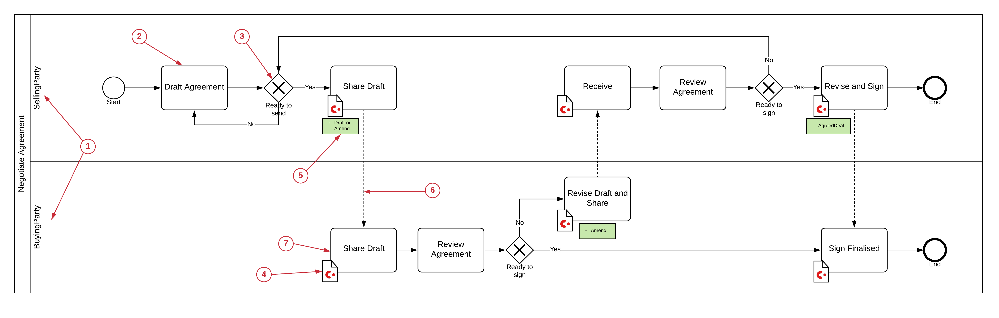

====================
BPMN (Orchestration)
====================

The Orchestration Layer is driven by business events. Whereas the Ledger Layer models all the things you can do with Corda states and transactions, the Orchestration layer deals with what you intend to do with the states and transactions, ie. actions which reflect legitimate business events.

A good way of capturing business events is to use a slightly modified Business Process Modelling Notation (BPMN), although any flowcharting method would work as well with similar modifications. The BPMN view, intends to capture all business events for the business processes which the CorDapp is supporting. It would normally consist of a hierarchical drill down from a high-level map of all processes to more detailed process diagrams at the resolution of individual business actions.

A simplified example for our Example agreement CorDapp might look like this.

High-level processes:

.. image:: ../resources/views/CMN2_BPMN_high_level.png
  :width: 40%
  :align: center

If we drill down into Negotiate Agreement we can see individual showing business events. some, but not all, of these will trigger a corda Transaction:

1. Swim Lanes

  BPMN uses swim lanes to segregate the actions taken by different parties.

2. Business event

  These are the business events in the business process

3. Gateways

  In BPMN, gateways are used to indicate conditional forks in the processes

4. Corda Transaction

  The Corda logo indicates that this event results in a Corda transaction. There will be a corresponding business event in the Swim lane of each participant in the transaction.

5. Corda Transaction Commands

  The green box denotes the commands in the Corda transaction associated with this business event. It is useful to relate to the ledger layer views supporting this process.

6. Shared views

  The dotted line connects participants in a Corda transaction, it originates from the instigator of the transaction (@InitiatingFlow) and goes to the responders to the transaction (@IntiatedBy flows)

7. Receiving event

  The business event for the party responding to the initiation of the Corda transaction

Where a business event creates a Corda Transaction we need to be able to specify the actions the CorDapp needs to take. To do this we have the next two Orchestration Views: the **Transaction Instance** view which specifies a transaction instance completely and the **Flow Sequence** view, which shows the flow level orchestration between parties to build and sign the transaction.
