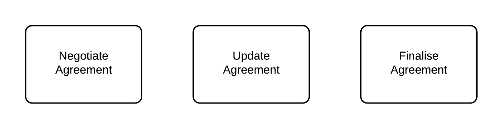

====================
BPMN (Orchestration)
====================

The Orchestration layer is driven by business events. Whereas the Ledger layer models all the things you can do with Corda states and transactions, the Orchestration layer deals with what you intend to do with the states and transactions, ie. actions which reflect legitimate business events.

A good way of capturing business events is to use Business Process Modelling Notation (BPMN), although any flowcharting method would work as well. The BPMN view, intends to capture all business events for the business processes which the CorDapp is supporting. It would normally consist of a hierarchical drill down from a high-level map of all processes to more detailed process diagrams at the resolution of individual business actions.

A simplified example for our Example agreement CorDapp might look like this.

High-level processes:

Drill down into Negotiate Agreement showing business events:

.. image:: resources/CMN_BPMN.png
  :width: 80%
  :align: center

Some, but not all, business events will require a Transaction to update the ledger. In the example above, Propose Agreement, Propose Amendment and Finalise would require a transaction, whereas, Review Agreement and Review Amendment just require a look up from the party’s own Vault.

Where a business event transaction is required, we need to specify the required transaction using the Transaction Instance View and how to build and agree the required transaction using the Flow Sequence View.
