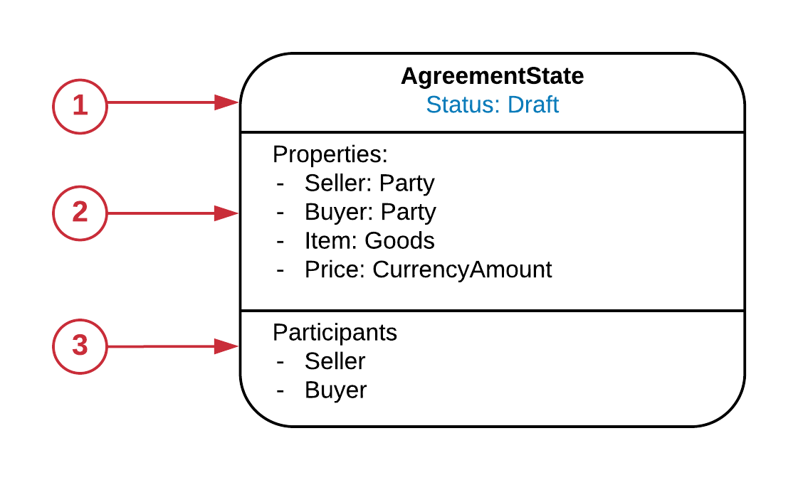
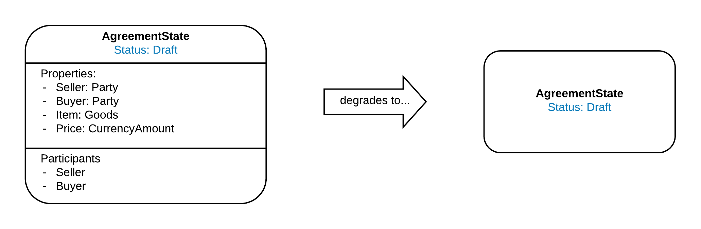

===============
Common Concepts
===============

--------------
Defining Terms
--------------

When discussing CMN we need to define some common terms.

 * **State:** A class or object which inherits from ContractState interface in net.corda.core.contracts. In the training materials, this is what is referred to as a State.
 * **Ledger state:**	This is the sum total of all the unconsumed ContractStates
 * **Status:** (of a State)	A snap shot of the potential values of the properties of a State.
 * **Contract:**	A class or object which inherits from Contract in net.corda.core.contracts. This defines the set of constraints which operate over the States in a Transaction.
 * **Transaction:**	A Corda transaction, the mechanism by which the Ledger state is changed.

-------------------
Representing States
-------------------

Many views in CMN show representation of a Corda State. For the latest version of CMN we have standardised the representation of a Corda State across all the various views. The base representation of a Corda State is as follows:

1)  State and Status

  The type of State and the Status of the state, this effectively defines the scope of the box, ie. if the State type or Status is different, it's a different box.

2) Properties

  These are the properties of the State whilst in the particular status. Not all Properties need to be shown, just the ones salient to the behaviour of the state in this status.

3) Participants

  These are the participants in the state, this corresponds to the parties who the Transaction containing the State will be sent to. Note, if the Transaction contains multiple States the Transaction will be sent to the union of all the States' participants.

The State representation no longer contains any Contract constraints, these are all shown externally to the State itself. See the State Machine view for details on constraints.

The representation of a State can degrade to show less detail For example, if you don't need to show participants or properties they can be omitted.

