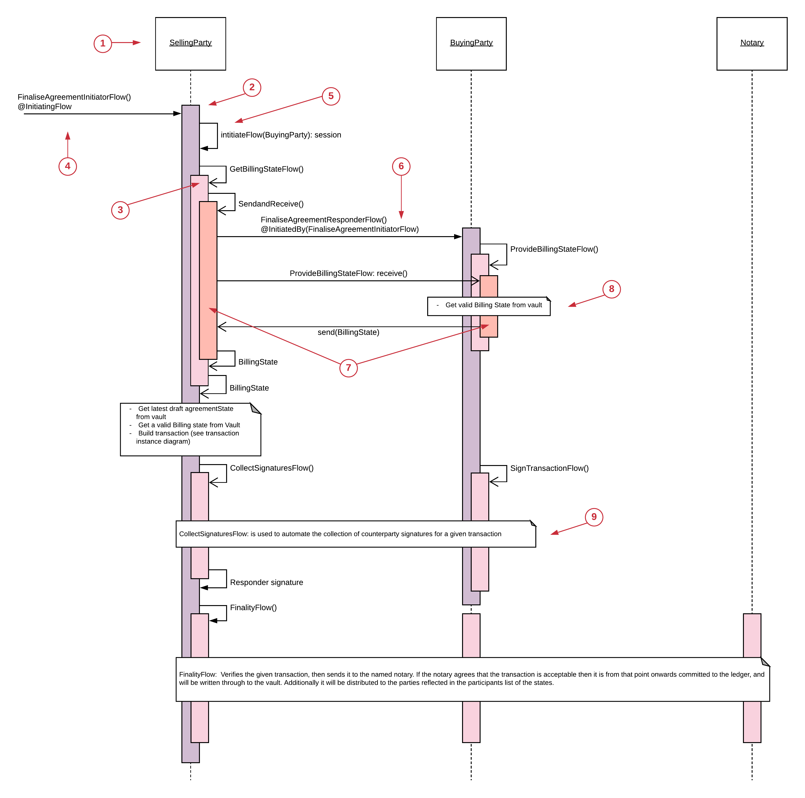
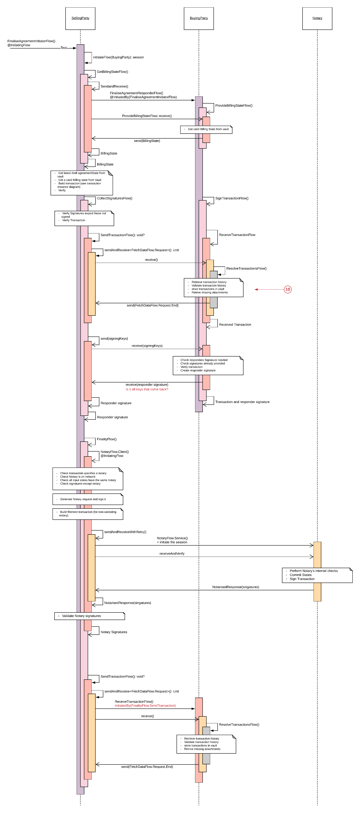

=============================
Flow Sequence (Orchestration)
=============================

Note, The Flow Sequence view set out in this section is designed to be very accurate representation of the flows for detailed analysis. For many purposes a standard PlantUml style sequence digram may suffice. For example, from the Designs section of this site:

.. image:: ../resources/views/CMN2_FS_Plantuml_example.png
  :width: 60%
  :align: center

To specify how we build and agree the transaction we can use the Flow Sequence Diagram, this is based on UML Sequence diagram and uses minor modifications to describes the Corda Flows:

1. Actors (Parties involved in the flow):

  Each Actor involved in the Flow is shown as a Box at the top of their Lifeline. The Lifeline is a dotted line that represents the passage of time as it extends downwards.

2. Flow Activation Box

  The Corda Flows are show as activation boxes going down the Lifeline for the Actor.

3. Subflow Activation Box

  Subflow activation boxes are show on top of the calling Flow, the call to the Subflow is shown with an arrow from the flow to the start of the Subflow.

  A solid arrow head represents a call which specifies a return value, an open arrow head implies that the return value will be shown explicitly with a matching open arrow at the end of the Subflow.

4. Initiating Flow

  A Flow must start with an Initiating Flow (in the code this is annotated with @InitiatingFlow). This is shown by adding @InitiatingFlow to the arrow.

  Note, in the corda implementation all non-Initiating Flows are in-lined into the main Initiating Flow. However, to aid readability, it is helpful to highlight the Subflows on the diagram.

5. Method call

  Methods which are called in the flow which don’t call to another party can be show as an arrow looping from the flow back to itself.

6. InitiatedBy

  In response to the FinaliseAgreementInitiatorFlow, the other party will run the FilaliseAgreementResponderFlow (Purple). However, Corda does not trigger the responder flow until the first send() to the other party. Hence, although the FlowSession was called earlier (5) it is only at this point that the responder flow starts.

  The responder flow will itself call a Subflow which matches the initiators GetBillingStateFlow with the responders ProvideBillingStateFlow (Pink). Matching flows should be shown in the same colour.

7. SendAndReceive()

  All interactions between parties ultimately reduce to matched send and receive calls. In the flow diagram these should be coloured the same on both sides to help match them up.

  The arrow should show the method which will be triggered on the receiving end of the call

8. Actions

  Actions taken by the Flow can be shown in a box to reduce the complexity of the diagram

9. Hiding complexity

  The full flows can become quite complex and long, parts of the flow can be replaced by a box to represent the details of the flow. In this example, the Corda provided Collect Signatures Flow and Finality flow are replaced by a box. However, if necessary the full flow can be modelled:

10. Subflow not shown

  Another way of hiding complexity is to call a Subflow on one party but not show all the interactions, for example the ResolveTransactionsFlow(). This is show in a grey colour.

Note, there is also the concept of Flow interfaces where by the sequence of send and receives and the types of data sent is defined. This is important for managing the upgrading of flows. See the corda docs for more details: https://docs.corda.net/upgrading-cordapps.html#flow-versioning
