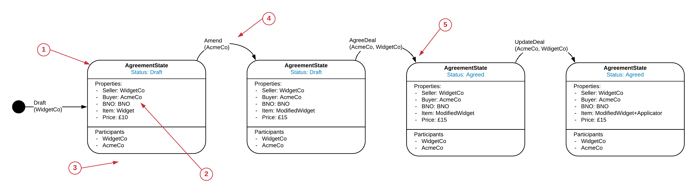
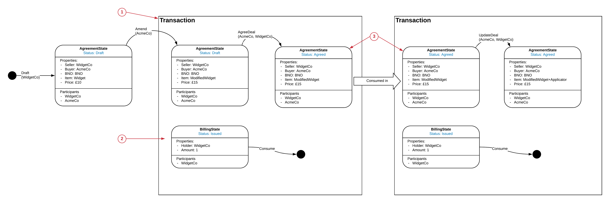

========================
State Evolution (Ledger)
========================

The State Evolution view aims to show how a State may evolve over time. You can think of it as one of many potential paths through the transitions permitted by a State Machine shown in the State Machine View.

-----------------------------
Basic State Evolution Diagram
-----------------------------

Let's start with the State Machine example from the State Machine Section.

.. image:: ../resources/views/CMN2_SM_Full_example.png
  :width: 100%
  :align: center

A State Evolution maps out a potential route through this State Machine, for example:

1. State

  Base representation of the State is consistent with other CDL views, how ever this represents an instance of a state rather than the generic behaviour of the state. the analogy would be an object vs it's class.

2. State Variable

  The generic variable types are replaced by specific values of the variables, for example instead of 'Seller: Party' it is Seller: 'WidgetCo'

3. Constraints

  There are no constraints shown, this is just an example State evolution. If the State Machine constraints are broken then it is not a valid state evolution (which might be the purpose of the diagram when documenting an anti-pattern)

4. Signers

  Signing Constraints have been replaced with actual Signers

5. Multiplicities

  There are no multiplicities as these are implicit in the diagram, eg. if there are 2 output states, then two output states are shown.

--------------------------
Interacting State Machines
--------------------------

Sometimes we will want to show how two or more state machines interact with each other. This becomes particularly important when scaling complexity and designing for Privacy.

Let's assume we have a BillingState that needs to be included in the AgreementState's AgreeDeal and UpdateDeal transitions. To show that the two State Machines (AgreementState and BillingState) come together in a single transaction we will introduce a Transaction box:

1. Transaction box

  The transaction box indicates that these two transition occur in the same transaction. Note, when analysing if this is a valid transactions the Constraints from both State Machines will need to be considered.

2. Billing States

  The transition from the billing state is also show in the transaction box.

3. Duplicate States

  To avoid overlapping boxes we sometimes have to represent a State in two places (first as an output, secondly as an input). To do this we duplicate the State and use a thick arrow labelled 'consumed in'. If the State is only being shown in one transaction box then this is not necessary.
