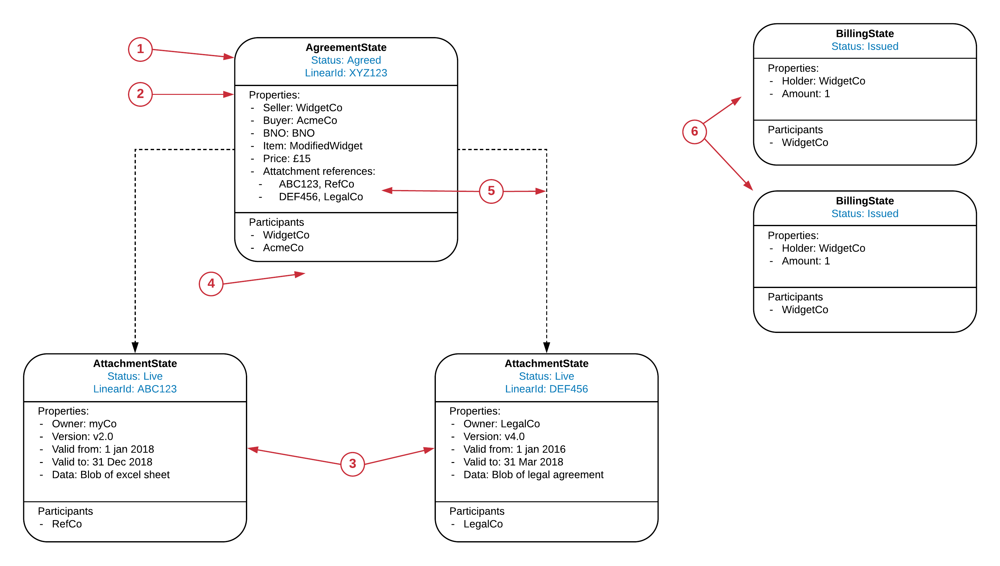

========================
States Instance (Ledger)
========================

The States Instance view is a subjective snap shot in time of a subset of States in a node's vault. It shows the state statuses and how they may be linked together and is independent of how the states came to be on the ledger. It is not trying to communicate controls or transitions, it is a just point in time instance diagram.

An State Instance diagram might look like this:

The view is based on states using a similar representation to the State Machine View, however there are some important differences:

1. State Ids

  As we are talking about instances of states, we are likely to need to add in identifiers for the instance of the state, typically these would be the Linear Id of the state, but could also be the stateRef depending on how the states reference each other.

2. Properties

  These are similar to the properties shown in the State Evolution view, the generic types shown in the State Machine view are replaced by specific values for the Variables.

3. Multiple instances of the same state/status

  The diagram has two boxes which are AttachmentStates in a Live Status, this is because there are two separate instances of an AttachmentState. They are shown separately even if they are governed by the same state machine (not shown)

4. No constraints

  The diagram is not trying to show constraints.

5. State references

  The diagram now shows references between States, the reference will need to show the id for the referenced state together with who is the publisher. There is a dotted line between from the State holding the reference to the referenced State

6. Diagram can include any State instances

  The diagram can include any State instances which the drawer feels are relevant. In this diagram, we include the two BillingStates even though they are not referenced from the other States.
