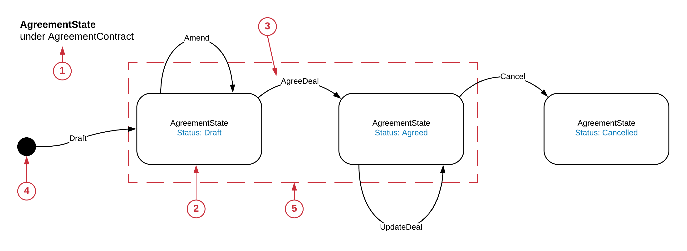
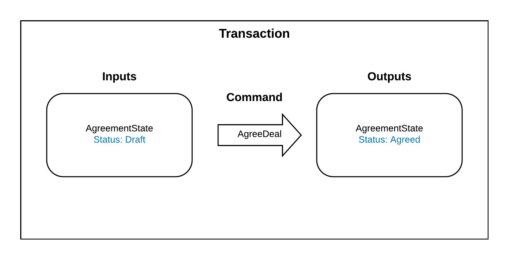
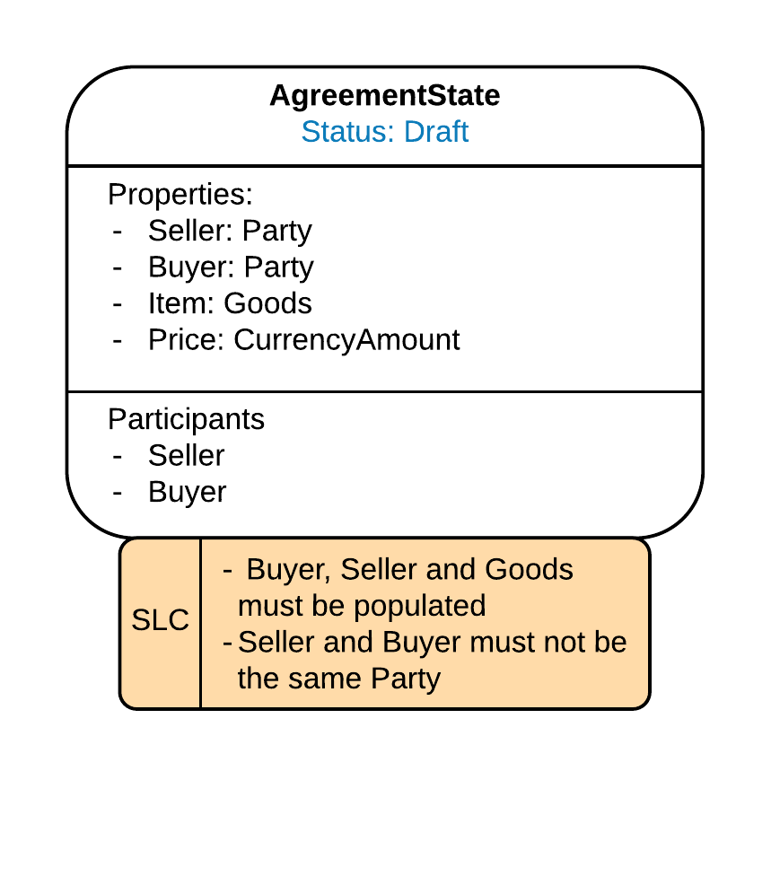
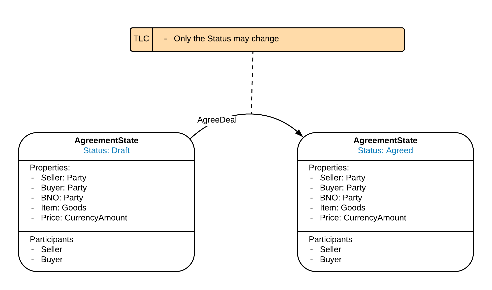
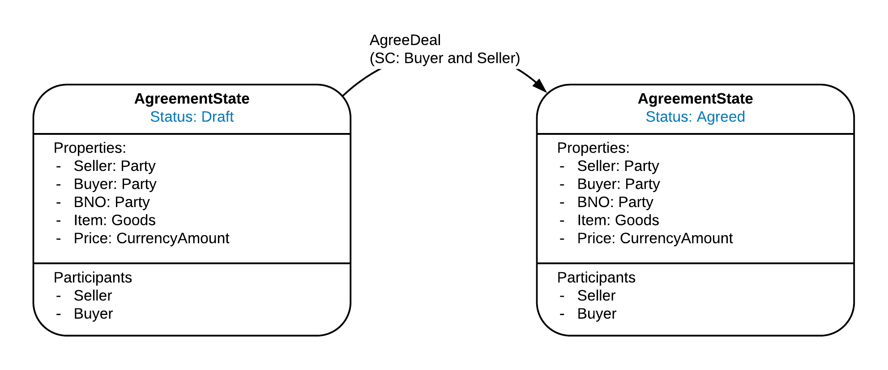
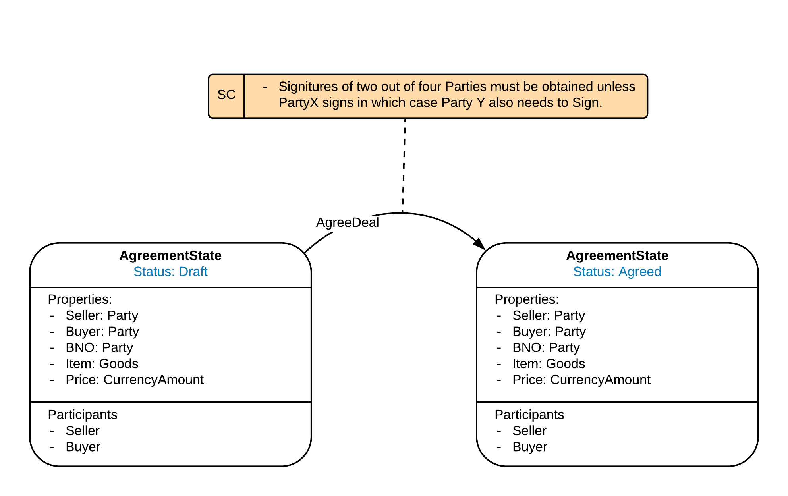
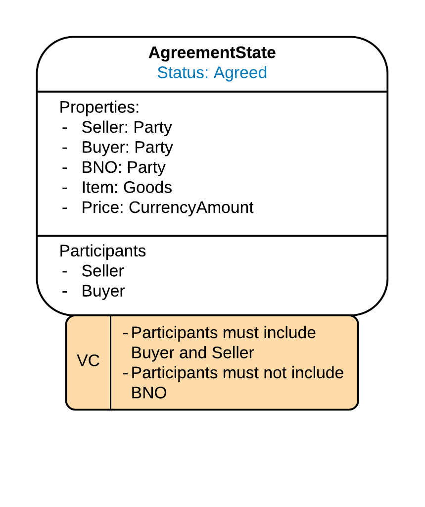
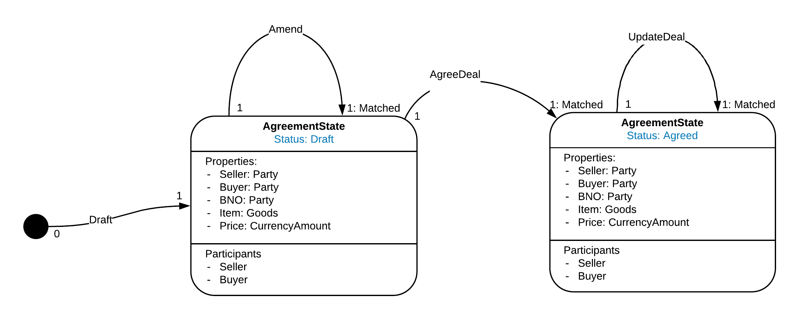
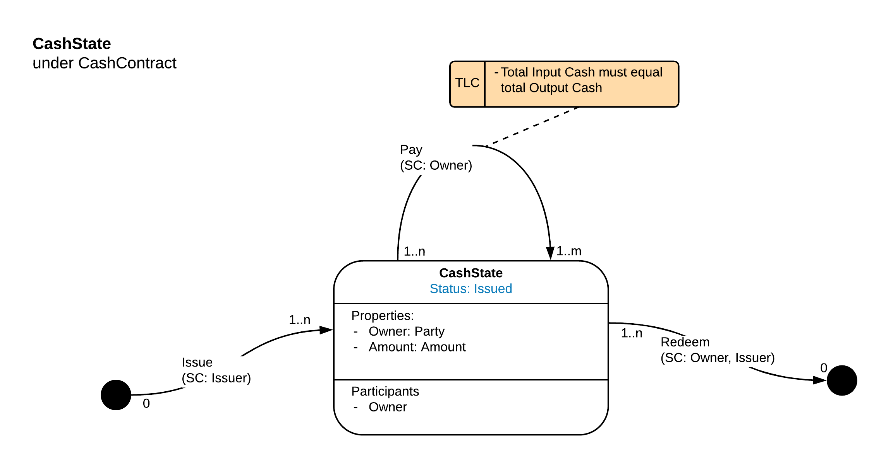
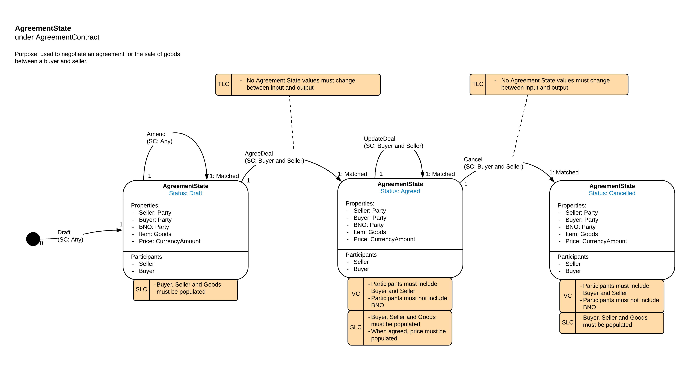

======================
State Machine (Ledger)
======================

---------------------------------
Analogy to a Finite State Machine
---------------------------------

The Corda Ledger consists of the totality of the unconsumed States in the Compatibility Zone.
From the point of view of a Party on the Network, the Ledger consists of all the States in the Party’s own vault. The Ledger can only evolve by the consumption of current States and the creation of new States in a valid Corda Transaction.

The Contracts attached to the Corda States impose a set of constraints which need to pass in order for the transaction to be valid. The constraints imposed by the Contract will depend on the Status of the consumed (input) and created (output) States in the transaction. For example, if a State has a status of ‘Closed’ it may not be allowed to be an input in a ‘Transfer’ transaction.

So, we have the Ledger State, then a set of allowed transitions to get to the new Ledger state of the ledger. This is similar to the idea of a Finite State Machine which forms the basis of this view.

However, modelling the entire Corda Ledger, even from the perspective of one CorDapp, as one big Finite State Machine is not practical. Instead we will model the behaviour of a single State. Later we will look at how different State types and different instances of the same State type can interact with each other.

UML (Unified Modelling Language) provides a notation for modelling Finite State Machines: https://en.wikipedia.org/wiki/UML_state_machine. The UML State Machine representation is the starting point for the CDL State Machine View, although there are some required modifications.

-----------
Basic model
-----------

The State Machine view aims to map out all of the possible ways that a State can evolve under the constraints imposed by its associated Contract.

Let’s take a simplified example:

1. Scope:

  Defines the State which is being modelled and the Contract which is constraining the evolution of the State. These must be defined as a pair, if you change either the State or the Contract then the possible Statuses and the constraints over the transitions will change and hence the model will also change.

2. Status:

  A State can be in potentially many different Statuses. Status could be defined by a field called ‘Status’ or more generally a combination of the values of the properties of the State.  Not all possible statuses need to have their own box, similar statuses should be grouped such that all possible statues in the group don’t change the constraints applied. So, if a State has a possible status ‘Banana1’ and ‘Banana2’ but both have the same constraints, there is no need to have separate boxes on the diagram, both statues will behave in the same way.

3. Command:

  From a particular Status there may be many permitted transitions. Corda Commands parameterise and describe specific transitions and allow different constraints to be applied depending on the Transaction Command.

4. No State:

  Indicates that there is no State (of this State type) at the beginning of this transition.

5. Potential Transactions

  Each of the transitions can, but not necessarily will, be enacted as a Corda transaction. The Status at the start of the arrow is an input state and the status at the end of the arrow is an output state. For the transition from Draft to Agreed, the Transaction Instance view would look as follows (simplified):

Note that this is a subtly different view, the transaction instance shows one particular transition, the State Machine View shows all potential usages of the state in a transition. This is important as the state machine view enables the user of the model to reason about all possible usages, not just a selected subset of usages that are intended as part of the CorDapp design or are explicitly built in the flows.

-----------------------
Introducing Constraints
-----------------------

By default, Corda allows any transaction that is not explicitly disallowed. The code to implement Contract constraints is placed in the Contract’s verify() method. If you have a State with a Contract with an empty verify() method, with the exception that the input states must be unconsumed, there are no restrictions over the composition of a transaction using those states.

To have a useful CorDapp, we need to impose constraints over how the States are allowed to evolve. There are multiple types of constraints which we may want to impose on a State and Transactions involving the State, the design language needs to reflect these.

It should be possible to reason that undesirable transitions are not permitted from the constraints in the model. It is envisaged that this will be important tools for audits and security reviews.

We will build up the types of constraints and show how they are represented in the view.

-----------------------
Transitions Constraints
-----------------------

The first type of constraint is the allowable transitions as denoted by allowable Commands

If you follow the basic model diagram above, we can see that when an agreement is in Draft it only has two valid transitions: back to Draft via the Amend Command or to Agreed via the AgreeDeal Command. It can't, for example, move from Cancelled to Agreed.

The language assumption is that if the transition/ Command is not shown on the diagram, it should not be permitted to occur.

-----------------------
State Level Constraints
-----------------------

There will be some constraints over the form of an instance of a State that are independent of other components of a transaction. For these we need a more refined box to represent the State:

The constraint is shown as an orange box attached to the State with the 'SLC' Label (State Level Constraint). In the example shown, the constraints are:

    -	(If the state status is Draft) Buyer, Seller and Goods must be populated
    -	The Seller and Buyer must not be the same Party

Note that the State Level Constraints are status dependent.

Importantly, State level Constraints would not include constraints which need to look outside of the instance of the State. For example, the input State and output State must be the same apart from property X, would note be state level as this looks across two instances, even though they are the same type of State.

-----------------------------
Transaction Level Constraints
-----------------------------

Transaction Level Constraints work over the whole of the Transaction. They are shown as orange boxes. Any information in a transaction can form the subject of the constraint.

These could include:

  -	Permitted changes between input and output versions of the same type of State
  -	Requirements that a particular type of State is include in the Transaction
  -	Requirements that a specified Command is included in the Transaction

As the nature of the Transaction changes based on the Command invoked, the Transaction Level Constraints are represented as being attached to the Command.

The total Transaction Level Constraints in a given Transaction is the union of the Transaction Level Constraints attached to all Commands in the Transaction from all the Contracts attached to the States in the Transaction.

Note, Transitions, Required Signatures, Visibility and Multiplicity constraints are also type of Transaction Level Constraints, but these have special importance so are shown separately to aid understanding. We want to avoid just having a big list of constraints as this is hard to visually take in and reason about.

----------------------------
Required Signers Constraints
----------------------------

Required signers are denoted in brackets after the Command which defines the transition.

The restriction could be stated as a specific Party, but is more likely to be a role defined with in the state.

In more complicated examples, the constraint might be conditional, if more space is reuquired an orange constraint box can be used, annotated with 'SC' and attached to the Command.

----------------------
Visibility Constraints
----------------------

A key differentiator for Corda compared to other Distributed Ledger Technologies is its peer to peer privacy so it is important to be able to model the Visibility Constraints of a CorDapp. This will become crucial when reasoning about the privacy of a CorDapp.

Visibility constraints are show in orange boxes attached to the state, annotated with VC (Visibility Constraint). They specify the restrictions on which Parties should and, importantly, which Parties should not receive a copy of the State.

Corda will distribute a copy of the Transaction to the union of participants in all the States in the Transaction. Visibility Constraints are restrictions on who should be in the total participants list for the Transaction, not just the participant list for the State whose contract imposes the restriction.

Note, there is nothing stopping a Party distributing a copy of a transaction to any other party, in the same way that a party to a regular legal transaction could show a competitor the details of a confidential deal. Hence, where there is a constraint that a specified party cannot see a State, there is no absolute guarantee that they won’t see it through some other means, only that Corda will not automatically distribute the State to that Party.

The purpose of imposing Visibility Constraints is to stop CorDapps inadvertently sharing confidential information thorough inappropriate design decisions.

Privacy in CorDapps and on Corda Networks is not straight forward to reason about. The resolution of historic state chains to prove the provenance of input states brings in complex privacy considerations, these are discussed in the CDL section on Privacy.

------------------------
Multiplicity Constraints
------------------------

So far, we have only looked at a single instance of a State, however, in production CorDapps there may be multiple interacting instances of the same State Type.

To describe this, we can add multiplicities to the Transition’s arrows.

Beginning of the arrow:

  - **0** : There are no input States of this type in the Transaction.
  - **1** : There is exactly one input State of this type in the Transaction.
  - **n** : There are n input States of this type in the Transaction.

End of the arrow:

  - **0** : There are no output States of this type in the Transaction.
  - **1** : There is exactly one output State of this type in the Transaction.
  - **1: Matched** : There is exactly one output State of this type in the Transaction and the output State's linearId must match the input State's LinearId.
  - **m** : There are m output States of this type in the Transaction.

The options above can be combined to form ranges, eg

  - **0..n** : Zero to n input/ output States

With fungible assets such as Cash you can have many cash input states and many cash outputs as long as the cash amounts balance across the transaction. This would be expressed as 1..n going to 1 ..m on the Pay transition, with a Transaction Level Constraint keeping the inputs and output amounts equal:

-------------------
Mapping to the code
-------------------

Constraints are implemented in the Corda Contract associated with the Corda State.

The Contract verify() method’s behaviour is usually parameterised on the Command usually via a Kotlin ‘when’ statement (or a ‘switch-case’ statement if you are using Java). State level Constraints are independent of the Command used and can be applied outside of the ‘when’ statement. Transaction Level Constraints, including Required signers, Visibility and Multiplicity Constraints are specified within the ‘when’ branch corresponding to the Command.

For example:

.. code-block:: kotlin

    class AgreementContract : Contract {

        interface Commands : CommandData {
            class Draft : TypeOnlyCommandData(), Commands
            class Amend : TypeOnlyCommandData(), Commands
            class AgreeDeal : TypeOnlyCommandData(), Commands
            class Update Deal : TypeOnlyCommandData(), Commands
            class Cancel : TypeOnlyCommandData(), Commands
        }

        override fun verify(tx: LedgerTransaction) {
            requireThat {

                //*** State Level Constraints, ie Constraints which are independent of the Command ***
            }

            val command = tx.commands.requireSingleCommand<MyContract.Commands>()

            when (command.value) {
                is Commands.Draft -> requireThat {

                    //*** Constraints applicable for the Draft transition ***
                }
                is Commands.Amend -> requireThat {

                    //*** Constraints applicable for the Amend transition ***
                }
                is Commands.AgreeDeal -> requireThat {

                    //*** Constraints applicable for the Agree transition ***
                }

                is Commands.UpdateDeal -> requireThat {

                    //*** Constraints applicable for the UpdateDeal transition ***
                }
                is Commands.Cancel -> requireThat {

                    //*** Constraints applicable for the Cancel transition ***
                }

                else -> {
                    throw TransactionVerificationException
                }
            }
        }
    }

Allowed transitions are managed in this case by the ‘when’ statement, if the Command is not in a valid ‘when’ branch then the contract throws an error. However, this is a simplified example which assumes one Command in the Transaction, the logic would be more complicated when multiple Commands can be present.

-------------------
Putting it together
-------------------

We can see each of the concepts above in this example of an AgreementState State Machine view:

