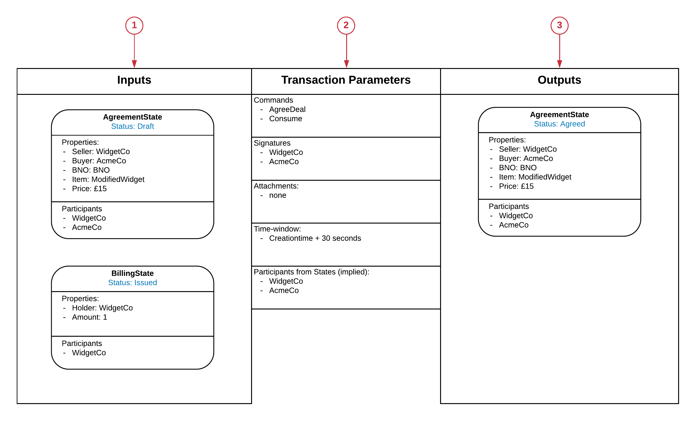

====================================
Transaction Instance (Orchestration)
====================================

To specify the required Transaction corresponding to a business event, we use the Transaction Instance view. This consists of writing down the specific Transaction that needs to occur for the particular business event.

1. Inputs:

  Shows all the input States including the relevant properties and participants. Note, these are instances of States so the actual participants and properties should be shown.

2. Transaction Parameters:

  Shows the Commands, Actual Signatures, any Attachments, the valid Time-window for notarising the transaction and the participants which consist of the union of the participants in the states.

  Note, any extra participants which the transaction will be distributed to via the flows are not shown here as they don’t form part of the transaction.

3. Outputs:

  Shows all the output States including relevant properties and participants. Note, these are instances of States so the actual participants and properties should be shown.
