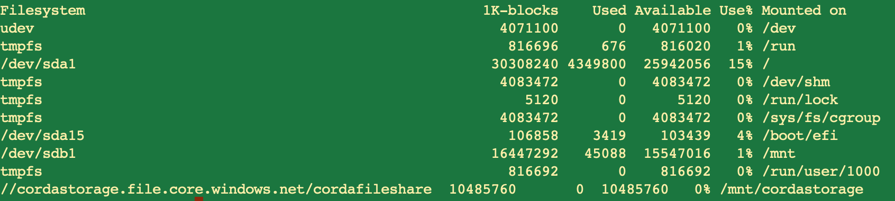

Azure Corda HA Deployment
=========================

In this section we will go thru the steps to ensure Corda Enterprise is deployed in HA configuration. The following steps need to be completed. 

1. Corda Enterprise Deployment on Primary VM.
#. Corda Artemis Message Queue on Azure Fileshare.
#. Corda Configuration File Load Balancer setup. 
#. Corda Enterprise Deployment on Backup VM.
#. Corda Enterprise on VM Startup.
#. Azure Fileshare on VM Startup.
#. Failover test of Corda Enterprise Node from Primary to Backup.

Corda Enterprise Deployment on Primary 
--------------------------------------

In order to deploy Corda you will need access to the version of Corda Enterprise 3.x or 4.x which can be obtained by emailing deployment@r3.com.

Log into the VM as corda:corda and deploy the binaries in /opt/corda. Once your /opt/corda directory is fully created it will contain the following files & directories.

.. sourcecode:: shell

   additional-node-infos/ -> only used in Bootstrapped Networks            
   artemis/ -> contains Artemis message queue                          
   brokers/                            
   certificates/ -> contains certificates created on node startup                  
   cordapps/ -> contains CorDapp Jar files 
   drivers/ -> contains RDBMS Drivers for SQL Server, Oracle and PostGres 
   logs/ -> contains Corda Enterprise Node log files   
   plugins -> drivers/
   corda.jar -> Jar file used to start Corda Enterprise Node 
   nodeInfo-XXXXXXXXX ->  contains node identity & address and is created during Doorman registration
   network-parameters ->  created after node is registered and it first connects to Network Map 
   node.conf -> main Corda configuration file containing CE parameters to be used on startup

The node.conf needs to be configured such that the VM Load Balancer DNS and Port are in the P2P section. This combination of Load Balancer and Port will be uploaded to the Network Map when the Corda Node is started following Node registration in UAT. 

Corda Artemis Message Queue on Fileshare
----------------------------------------

As we learned in the previous section on NFS setup, when the Azure File Share is deployed on Primary and Backup you will see entries similar to those below on *both* VM's. 

At this point we need to move the /opt/corda/artemis directory to the Azure File Share. The local mountpoint in our scenario is /mnt/cordastorage. Once this is done we will create a softlink back to the /opt/corda directory. 

.. parsed-literal::
    > sudo mkdir /mnt/cordastorage
    > sudo  mv /opt/corda/artemis /mnt/cordastorage
    > sudo ln -s /mnt/cordastorage/artemis /opt/corda/artemis

Note if you are logged into Primary VM and Backup VM when you move the artemis directory on the Primary you should check on the Backup that you can see the folder

.. parsed-literal::
    > sudo ls -ls /mnt/cordastorage/artemis

Corda node.conf Configuration File
----------------------------------

The node.conf file should be edited to ensure the Load Balancer DNS and Port are in the P2P section.

.. literalinclude:: ./resources/nodefulllb.conf
    :language: javascript

Corda Enterprise Deployment on Backup VM
----------------------------------------

In order to ensure identical versions of Corda Enterprise are on both systems we will copy over from Primary to Backup. 

On the Primary VM run the following:

.. parsed-literal::
    > cd /opt/corda
    > tar xvf corda.tar.gz .
    > scp corda.tar.gz VMBackup:/opt/corda

Note that in order to scp the tar file from Primary VM to Backup VM you will need to run ssh-keygen on Primary and copy the public key generated to VMBackup:/home/corda/.ssh/authorized_keys 

On the Backup VM run the following:

.. parsed-literal::
    > cd /opt/corda
    > tar cvf corda.tar.gz 

At this point both Primary and Backup VM's have identical environments with the /opt/corda/artemis directory on a shared file system.

Corda Enterprise on VM startup
------------------------------

Corda can be configured to start automatically whenever the VM starts as by creating a system service as follows:

.. parsed-literal::
    > sudo vi /etc/systemd/system/corda.service 

Enter the following in the file and save:

.. sourcecode:: shell

[Unit]
Description=Corda Node
Requires=network.target

[Service]
Type=simple
User=cordaadmin
WorkingDirectory=/opt/corda
ExecStart=/usr/bin/java -Xmx2048m -jar /opt/corda/corda-3.3.jar
Restart=on-failure

[Install]
WantedBy=multi-user.target

Run the following commands in the VM as root:

.. parsed-literal::
    > sudo systemctl enable --now corda
    > sudo systemctl daemon-reload

You can now start/stop/check status of Corda JVM as follows

.. parsed-literal::
    > sudo systemctl start corda
    > sudo systemctl stop corda
    > sudo systemctl status corda

Azure Fileshare on VM Startup
-----------------------------

It is critical that the Azure Fileshare on which /opt/corda/artemis resides is available prior to Corda starting on the VM. 

Azure Fileshare  can be configured to start automatically whenever the VM starts as by creating a system service as follows:

.. parsed-literal::
    > sudo vi /etc/systemd/system/fileshare.service 

Enter the following in the file and save:

.. sourcecode:: shell

[Unit]
Description=Mount EFS
Requires=network.target

[Service]
Type=oneshot
User=root
WorkingDirectory=/mnt
ExecStart=/bin/mkdir /mnt/MyAzureFileShare 
ExecStart=/bin/mount -a 

[Install]
WantedBy=multi-user.target

Run the following commands in the VM as root:

.. parsed-literal::
    > sudo systemctl enable --now fileshare
    > sudo systemctl daemon-reload

You can now start/stop/check status of Corda JVM as follows

.. parsed-literal::
    > sudo systemctl start fileshare
    > sudo systemctl stop fileshare
    > sudo systemctl status fileshare

