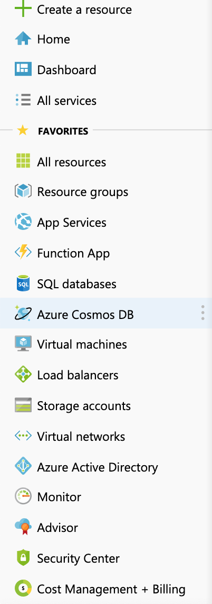
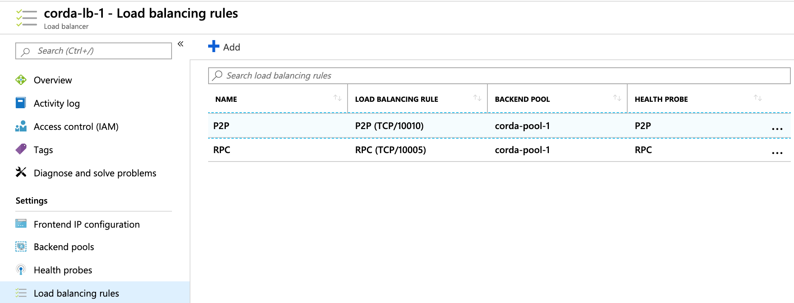
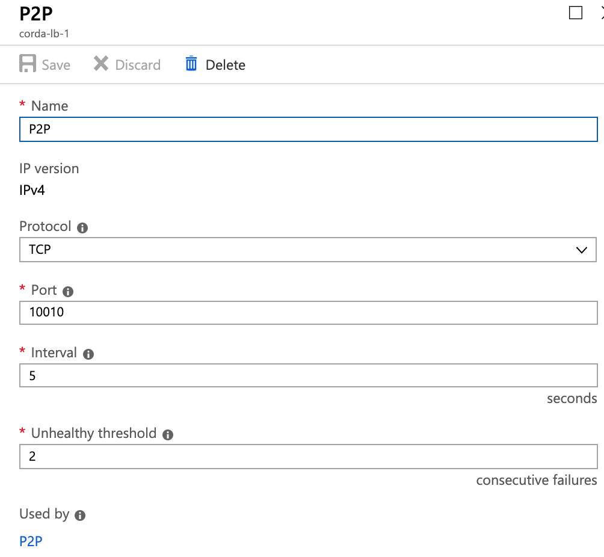

Azure Load Balancer
===================

The purpose of a Load Balancer is to present a single IP address or DNS name to RPC Clients and P2P Peer Corda Nodes. The steps for setting up a Load Balancer in Azure are as follows:

1. In portal.azure.com choose Load Balancers from the left hand side menu. 

2. Choose Add and fill out required fields as follows:

- Subscription : choose your portal.azure.com default subscription
- Resource Group : choose the same RG as the one used for the 2 VM's you already created
- Name : corda-lb (suggested name)
- Region : choose the same region as the as the 2 VM's you already created
- Type : Public
- SKU : Basic
- Public IP Address : Create New
- Public IP Address Name : corda-lb (suggested name)
- Assignment : Static 

3. Assign Tags as needed and create the Load Balancer.

4. Once the Load Balancer is created you need to click on it and then add a Back End Pool for the 2 VM's you created. 

- Name : corda-backend-pool (suggested name)
- Associated To : corda-avail-set will appear as a default option
- Target Virtual Machine : Corda-Primary
- Network IP Configuration : Choose the default associated with Corda-Primary
- Target Virtual Machine : Corda-Backup
- Network IP Configuration : Choose the default associated with Corda-Backup

5. Once the Back End Pool is created you need to create Load Balancing Rules which are associated to the 2 VM's on the corda-backend-pool that you have created. Load Balancing Rules direct incoming requests from P2P peers and RPC clients on to the Primary VM and if needed Backup VM (during failover) 

In the example below 2 rules have been created based on a node.conf entry for P2P Port 10010 and RPC Port 10005

6. The next step is to create Health Probes which will monitor the ports specified to ensure the P2P and RPC Corda services are up and listening on their respective ports. An example of a P2P probe is provided below. Both P2P and RPC Probe Ports must match those created for Load Balancer Rules. 

Once the above steps have been completed you can select you Load Balancer and ensure you see the following:

- Backend Pool
- 2 Health Probes
- 2 Load Balancing Rules
- 1 Public IP Address (not this must be static as this will be the entry in the P2P node.conf file and will appear in the Network Map in Corda for other Corda Nodes to connect to via P2P and also RPC clients. 

When you click on your Primary or Backup Virtual machine, you will now see the DNS name in the format corda-lb.azureregion.cloudapp.azure.com. The Corda Enterprise node.conf will have the following entries on both Primary and Backup VM's. 

Note that the P2P entry (combination of the Load Balancer and P2P Port) and the RPC address Port are the same ports we used to create Load Balancer Rules and Probes earlier. 

.. literalinclude:: ./resources/nodefulllb.conf
    :language: javascript

