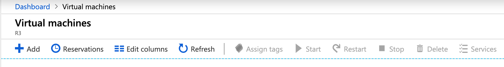
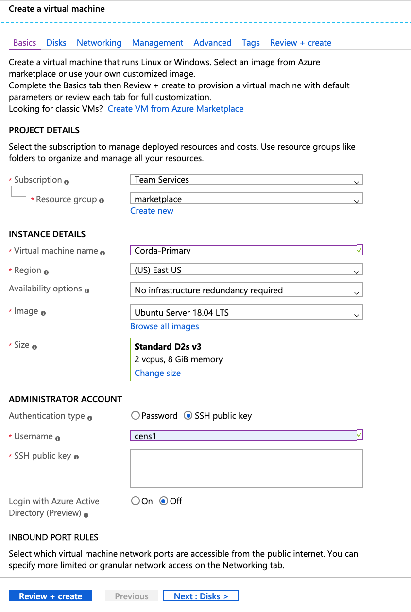
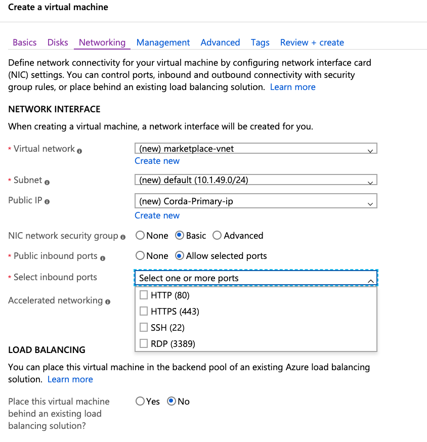

Azure VM Deployment
===================

This guide to deployment of VM's in Azure assumes the following:

- Azure Subscription is in place for https://portal.azure.com
- Resource Group is allocated for deployment of Corda Enterprise

The following steps are required:

Basics
------

1. Click on Create a Virtual Machine
2. Choose an appropriate Subsctiption and Resource Group
3. Choose Instance Details

- Virtual Machine Name : Corda-Primary
- Region : based on user preference
- Availability Options : Availability Set
- Availability Set : Create New
- Availability Set Name : corda-avail-set
- Image : Ubuntu Server 18.04 LTS
- Size : Standard B2s 2 vcpu's, 4 GB Memory
- Authentication Type : SSH Public Key

If you are using MacOS or Windows Terminal, use the ssh-keygen to create a private and public key. The public key should be pasted into the SSH Public Key Section.

- Inbound Port Rules : Choose SSH 

Disks 
-----

- OS Disk Type : Standard HDD
 

Networking
----------

- Virtual Network : Choose an existing Virtual Network or Create New 
- Subnet : Default subnet
- NIC Network Security Group : Basic
- Public Inbound Ports : Allow Selected Ports
- Choose SSH
- Load Balancing : No (this will be configured later) 

Management
----------

- Select Default Settings. If you wish to configure an auto shutdown you can do so in this section

Advanced
--------

- Select Default Settings

Tags
----

- Name : Corda
- Value : Primary

The final step should be to review and create a Virtual Machine in Azure. You should repeat the above steps to create a Virtual Machine called Corda Backup which will be the HA server. Azure will also give you an option of downloading a script in various formats which can automatically deploy VM's. 

Once you deploy your VM there are a couple of additional settings required. 

1. Click on the VM and choose DNS Name and choose a Static DNS Name.
2. Click on Networking and create: 

- Inbound Port Rule range of 10000-100015 for both P2P and RPC access. 
- Outbound Port Rule range of 10000-100015 for both P2P and RPC access. 

Once these are set you should be able to click on the Connect button on the main VM page and that will provide the login connection details from a Mac or Windows terminal. 

VM Preparation for Corda Deployment
-----------------------------------

Once you have successfully ssh'd into the VM do the following:

- Create a user corda:corda

.. parsed-literal::
    > sudo adduser corda:corda

- Create an /opt/corda directory

.. parsed-literal::
    > sudo mkdir /opt/corda 

- Change user/groupo ownership of /opt/corda to corda

.. parsed-literal::
    > sudo chown corda:corda /opt/corda 

- Install Java 8 on the VM

.. parsed-literal::
    > sudo add-apt-repository ppa:webupd8team/java
    > sudo apt update
    > sudo apt install oracle-java8-installer 

At this point your VM is now ready for deployment of the Corda Enterprise software in /opt/corda. Please reach out to deployment@r3.com and we will provide licensed customers with access to the software repository.

Once your /opt/corda directory is fully created it will contain the following files & directories

.. sourcecode:: shell

   additional-node-infos/ -> only used in Bootstrapped Networks            
   artemis/ -> contains Artemis message queue                          
   brokers/                            
   certificates/ -> contains certificates created on node startup                  
   cordapps/ -> contains CorDapp Jar files 
   drivers/ -> contains RDBMS Drivers for SQL Server, Oracle and PostGres 
   logs/ -> contains Corda Enterprise Node log files   
   plugins -> drivers/
   corda.jar -> Jar file used to start Corda Enterprise Node 
   nodeInfo-XXXXXXXXX -> this contains the node identity & location and is created during Doorman registration
   network-parameters -> this is created after node is registered and it first connects to Network Map 
   node.conf - this is the main configuration file containing CE parameters to be used on startup

