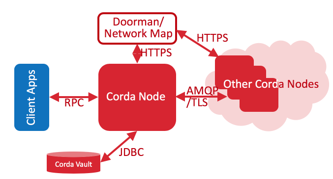
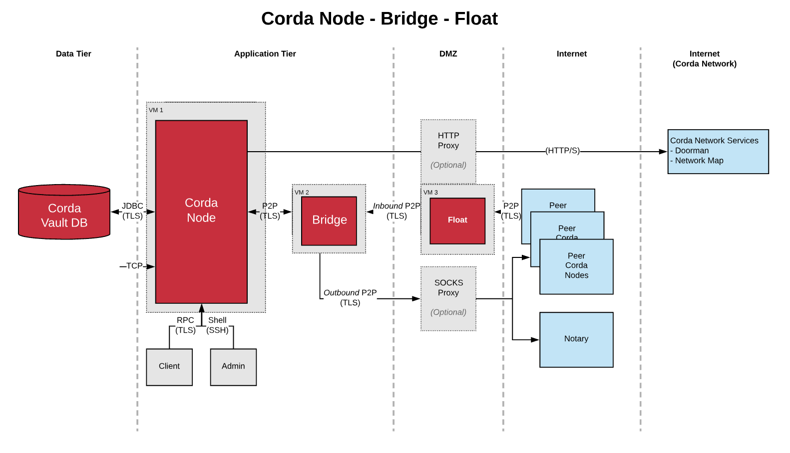

Overview of Corda Node Architecture Components
==============================================

This diagram illustrates the communication protocols used by the Corda Node communicating with peers on the Corda Network.

- Corda uniquely enables P2P Corda Networking within security constraints of corporate networking architectures. 
- Restricts access to Corda node from the internet only to nodes with valid identity certificates.
- Deployed in DMZ
- Terminates TLS Connections
- Does not connect into the internal network, connection initiated from the Node. 

The diagram below illustrates the basic components that are typically deployed:

Corda Enterprise Node
Corda Enterprise Vault
Corda Enterprise Firewall

The Corda Firewall is actually made up of two separate programs, called the bridge and the float. These handle outbound and inbound connections respectively, and allow a node administrator to minimise the amount of code running in a network’s DMZ. 

The primary function of the Corda Firewall is to act as an application level firewall and protocol break on all internet facing endpoints. 

The Float is effectively an nbound socket listener which provides packet filtering and is a DMZ compatible component.  The Float exposes a public IP address and port to which other peers on the network can connect. This prevents the Node from being exposed to peers. The Floats primary function is to bundle messages and send them to the Bridge across a DMZ internal firewall. The Bridge in turn runs some additional health checks on the message prior to sending to the Node Artemis queue. 

