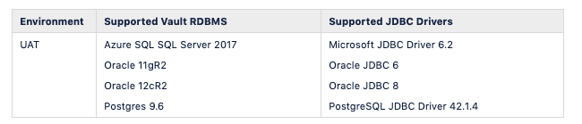

Corda Vault
===========

Corda Vault Information

JDBC Connectivity from the Corda Node to the Corda Vault is required to create Corda system tables on startup as well as storing application tables/logic. 
 
The following RDBMS are supported with Corda Enterprise

- Azure SQL
- SQL Server 2017/Microsoft JDBC Driver 6.2
- Oracle 11gR2/Oracle JDBC 6
- Oracle 12cR2/Oracle JDBC 8
- Postgres 9.6/PostgreSQL JDBC Driver 42.1.4

Corda stores information about several aspects of the Corda Node and Network in tables in the vault. 
During deployment the following tables will be created in the Vault database:

- dbo.DATABASECHANGELOG
- dbo.DATABASECHANGELOGLOCK
- dbo.node_attachments
- dbo.node_attachments_contracts
- dbo.node_checkpoints
- dbo.node_contract_upgrades
- dbo.node_identities
- dbo.node_info_hosts
- dbo.node_info_party_cert
- dbo.node_infos
- dbo.node_link_nodeinfo_party
- dbo.node_message_ids
- dbo.node_message_retry
- dbo.node_mutual_exclusion
- dbo.node_named_identities
- dbo.node_our_key_pairs
- dbo.node_properties
- dbo.node_scheduled_states
- dbo.node_transaction_mappings
- dbo.node_transactions
- dbo.vault_fungible_states
- dbo.vault_fungible_states_parts
- dbo.vault_linear_states_parts
- dbo.vault_linear_states
- dbo.vault_states
- dbo.vault_transaction_notes

JDBC Connectivity to the Corda Vault is handled in the Corda Enterprise node.conf file in /opt/corda. Here are examples for each supported RDBMS.

.. literalinclude:: ./node.conf
    :language: javascript

The diagram below outlines the relations between tables in the Vault.

