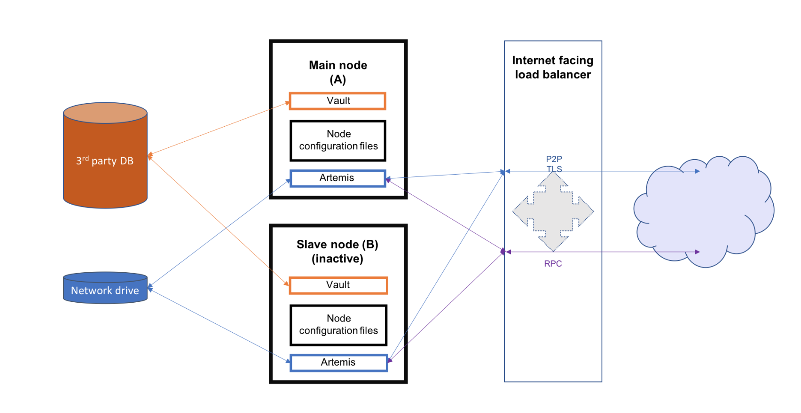

HA Deployment Overview
======================

This guide is designed to provide detail on how to deploy Corda Enterprise in a HA environment.

The guide is a supplement to detail on Hot/Cold deployment which can be found here: https://docs.corda.r3.com/hot-cold-deployment.html. 

The image below illustrates the environment that will result from following the guide. There will be two Corda Enterprise nodes, one active and the other inactive. Each node will represent the same legal identity inside the Corda network. Both will share a database and a network file system.

In order to deploy Corda Enterprise in HA the following resources are required:

- Security Group with default Inbound/Outbound TCP, HTTP Access Rules
- Load Balancer to present single IP for RPC and P2P Inbound connections 
- Back End Pool consisting of 2 VM’s for the LB to target 
- Availability Set for the 2 VM’s in HA configuration        
- Health Probes which monitor a Protocol and Port to detect health of processes 
- Load Balancing Rules which assign a Protocol (P2P, RPC, HTTP) and Port to monitor processes
- Static public Load Balancer IP addresses & DNS names for Appplication Server/CorDapp access 
- Storage File System  which will be set up as a File Service which acts as a shared mount point on both Primary and Backup VM. This file system will have a Public IP address and can be mounted on both VM's on startup.
- SQL Database which will be shared by the Corda Enterprise Nodes on both Primary and Backup VM's
- Network Security rules which, when configured, will allow P2P, RPC & HTTP traffic from outside the network to the Corda Nodes on Primary and Backup VM's 

It is important to note at the outset of deployment that Corda Enterprise needs a direct network connection to other Corda Enterprise Nodes in the network.

This means that the entry in the Network Map for every Corda Node must be a static Public IP address or Public DNS name.
