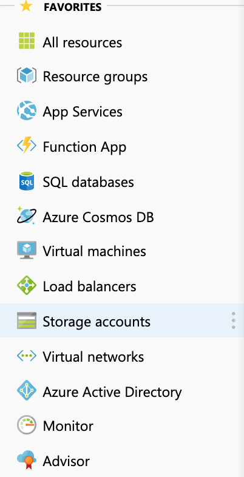

Linux Fileshare 
===============

In order to build a Corda HA environment, the Primary VM and Backup VM must both have Corda Enterprise deployed and share the Artemis message queue so that there is access to it from both VM's. 

The basic goal is to have identical copies of Corda software on both VM's and the /opt/corda/artemis folder is actually stored on a separate shared file system.

There are a number of issues to take into consideration which we will go into once the SMB file system has been created. The steps required are listed below using Azure for example purposes.

1. Create a Storage Account by clicking on the option on left hand side of menu. 

2. Choose the following options:

- Name : cordastorage (suggested name)
- Resource Group : same as VM's created earlier
- Location : same as VM's created earlier
- Account Kind : Storage V2

3. Once the Storage Account is created, click on it and choose Files and add a File Share called cordastorage. Click on connect, choose the Linux option and you will see a series of Linux commands that can be run to set up the NFS file system on the VM. We want to accomplish 3 stpes 

a) Create a folder on the VM for the fileshare to mount, and a folder to store credentials for the fileshare as follows:

.. parsed-literal::
    > sudo mkdir /mnt/cordastorage
    > sudo mkdir /etc/smbcredentials

b) Create the credentials file and ensure only root user can view the file

.. parsed-literal::
    > sudo bash -c 'echo "username=cordastorage" >> /etc/smbcredentials/cordastorage.cred'
    > sudo bash -c 'echo "password=passwordprovided" >> /etc/smbcredentials/cordastorage.cred'
    > sudo chmod 600 /etc/smbcredentials/cordastorage.cred

c) Ensure the mount remains available following a reboot of the server by placing the following entry in /etc/fstab:

Note /etc/fstab is a system configuration file which lists the main file systems in the VM environment.

.. parsed-literal::
    > sudo bash -c 'echo "//cordastorage.file.core.windows.net/cordafileshare /mnt/cordastorage cifs nofail,vers=3.0,credentials=/etc/smbcredentials/cordastorage.cred,dir_mode=0777,file_mode=0777,serverino" >> /etc/fstab'

Once the above steps have been taken you will now be able to mount the directory as follows:

.. parsed-literal::
    > sudo mount -t cifs //cordastorage.file.core.windows.net/cordafileshare /mnt/cordastorage -o vers=3.0,credentials=/etc/smbcredentials/cordastorage.cred,dir_mode=0777,file_mode=0777,serverino

If the mount point is successfully created then the output of 'df' on the VM will look similar to that below

.. image:: ./resources/smb.png
   :scale: 50%

The steps above should be completed in both the Primary and Backup VM's on which Corda will run.

