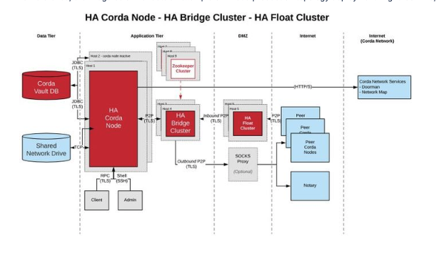
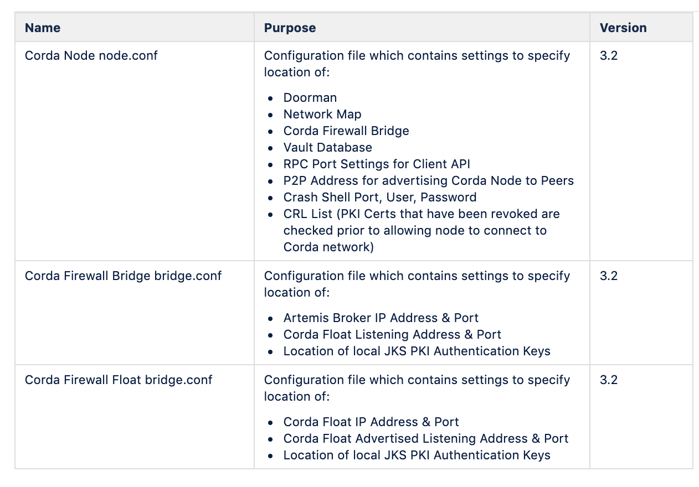
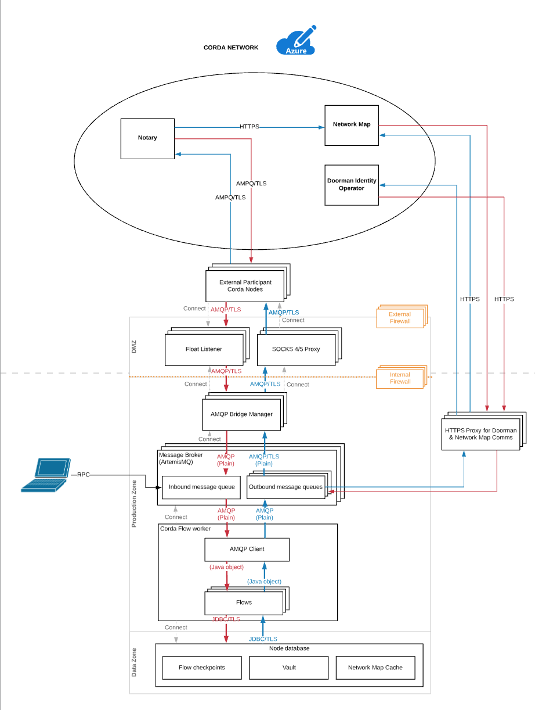
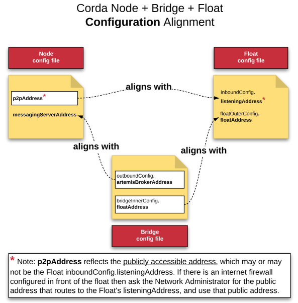

Installation and Configuration
==============================

These instructions will guide the user through the UAT & PROD configuration to deploy the following components.

- Corda Node
- Corda Vault
- Corda Bridge
- Corda Float
- Load Balancer  (present 1 IP to CorDapp)
- Zookeeper Cluster (manage Corda Firewall Component availability.
- HTTPS Proxy Server (Node Registration, Network Map Download)
- SOCKS5 Proxy Server (AMPQ over TLS Messaging)

There are alternative approaches to how these components are deployed. For the purposes of this document, the following diagram represents the topology used.

Non HA Corda Node, Bridge, Float
~~~~~~~~~~~~~~~~~~~~~~~~~~~~~~~~

.. image:: ./resources/nonha.png
   :scale: 100%
   :align: center

HA Corda Node, Bridge, Float
~~~~~~~~~~~~~~~~~~~~~~~~~~~~

1. Corda Nodes run in a Hot/Cold Setup.
#. The Corda node communicates with the Doorman (authentication) and Network Map (peer addresses) over HTTPS typically thru an HTTP Proxy Server.
#. The Corda node communicates with peers on the Corda network communicating with Corda Firewall which has 2 parts, Bridge & Float.
#. The Float’s job is to act as an inbound socket listener, capture messages from peers and send them to the Bridge. The Float prevents the Node and Artemis server from being exposed to Peer Nodes.
#. The Bridge captures the inbound messages and sends them to the shared Artemis queue.  The Bridge is typically configured to route thru a SOCKS5 Proxy Server and also manages outgoing messages from the Node to Peers on the Network.
#. In the HA configuration Node A and Node B use a shared Artemis queue configured on an NFS mountpoint shared between VM A and VM B.
#. R3 have tested Zookeeper to provide an election mechanism to determine which Bridge is up and chooses a Bridge to send messages to the shared Artemis queue.
#. The Bridge can select an Active and Alternative Artemis queue for incoming messages and an Active and Alternative Float for outgoing messages based on a configuration file setting.
#. R3 customers have tested F5 Load Balancer presenting 1 Float IP to the external world for incoming Peer to Peer Traffic.
#. R3 customers have also deployed Azure/F5 Load Balancers presenting 1 Node IP for RPC client connections.
#. Customers could use a solution like VCS cluster for Node A to Node B failover, though this configuration has not been tested by R3.

Java 8 Installation on VM
~~~~~~~~~~~~~~~~~~~~~~~~~

Java 8 should be installed on your Virtual Machine. Here is an example of how this would be done in Azure/AWS on Ubuntu.

.. parsed-literal::
    > sudo add-apt-repository ppa:webupd8team/java
    > sudo apt update
    > sudo apt install oracle-java8-installer

These are the configuration files that will be created during the process:

You can find examples of configuration files available here : https://docs.corda.r3.com/corda-bridge-component.html?highlight=node%20conf

Node Installation
~~~~~~~~~~~~~~~~~

1. Upload the corda-3.2.jar to the node root directory.
#. In the root of your node directory, create a folder called /certificates.  
#. R3 Operations team will provide you with a network-root-truststore.jks which will be used for authentication. 
#. Upload the network-root-truststore.jks file to this directory.
#. In the root of your node directory, create a folder called cordapps.  Upload your CorDapps to this folder.
#. Check that your node directory is structured as follows:

.. image:: ./resources/cordadir.png
   :scale: 60%
   :align: center
   
   
Once your /opt/corda directory is fully created it will contain the following files & directories

.. sourcecode:: shell

   additional-node-infos/            
   artemis/                          
   brokers/                            
   certificates/                  
   cordapps/ 
   drivers/  
   logs/   
   plugins -> drivers/
   corda-3.2.jar 
   network-parameters
   node.conf
   nodeInfo-XXXXXXXXX

..

This is a sample node.conf which connects to the Corda UAT Network.

.. literalinclude:: ./resources/nodefull.conf
    :language: javascript

Corda Firewall PKI Implementation
~~~~~~~~~~~~~~~~~~~~~~~~~~~~~~~~~

In a bank environment there will typically be several layers of security protecting the firms data.

Network Authentication

- The Corda Node may be deployed behind the inner DMZ (no access to the Internet)
- The Bridge Server may reside on a VM in front of the inner DMZ  (not addressable from the Internet)
- The Corda Float may reside on a VM in the Outer DMZ (directly addressable from the Internet)

PKI Authentication

- Corda PKI Authentication issued by Corda Network can link the Node and Bridge i.e. the red keys indicated below truststore and sslkeystore
- Local PKI Authentication issued by separate CA will link the Bridge and Float i.e the purple keys indicated below trust and bridge.

.. image:: ./resources/firewallpki.png
   :scale: 60%
   :align: center

The key thing is to look at this from the perspective of a bank implementing these Corda and Local PKI keys.

- Corda PKI Authentication will link the Node and Bridge and authenticate to Corda Network in the outside world. In other words, this permits mutual authentication between a Corda Node and its Peer Corda Nodes.
- Local PKI Authentication will link the Bridge and Float and allow a secure tunnel into the Float from the outside world. In other words, this permits mutual authentication between two software components, the Bridge and the Float.

Explanation of PKI Keys
~~~~~~~~~~~~~~~~~~~~~~~

Node Authentication

*truststore.jks* - this is the same trust store that the node is bootstrapped with during initial registration. It contains the cordarootca certificate - this is the public, root certificate of the entire network. It needs to be copied to the bridge when it is setup. Note that the truststore is also dynamically copied from the bridge to the float at runtime (and is held in memory only on the float). The truststore is used for authenticating nodes that connect to the bridge (& float).

Node to Bridge Connection

*sslkeystore.jks* is issued by the Node and contains just the node's TLS certificate. It needs to be installed on the node and the bridge. The node-to-bridge connection is mutually authenticated TLS, with sslkeystore used both sides to establish the secure tunnel. (truststore.jks is required on each side to authenticate the connection).

Bridge to Float Connection

*bridge.jks* & *float.jks* contain TLS certificates their associated private keys. By convention they should be referred to as keystores. These TLS certificates are unrelated to any of the certificates issued by the node. In our example documentation the bridge & float keys are issued by a stand-alone root certificate. This root certificate is stored in trust.jks. This is required for the bridge and float to authenticate each other

Generate Bridge and Float Keystores
~~~~~~~~~~~~~~~~~~~~~~~~~~~~~~~~~~~

- In the root of your Corda node directory cd to /opt/corda/temp

- Create a script called keygen.sh and copy the keytool commands from the code block below.

- In /opt/corda/temp run chmod 755 keygen.sh

- In /opt/corda/temp run ./keygen.sh

The following keys will be generated:

bridge.jks
bridge.pem
bridgechain.pem
float.jks
float.pem
floatca.jks
floatchain.pem
root.pem
trust.jks

The important keys are bridge.jks, float.jks, trust.jks.

.. literalinclude:: ./resources/pki-keys.conf
    :language: javascript

A full guide to the creation and deployment of these keys can be found here : https://docs.corda.r3.com/bridge-configuration-file.html

Bridge Installation
~~~~~~~~~~~~~~~~~~~

1. Upload the {{corda-bridgeserver-3.2.jar}} to the /opt/cordabridge directory.
#. In the /opt/cordabridge directory, create a softlink called {{certificates}} linked to /opt/corda/certificates
#. In the /opt/cordabridge directory, make a directory called bridgecerts
#. In the /opt/cordabridge directory, copy /opt/corda/network-parameters back to  /opt/cordabridge
#. In the /opt/cordabridge directory, create a file called bridge.conf
#. Copy the files /opt/corda/temp/bridge.jks and  /opt/corda/temp/trust.jks into the /opt/cordabridge/bridgecerts directory

This is a sample bridge.conf:

.. literalinclude:: ./resources/bridge.conf
    :language: javascript

Float Installation
~~~~~~~~~~~~~~~~~~

1. Create an /opt/cordafloat directory on your VM
#. Upload the {{corda-bridgeserver-3.2.jar}} to the /opt/cordafloat directory.
#. In the /opt/cordafloat directory, make a directory called floatcerts.
#. In the /opt/cordafloat directory, create a file called float.conf.
#. The keys were created in the Node VM so sftp from the Node VM to the Float VM and copy the files NodeVM:/opt/corda/temp/float.jks and  /opt/corda/temp/trust.jks into the FloatVM:/opt/cordafloat/floatcerts directory.
#. You now should have the correct non Corda PKI CA authentication in place between Bridge and Float.

This is a sample float.conf:

.. literalinclude:: ./resources/float.conf
    :language: javascript

Port Policy and Network Configuration
~~~~~~~~~~~~~~~~~~~~~~~~~~~~~~~~~~~~~
Connections with the Corda Network Doorman and Network Map services (inbound and outbound traffic) will be over HTTP/HTTPS on ports 80 and 443.

Connections with peer Corda Nodes (including Notaries) will happen on a peer-to-peer connection using AMQP/TLS typically in a port range of 10000 - 10099, though the ports used by other nodes is determined by the node owner.

Connections with local applications connecting with the CorDapp via the Corda Node happen over RPC.

Administrative logins with the Corda Node happen via ssh whose port is configured in the node.conf file, typically port 2222.

Suggested Work flow for Corda Node & Corda Firewall Installation

1. Run ifconfig on Node VM.
#. Run ifconfig on Bridge VM.
#. Run ifconfig on Float VM.
#. Ask your Infrastructure team to tell you public IP of load balancer/firewall.
#. In Node.conf p2pAddress put IP from question 4.
#. In Node.conf messagingServerAddress put local IP address of Node from question 1, or 0.0.0.0 for all interfaces.
#. In Bridge.conf outboundconfig put IP address of node from question 1.
#. In Bridge.conf bridgeInnerConfig put IP address of 3, or ask infrastructure team what address is presented by firewall between Bridge and Float.
#. In Float.conf floatOuterConfig put IP address from 3 which will be routed to from node. If machine has one NIC use that address, if it has two then use the card that has permission for access from bridge network.
#. In Float.conf inboundConfig use IP address from 3 which faces the internet. If there is only one NIC use that value, if there are two check with Infrastructure which one is accessed from the load balancer.
#. In Float.conf floatOuterConfig put IP address from 3 which will be routed to from node. If machine has one NIC use that address, if it has two then use the card that has permission for access from bridge network.

The following image may be helpful in ensuring alignment between the Node, Bridge and Float configuration files.

\* Note: **p2pAddress** reflects the **publicly accessible address**, which may or may not be the Float inboundConfig.listeningAddress. If there is an internet firewall configured in front of the Float then ask the Network Administrator for the public address that routes to the Float's **listeningAddress**, and use that public address for your **p2pAddress**.

Proxy Configurations
~~~~~~~~~~~~~~~~~~~~
You will likely need to establish proxy servers, one for HTTP connection to the Doorman and Network Map services, and Socks proxy to be used with the Corda Firewall for P2P communication Corda Nodes. Please note the examples below are for demonstration purposes only, it is assumed most financial institutions will already have Enterprise Proxy Server deployments in place and available for use by the Corda Firewall.

Using HTTP Proxy with Corda
---------------------------

Many financial institutions will use an HTTP Proxy Server to monitor connections going out to the Internet.

Corda facilitates the use of an HTTP Proxy to access the Doorman & Network map via HTTPS "get" requests.

The following is an example of how to set up a Squid Proxy Server and start the Corda Node to point to it as a "tunnel" to connect to Doorman and Network Map.

1. Prerequisite is a VM 2 CPU Core & 2 GB RAM running Ubuntu 18.x.

2. ssh into the VM where you want to install the Proxy Server and run the following:

- sudo apt update
- sudo apt -y install squid

3. You should edit /etc/squid/squid.conf and add the following entries

.. literalinclude:: ./resources/squidconfig.conf
    :language: javascript

4. Once Squid is successfully installed run:

- sudo systemctl start squid
- sudo systemctl enable squid
- sudo systemctl status squid

5. If Squid starts successfully you will see an output similar to this

.. literalinclude:: ./resources/squidstatus.conf
    :language: javascript

6. At this point you can ssh to the VM where the Corda Node is installed and run the following:

- java -Dhttps.proxyHost=your-firewall-proxy -Dhttps.proxyPort=8080 -jar corda.jar

7. If the Corda Node starts up sucessfully you can then check /var/log/squid/access.log and you should see output as follows:

.. literalinclude:: ./resources/access.conf
    :language: javascript

Using Socks Proxy with Corda Bridge
-----------------------------------

R3 strongly recommend the use of an SOCKS Proxy in conjunction with the Corda Firewall to access peers on the network for P2P communication.

SOCKS is a general purpose proxy server that establishes a TCP connection to another server on behalf of a client, then routes all the traffic back and forth between the client and the server. It works for any kind of network protocol on any port. SOCKS Version 5 adds additional support for security and UDP. By contrast an HTTP Proxy only understands HTTP traffic.

SOCKS works by establishing a TCP connection with another server on the behalf of your client machine. Through this connection, traffic is routed between the client and the server, essentially anonymizing and encrypting your data and your information along the way.

SOCKS proxies provide an improvement over HTTP proxy in terms of speed of data delivery & by preventing data packets being mis-routed or mislabeled. This provides an overall improvement in terms of stability and avoiding data transfer errors that could otherwise happen.

The additional benefit of utilizing a SOCKS server is that it facilitates organizations enforce security policy and allow applications to reach legitimate external hosts through simple, centrally controlled rule-based settings.

.. literalinclude:: ./resources/socks.conf
    :language: javascript
