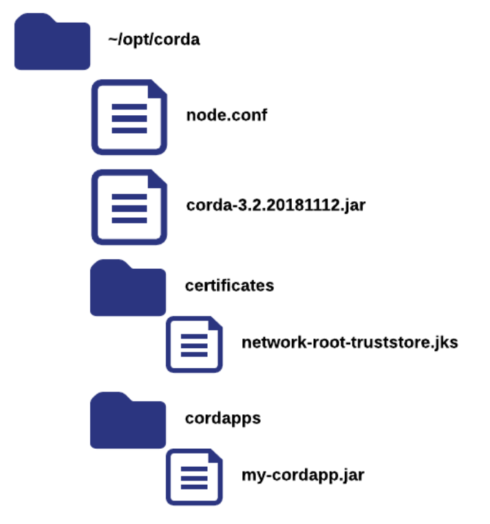
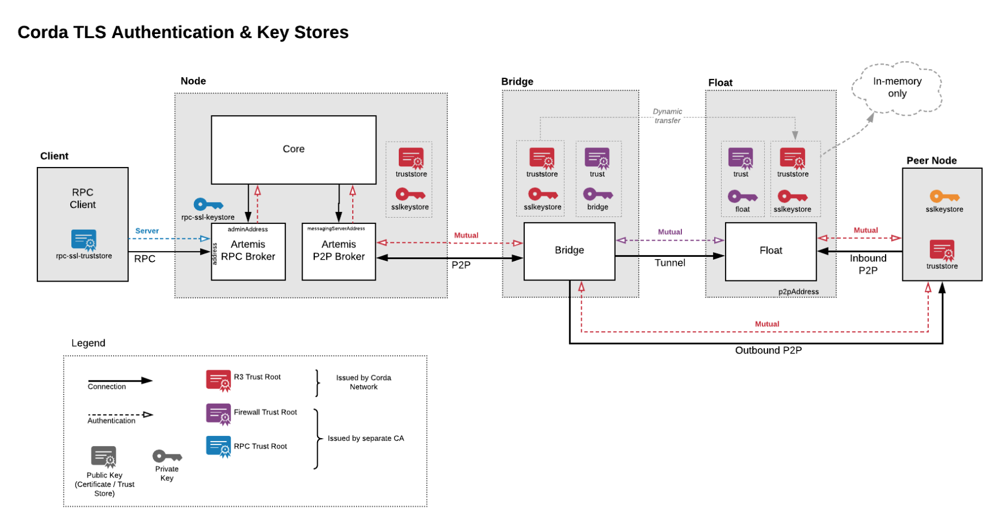

Corda Node & Corda Firewall Deployment
======================================

These instructions will guide the user through the UAT & PROD configuration to deploy the following components.

- Corda Node
- Corda Vault 
- Corda Bridge
- Corda Float
- Load Balancer  (present 1 IP to CorDapp)
- Zookeeper Cluster (manage Corda Firewall Component availability.
- HTTPS Proxy Server (Node Registration, Network Map Download)
- SOCKS5 Proxy Server (AMPQ over TLS Messaging)

There are alternative approaches to how these components are deployed. For the purposes of this document, the following diagram represents the topology used.

Non HA Corda Node, Bridge, Float
^^^^^^^^^^^^^^^^^^^^^^^^^^^^^^^^

.. image:: nonha.png
   :scale: 100%
   :align: center

HA Corda Node, Bridge, Float
^^^^^^^^^^^^^^^^^^^^^^^^^^^^

.. image:: ha.png
   :scale: 100%
   :align: center

Java 8 Installation on VM
^^^^^^^^^^^^^^^^^^^^^^^^^

First of all you will need to install Java 8 on your Virtual Machine

.. parsed-literal::
    > sudo add-apt-repository ppa:webupd8team/java
    > sudo apt update
    > sudo apt install oracle-java8-installer

These are the configuration files that will be created during the process:

.. image:: config.png
   :scale: 60%
   :align: center

Node Installation
^^^^^^^^^^^^^^^^^

1. Upload the {{corda-3.2.jar}} to the node root directory.
#. In the root of your node directory, create a folder called {{certificates}}.  Upload the network-root-truststore.jks file to this directory.
#. In the root of your node directory, create a folder called {{cordapps}}.  Upload your CorDapps to this folder.
#. Check that your node directory is structured as follows:

This is a sample node.conf which connects to the Corda UAT Network.

.. literalinclude:: ./node.conf
    :language: javascript

Corda Firewall PKI Implementation
^^^^^^^^^^^^^^^^^^^^^^^^^^^^^^^^^

In a bank environment there will typically be several layers of security protecting the firms data.

.. image:: cordaarch.png
   :scale: 60%
   :align: center

Network Authentication

- The Corda Node may be deployed behind the inner DMZ (no access to the Internet)
- The Bridge Server may reside on a VM in front of the inner DMZ  (not addressable from the Internet)
- The Corda Float may reside on a VM in the Outer DMZ (directly addressable from the Internet)

PKI Authentication

- Corda PKI Authentication issued by Corda Network can link the Node and Bridge i.e. the red keys indicated below truststore and sslkeystore
- Local PKI Authentication issued by separate CA will link the Bridge and Float i.e the purple keys indicated below trust and bridge.

The key thing is to look at this from the perspective of a bank implementing these Corda and Local PKI keys.

- Corda PKI Authentication will link the Node and Bridge and authenticate to Corda Network in the outside world. In other words, this permits mutual authentication between a Corda Node and its Peer Corda Nodes.
- Local PKI Authentication will link the Bridge and Float and allow a secure tunnel into the Float from the outside world. In other words, this permits mutual authentication between two software components, the Bridge and the Float.

Explanation of PKI Keys 
^^^^^^^^^^^^^^^^^^^^^^^

Node Authentication 

*truststore.jks* - this is the same trust store that the node is bootstrapped with during initial registration. It contains the cordarootca certificate - this is the public, root certificate of the entire network. It needs to be copied to the bridge when it is setup. Note that the truststore is also dynamically copied from the bridge to the float at runtime (and is held in memory only on the float). The truststore is used for authenticating nodes that connect to the bridge (& float).

Node to Bridge Connection

*sslkeystore.jks* is issued by the Node and contains just the node's TLS certificate. It needs to be installed on the node and the bridge. The node-to-bridge connection is mutually authenticated TLS, with sslkeystore used both sides to establish the secure tunnel. (truststore.jks is required on each side to authenticate the connection).

Bridge to Float Connection

*bridge.jks* & *float.jks* contain TLS certificates their associated private keys. By convention they should be referred to as keystores. These TLS certificates are unrelated to any of the certificates issued by the node. In our example documentation the bridge & float keys are issued by a stand-alone root certificate. This root certificate is stored in trust.jks. This is required for the bridge and float to authenticate each other

Generate Bridge and Float Keystores
^^^^^^^^^^^^^^^^^^^^^^^^^^^^^^^^^^^

- In the root of your Corda node directory cd to /opt/corda/temp

- Create a script called keygen.sh and copy the keytool commands from the code block below.

- In /opt/corda/temp run chmod 755 keygen.sh 

- In /opt/corda/temp run ./keygen.sh 

The following keys will be generated:

bridge.jks
bridge.pem
bridgechain.pem
float.jks
float.pem
floatca.jks
floatchain.pem
root.pem
trust.jks

The important keys are bridge.jks, float.jks, trust.jks. 

.. literalinclude:: ./pki-keys.conf
    :language: javascript

Bridge Installation 
^^^^^^^^^^^^^^^^^^^

1. Upload the {{corda-bridgeserver-3.2.jar}} to the /opt/cordabridge directory.
#. In the /opt/cordabridge directory, create a softlink called {{certificates}} linked to /opt/corda/certificates
#. In the /opt/cordabridge directory, make a directory called bridgecerts
#. In the /opt/cordabridge directory, copy /opt/corda/network-parameters back to  /opt/cordabridge
#. In the /opt/cordabridge directory, create a file called bridge.conf
#. Copy the files /opt/corda/temp/bridge.jks and  /opt/corda/temp/trust.jks into the /opt/cordabridge/bridgecerts directory 

This is a sample bridge.conf:

.. literalinclude:: ./bridge.conf
    :language: javascript

Float Installation
^^^^^^^^^^^^^^^^^^^

1. Create an /opt/cordafloat directory on your VM
#. Upload the {{corda-bridgeserver-3.2.jar}} to the /opt/cordafloat directory.
#. In the /opt/cordafloat directory, make a directory called floatcerts.
#. In the /opt/cordafloat directory, create a file called float.conf.
#. The keys were created in the Node VM so sftp from the Node VM to the Float VM and copy the files NodeVM:/opt/corda/temp/float.jks and  /opt/corda/temp/trust.jks into the FloatVM:/opt/cordafloat/floatcerts directory.
#. You now should have the correct non Corda PKI CA authentication in place between Bridge and Float.

This is a sample float.conf:

.. literalinclude:: ./float.conf
    :language: javascript

Network Requirements for Installation
^^^^^^^^^^^^^^^^^^^^^^^^^^^^^^^^^^^^^

Suggested Work flow for Corda Node & Corda Firewall Installation

1. Run ifconfig on Node VM.
#. Run ifconfig on Bridge VM.
#. Run ifconfig on Float VM.
#. Ask your Infrastructure team to tell you public IP of load balancer/firewall.
#. In Node.conf p2pAddress put IP from question 4.
#. In Node.conf messagingServerAddress put local IP address of Node from question 1, or 0.0.0.0 for all interfaces.
#. In Bridge.conf outboundconfig put IP address of node from question 1.
#. In Bridge.conf bridgeInnerConfig put IP address of 3, or ask infrastructure team what address is presented by firewall between Bridge and Float.
#. In Float.conf floatOuterConfig put IP address from 3 which will be routed to from node. If machine has one NIC use that address, if it has two then use the card that has permission for access from bridge network.
#. In Float.conf inboundConfig use IP address from 3 which faces the internet. If there is only one NIC use that value, if there are two check with Infrastructure which one is accessed from the load balancer.
