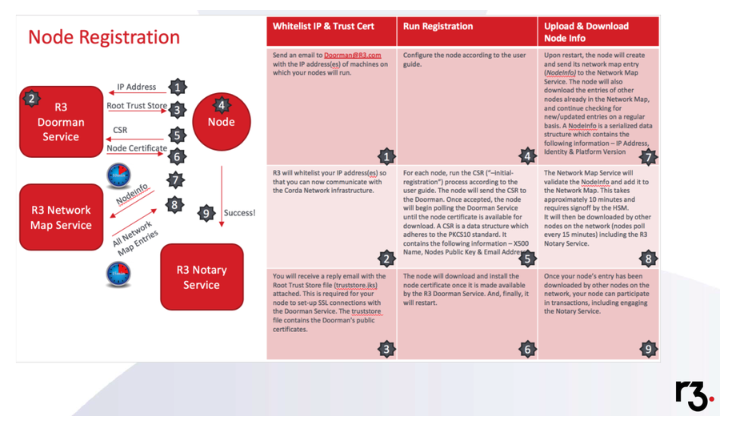
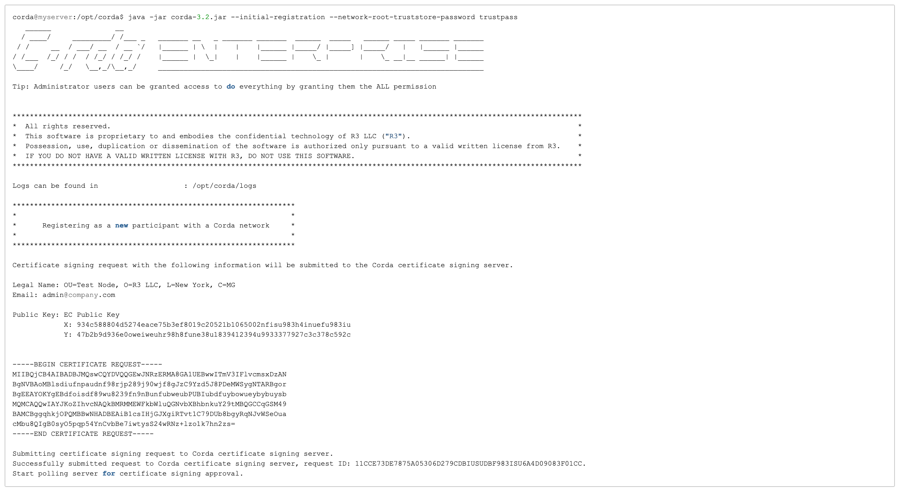
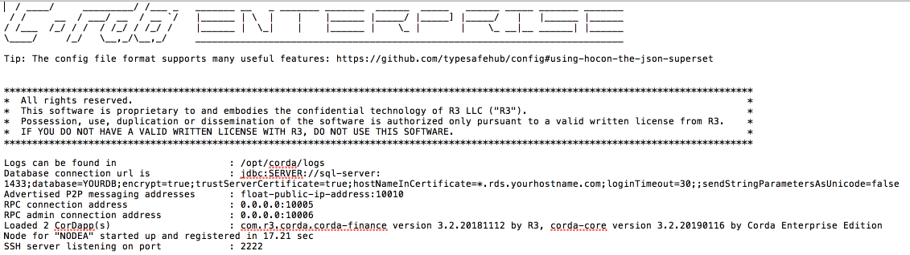

Node Registration
=================

Overview
~~~~~~~~
The diagram illustrates the process of joining one of the Corda Network environments, e.g., UAT or PROD. The first few steps may happen any time before the actual Corda Node registration in order to retrieve the public key.  Prior to registering customers should fill out the Corda Network Agreement which can be found here:

https://fs22.formsite.com/r3cev/CordaUATAgreement2019/index.html

Registration Actions
~~~~~~~~~~~~~~~~~~~~

\1. Send email to doorman@r3.com using email address representing the enterprise whose Legal Identity will be registered, providing IP address of machine that will listen for traffic (Float).

\2. R3 performs a basic verification of the requestor, ensuring the legal identity they wish to register aligns with the email domain from which they are making the request. 

\3. You will receive a network-root-truststore.jks file containing the public key certificate from the Corda compatibility zone to which you are registering, e.g., Corda Network UAT or Corda Network. This is the file you will use later in the process to register your Corda Node once it is configured.

\4. The network-root-truststore.jks file is required to setup SSL connections with the Doorman. The network-root-truststore.jks file contains the Doorman's public certificates. This should go in the /certificates folder in your Corda directory. Configure your node.conf with the required entries to join the Corda UAT Network.

\5. For each node run the initial registration process. The Corda Node will send a CSR request to the Doorman and when it is accepted the Node will begin polling Doorman until it's certificate is available for download. 

   \a. On the Corda Node change directory into the node directory:

      corda@myserver:~$ cd /opt/corda

   \b. Start the Corda Node with an initial-registration operation, and specify a Proxy Server and Proxy Server Port

      corda@myserver:/opt/corda$ java -Dhttps.proxyHost=PROXYSERVER -Dhttps.proxyPort=8080 -jar corda.jar. --initial-registration --network-root-truststore-password trustpass

   \c. If successful you will see the following output in your terminal:

   
\6. Corda Operations Report will receive a CSR JIRA ticket acknowledging that a registration request has been made. The Operations team will seek to identify which legal entity is making the request prior to approval.

The Corda JVM process will be suspended until R3 Operations approve the CSR and the node  has received the certificate from the Doorman.

The Node will download and install the certificate and shut down.

\7. Upon restarting the Node after initial registration the node will create and send its Network Map entry (NodeInfo-*) and also download all of the evailable entries for other Corda Nodes in the Network Map. The NodeInfo-* file is a data structure which contains IP Address, Identity and Platform Version. You can then restart your Corda Node as follows:

      corda@myserver:/opt/corda$ java -Dhttps.proxyHost=PROXYSERVER -Dhttps.proxyPort=8080 -jar corda.jar 
      
and you will see output like this:

\8. The Network Map service will validate the Node NodeInfo-* and add it to the Network Map, and the Network Map will then be downloaded by other Nodes on the network within approximately 10 mins.

\9. Once this process is complete your Corda Node can now transact with others in the Corda Network.

