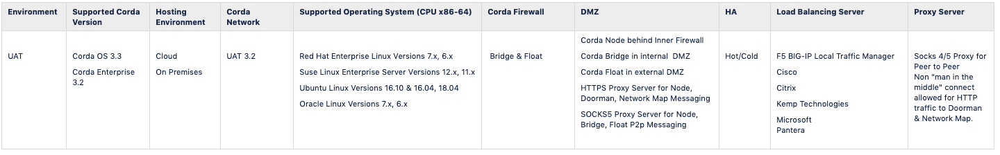
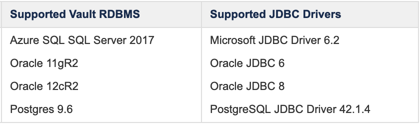
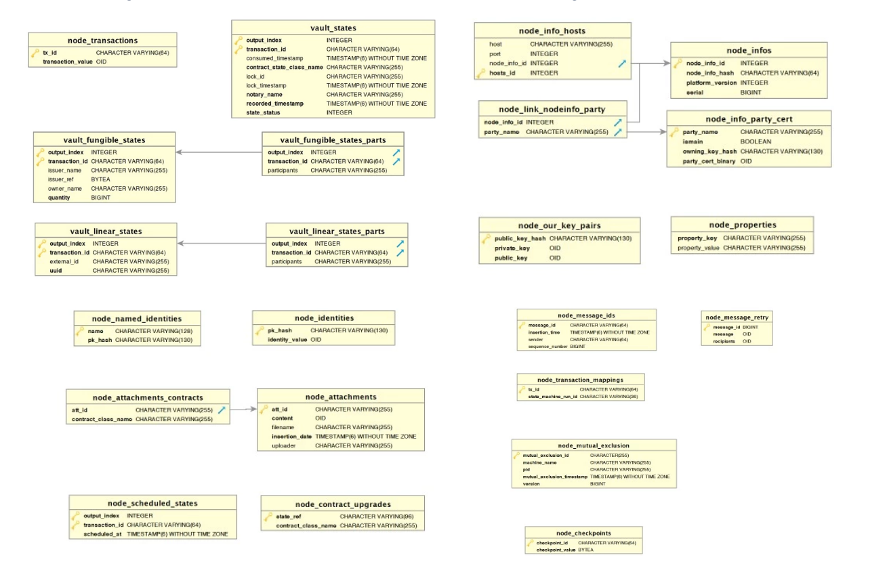

Prerequisites and Sizing
========================
Here please find the list of pre-requisite software needed to run Corda Enterprise version 3.2 in the Corda Network.

Corda Node, Bridge and Float
----------------------------
Prerequisite and sizing information for the Corda Node, Bridge and Float components.

Prerequisite on UAT
~~~~~~~~~~~~~~~~~~~

Reference: Corda Platform Support Matrix https://docs.corda.r3.com/platform-support-matrix.html

Sizing Specification
~~~~~~~~~~~~~~~~~~~~

For procurement of VM’s here are some guidelines. Please note that R3 recommend a max Java Heap Memory size of 2 GB be allocated to a Corda Node running in Production, which is why the RAM guidelines follow the pattern below.

Minimum Specification (UAT) Components on Separate VM’s

- Corda Node 2 CPU Core, 4 GB Memory
- Corda Bridge 2 CPU Core, 2 GB Memory
- Corda Float 2 CPU Core, 2 GB Memory

Recommended Specification (PROD) Components on Separate VM’s

- Corda Node 4 CPU Core, 8 GB Memory
- Corda Bridge 2 CPU Core, 2 GB Memory
- Corda Float 2 CPU Core, 2 GB Memory

Recommended Specification (PROD) Multiple Nodes 1 on 1 VM

- Corda Node(s) 8 CPU Core, 16 GB Memory
- Corda Bridge(s) 4 CPU Core, 4 GB Memory
- Corda Float(s) 2 CPU Core, 4 GB Memory

Reference: Corda Enterprise Sizing and Performance https://docs.corda.r3.com/releases/3.2/sizing-and-performance.html

Vault - Database
----------------
Prerequisite and sizing information for the Corda Vault (database).

Prerequisite
~~~~~~~~~~~~

Reference: Corda Platform Support Matrix https://docs.corda.r3.com/platform-support-matrix.html

Sizing
~~~~~~

Recommended Minimum Vault Database Size is 2 GB

It is recommended that a separate database instance, deployed in a high availability configuration, is used for each production Corda node. However, it is possible to create separate schema for each node within a single database instance subject to performance, availability and security constraints (the schema to be used is defined in the node config file).

As with the Corda node, the use case determines the sizing needs for the database. The operator needs to take account of the CorDapp data structure design i.e. the complexity of a transaction and the use of any relational tables used by the corDapp e.g. attachments, as well as volumetrics. As a guide, a simple issue and pay transaction with two parties requires approximately 25-30KB per transaction. Some guidance on this is provided in the Corda Enterprise doc, Sizing and Performance: Database server configuration. Refer to the selected ­RDBMS documentation for guidelines on deploying the database.

Note that Corda Enterprise generates the requisite data structures for the Corda Node AND the CorDapps the node has in its cordapps folder. There is a parameter "runMigration" when set to true will do this work automatically. For development and maybe test environments that's fine. FYI, Corda Enterprise uses Liquibase under the covers to do this work.

Where your DBAs require more control over the creation and running of those scripts, the "runMigration" parameter would be set to "false", and we offer a database management tool that you may separately run against CorDapps to introspect the schemas defined in your code https://docs.corda.r3.com/database-management.html#database-management-tool.

Given a specific use case, consider your data needs, and forecast its growth.

Additional Details
~~~~~~~~~~~~~~~~~~

JDBC Connectivity from the Corda Node to the Corda Vault is required to create Corda system tables on startup as well as storing application tables/logic.
Corda stores information about several aspects of the Corda Node and Network in tables in the vault.
Reference: https://docs.corda.r3.com/node-database.html#node-database

During deployment the following system (not user) tables will be created in the Vault database:

- dbo.DATABASECHANGELOG
- dbo.DATABASECHANGELOGLOCK
- dbo.node_attachments
- dbo.node_attachments_contracts
- dbo.node_checkpoints
- dbo.node_contract_upgrades
- dbo.node_identities
- dbo.node_info_hosts
- dbo.node_info_party_cert
- dbo.node_infos
- dbo.node_link_nodeinfo_party
- dbo.node_message_ids
- dbo.node_message_retry
- dbo.node_mutual_exclusion
- dbo.node_named_identities
- dbo.node_our_key_pairs
- dbo.node_properties
- dbo.node_scheduled_states
- dbo.node_transaction_mappings
- dbo.node_transactions
- dbo.vault_fungible_states
- dbo.vault_fungible_states_parts
- dbo.vault_linear_states_parts
- dbo.vault_linear_states
- dbo.vault_states
- dbo.vault_transaction_notes

Detailed information on the Corda Vault can be found here:

https://docs.corda.r3.com/releases/master/node-database.html

JDBC Connectivity to the Corda Vault is handled in the Corda Enterprise node.conf file in /opt/corda. Here are examples for each supported RDBMS.

.. literalinclude:: ./resources/node.conf
    :language: javascript

The diagram below outlines the relations between tables in the Vault.

