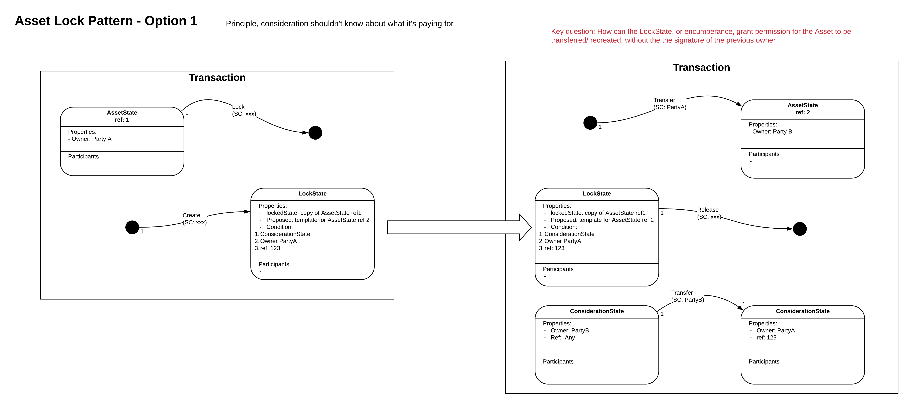
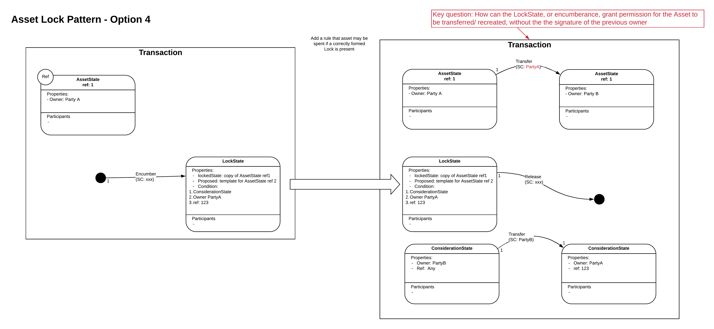

==================
Asset Lock Pattern
==================

WIP

The asset lock pattern purpose is to enable an asset to be locked out of use pending another event happening which allows the asset to be unlocked and transferred to a new Owner.

The challenge is to set up the lock so that the lock can be released by somebody other than the owner once they have provided some consideration. This is difficult as the asset's own contract rules are likely to state that the current owner needs to sign to transfer ownership.

It is likely that the asset has to have a rule that says it can be transferred without the owners signature if some form of precondition is proved to have been met. eg a lock state signed by the owner specifying asset that can be transferred, who it is transferred to and the condition for the transfer.

4 options mapped out so far.

.. image:: resources/Asset-Lock-option-2.png
  :width: 80%
  :align: center

.. image:: resources/Asset-Lock-option-3.png
  :width: 80%
  :align: center

for option 4 - doesn't actually lock the asset, so not an asset lock, it only gives the ability for someone other than the owner to move the asset.

Note, if need to guarantee that only a specific counterparty can pay the consideration, then the counterparty can pass H(Secret) to the asset owner. when the asset owner creates the asset lock, a pre-condition is that the consideration state must reveal the matching secret.
