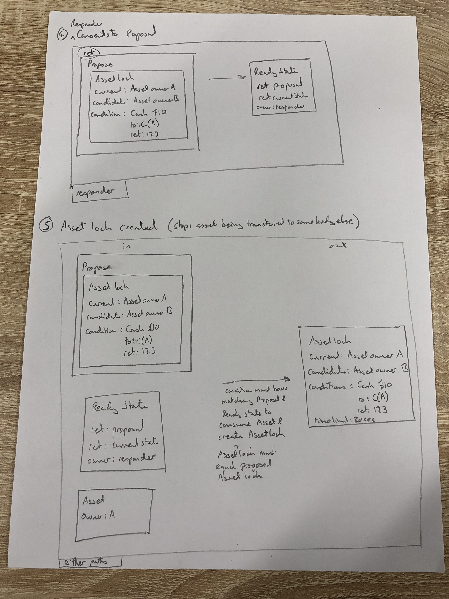
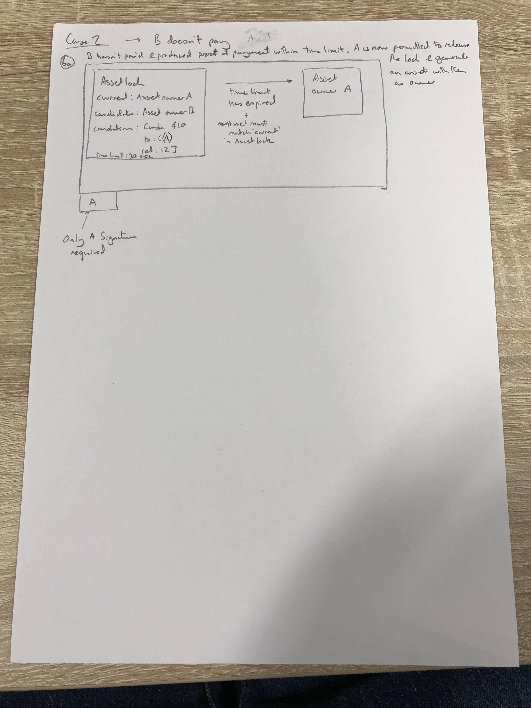

=====================
Business Deal Pattern
=====================

WIP

Generic 'Business deal' Pattern (all 'on-ledger') combines Asset lock, Receipts/ token-receipts, propose-agree patterns such that:

 - Two parties can agree to a deal, where some arbitrary state transition will take place only if another party makes payment with a payment asset.
 - The deal is atomic, if payment is not made, the state transition doesn't take place, recreating the original state. (ie the deal unwinds)
 - The payment asset does not leak information about previous transactions it has been used to pay for. (core problem with niaive DVP approach)
 - Both partys can consent to the deal, ie possible for a human to decline. (Not possible in Collectsignatures flow)
 - Confidential identites protect identity of previous payment asset owners.

(Illustrated in notes with Asset moving for Cash)

.. image:: resources/propose-lock-pay-1.jpg
  :width: 80%
  :align: center

.. image:: resources/propose-lock-pay-3.jpg
  :width: 80%
  :align: center

