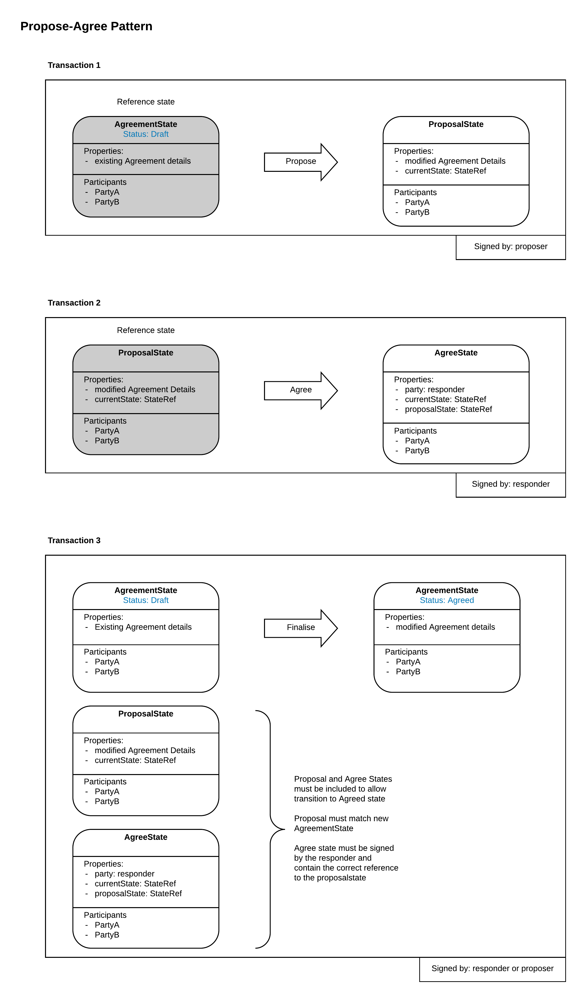

======================
Propose-Agree Patterns
======================

WIP
-----------
The problem
-----------

When recoding a business agreement between two parties on the corda ledger, consent to the agreement is indicated by the Parties respective digital signatures over the transaction recording the details of the business agreement.

One Party will usually propose the agreement, the proposer, who will form the candidate corda transaction and add their signature and send it to the other party using CollectSignatureFlow(). Then the other party, the responder, will receive this candidate transaction using the SignTransactionFlow(), resolve the transaction, verify the transaction and add their signature to agree.

However, here lies the problem, with Corda current functionality, SignTransactionFlow does not allow for the flow to be paused whilst a ‘human’ decision is taken to accept the transaction or not. Or in other words there is no ability to say ‘No’ I don’t want to sign this because it’s a bad deal.

There is the checkTransaction() function, which is called as part of the SignedTransactoinFlow where a responder can insert customer logic to check a transaction. It would be possible to insert a ‘go and ask somebody’ call out in this function but this would have material impacts on the performance and scalability of the node, see: https://docs.corda.net/head/api-flows.html#locking

So, we need a pattern which will allow agreement between two parties, which allows genuine ‘Human’ choice for the responder.

The propose okay mechanism can act on any status transition, it doesn’t need to be explicitly incorporated into the state machine transition model.

Advantages
  - The Chain of Agreement states remains clean
  - The State Machine for agreement state remains clean and easy to understand
  -	The transition rules from Draft to agreed are still applied directly between the two states (not over two contracts)
  -	Can be extended to multilateral agreements and n of m type signature constraints.
  -	Proposal can be revoked by the proposer by consuming the proposal state
  -	Proposal can be rejected by the responder by consuming the proposal state + creating a rejected state.

Disadvantages
  -	Minimum 3 transactions per business transition
