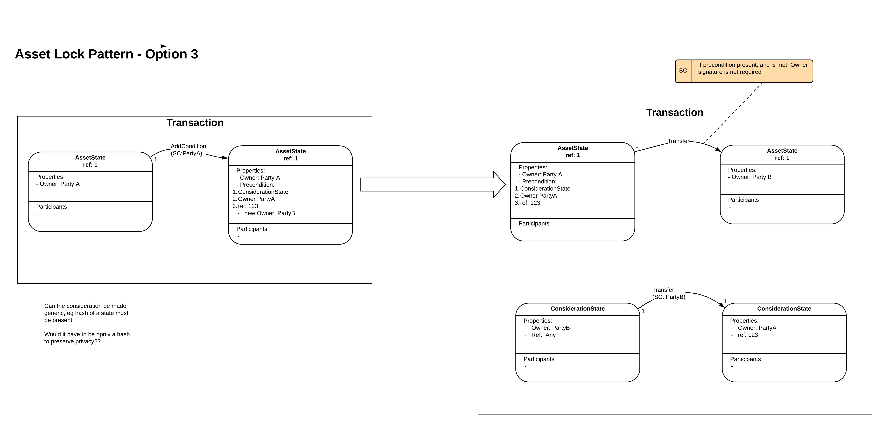

==================
Asset Lock Pattern
==================

:Status: Ready for review
:Implemented: No, still under design review

-------
Summary
-------

An asset lock is a mechanism, used during a two party agreement, that prevents one party spending or distributing the asset involved in the agreement elsewhere.
The lock enables a named asset to be locked out of use until another event has happened. The mechanism further allows the asset to be unlocked once an certain event has occured

-------
Context
-------

When we want to transfer an asset state from one party to another, we often need to ‘freeze’ the asset while the transaction occurs, as if to put it in a kind of escrow until another event or transaction has occurred.
One of the most common examples of this kind of event would be a payment for the asset such that the asset is locked until the new owner has made payment. Once payment or proof-of-payment has occured the lock can be lifted, allowing the buyer to accept ownership of the asset. This pattern is not restricted to payments and could be used for essentially any state change at all.

-------
Problem
-------

The need for such an lock stems from the potential for nefarious actors attempting to:

- Transact the same asset with a different party while a deal is underway.
- Spend states away mid pattern to benefit one party.
- Offer a state but substitute a fake state (i.e. one without the assumed provenance)
- Pledge a state from an invalid transaction.
- Use a state used to power two transitions of the same value in same transaction.
- Use a state used to power more than one transaction using reference states

--------------
Forces/Factors
--------------

The challenge is to set up the lock so that the lock can be released by somebody other than the owner once they have provided some consideration. This is difficult as the asset's own contract rules are likely to state that the current owner needs to sign to transfer ownership.

--------
Solution
--------

There are four proposed patterns put forward. Each of these is described separately below.

**1.    Pre-permissioned pattern with regular states**

a) *Description & Walkthrough*

.. image:: resources/Asset-Lock-option-1.png
  :width: 80%
  :align: center

The transfer of the asset occurs over two transactions:

**Tx 1**: includes the AssetState itself as an input state and a LockState. The AssetState contains an owner property and any other arbitrary properties. The LockState contains the following properties:

    - `locked`: this is a copy of the input asset state in this transaction.
    - `proposed`: a new proposed template or version of the Asset state, which will be used in transaction 2.
    - `considerationState`: this a state that acts as either payment or proof-of-payment between A and B.
    - A reference ID

After this transaction successfully occurs the asset state becomes consumed. This transaction must be signed by the owner or seller of the asset.

**Tx 2**: This transaction encompasses the actual transfer of asset ownership from Party A to Party B. The input LockState is the output state of Tx 1. The input and output ConsiderationState is a state transfer that is used to denote the payment provided for the asset.

b. *Analysis & Considerations*

  - Since the original asset is consumed as part of Tx 1, Party A cannot sell the asset to a different party while a deal is underway or anywhere mid-pattern.
  - Since the AssetState is referenced in the LockState of Tx 1 it is not possible to substitute a bogus state in Tx 2 i.e. one without the assumed provenance.
  - Party B cannot consume a state in an invalid Tx 2 because if Tx 1 fails then the LockState will not be created as an output state thus Tx 2 cannot happen.
  - Since the LockState is consumed it cannot be used in multiple transactions similar Tx 2. The same applies to ConsiderationState. Furthermore, reference states are not used as part of this transaction so there is no risk of one state being used in multiple transactions.
  - Since it is a bilateral agreement, privacy is shared between the two participants.

**2.    Pre-permissioned pattern with encumbered states**

a) *Description & Walkthrough*

.. image:: resources/Asset-Lock-option-2.png
  :width: 80%
  :align: center

The transfer of the asset again occurs over two transactions:

**Tx 1**: Here we have The AssetState (the encumbered state) to be encumbered by LockState(the encumbrance/encumbering state). The encumbrance state, if present, forces additional controls over the encumbered state. You cannot spend encumbered state without the encumbrance state. The LockState contains special properties:

    - `lockedState`: this is a copy of the input asset state of this transaction.
    - `proposed`: this is the proposed version of the Asset that the buyer will receive ownership of.
    - `considerationState`: this a state that acts as either payment or proof-of-payment between A and B.
    - `currentOwner`: the current owner of the asset
    - `newOwner`: the new owner of the asset, the buyer.
    -  A reference ID

**Tx 2**: Since the encumbrance still lies on the AssetState from transaction one, the LockState must be released before the AssetState can finally be transferred to its new owner. Furthermore, the contract logic of the LockState requires the presents of a relevant ConsiderationState that defines valid payment of the AssetState, whether via the state itself of proof-of-payment elsewhere, potentially with the side state of the Receipts Pattern.

b. *Analysis & Considerations*

- Since the original asset is encumbered as part of Tx 1, Party A cannot sell the asset to a different party while a deal is underway or anywhere mid-pattern.
- Since the AssetState is reference in the LockState in Tx 1 it is not possible to substitute a bogus state in Tx 2 i.e. one without the assumed provenance.
- Party B cannot consume a state in an invalid Tx 2 because if Tx 1 fails then the LockState will not be created as an output state thus Tx 2 cannot happen.
- Since the LockState is consumed it cannot be used in multiple transactions similar to Tx 2. The same applies to ConsiderationState.
- Reference states are not used as part of this transaction so there is no risk of one state being used in multiple transactions.
- Since it is a bilateral agreement, privacy is shared between the two participants. Privacy of consideration is a fundamental part of the Receipts pattern design.

**3.    State property pre-condition lock**

a) *Description & Walkthrough*

This asset transfer also occurs over two transactions.

**Tx 1**: involves the preparation of the asset state for transfer via the addition of fields and conditions. This happens by consuming the input AssetState to a new ‘twin’ output AssetState. This output AssetState contains the following properties:

    - `currentOwner`: the current owner of the asset
    - `newOwner`: the new owner of the asset, the buyer.
    - `precondition`: this is some event that must occur before the state can be consumed. The condition could be the presence of the correct ConsiderationState in a transaction with it.
    - `considerationState`: this a state that acts as either payment or proof-of-payment between A and B.
    - A reference ID to be used in the consideration later on.

**Tx 2**: In order the transfer of the AssetState to occur, the contract rules of the twin AssetState must be met. These include that the precondition is satisfied and that there is a ConsiderationState with the correct reference ID also present in the transaction.

b. *Analysis & Considerations*

- Since the original asset is consumed as part of Tx 1, Party A cannot sell the asset to a different party while a deal is underway or anywhere mid-pattern.
- Since the AssetState new owner (PartyB) is referenced in the twin AssetStatein Tx 1 it is not possible to sneakily change the new owner to some other Party in Tx 2.
- Party B cannot consume a state in an invalid Tx 2 because if Tx 1 fails then the twin AssetState will not be created as an output state, thus Tx 2 cannot happen.
- Since the twin AssetState is consumed it cannot be deviously be reused in multiple transactions similar to Tx 2. The same applies to ConsiderationState.
- Reference states are not used as part of this transaction so there is no risk of one state being used in multiple transactions.
- It is mandatory that the owners signatue is not required to transfer ownership of the asset in Tx 2, other the payment could be made and the Asset never transferred.
- Since it is a bilateral agreement, privacy is shared between the two participants. Privacy of the consideration is a fundamental part of the Receipts pattern design.

doesn’t actually lock the asset, so not an asset lock, it only gives the ability for someone other than the owner to move the asset.

**4. Pre-permissioned Asset transfer with reference states**

a. *Description & Walkthrough*

.. image:: resources/Asset-Lock-option-4.png
  :width: 80%
  :align: center

This asset transfer also occurs over two transactions.

**Tx 1**: the AssetState to be transferred is first included as a reference state. A LockState as before is also included as an output, containing the properties:

    - `lockedState`: this is a copy of the input reference state of this transaction.
    - `proposed`: this is the proposed version of the Asset that the buyer will receive ownership of.
    - `considerationState`: this a state that acts as either payment or proof-of-payment between A and B.
    - `currentOwner`: the current owner of the asset
    - `newOwner`: the new owner of the asset, the buyer.
    -  A reference ID to be used in the consideration later on

**Tx 2**: As before, the contract rules of the LockState require that for the AssetState to be spent the specified lock must be present. The same goes for the consideration.

b. *Analysis & Considerations*

- It seems possible for the AssetState to be spent away by the selling party since is it not consumed as part of Tx 1.
- Since the AssetState new owner (PartyB) is referenced in the LockedState in Tx 1 it is not possible to sneakily change the new owner to some other Party in Tx 2.
- Party B cannot consume a state in an invalid Tx 2 because if Tx 1 fails then the LockState will not be created as an output state, thus Tx 2 cannot happen.
- By virtue of being a reference state the AssetState is **not** consumed, thus there is the possibility that it could be deviously be reused in multiple transactions similar to Tx 2.
- Since it is a bilateral agreement, privacy is shared between the two participants. Privacy of the consideration is a fundamental part of the Receipts pattern design.
- This pattern doesn’t actually lock the asset, so it is not in fact an asset lock. It only gives the ability for someone other than the owner to move the asset. ** Explain further

Note, if need to guarantee that only a specific counterparty can pay the consideration, then the counterparty can pass H(Secret) to the asset owner. when the asset owner creates the asset lock, a pre-condition is that the consideration state must reveal the matching secret.

--------
Benefits
--------

Particular benefits of using this pattern

---------
Drawbacks
---------

The challenge is to set up the lock so that the lock can be released by somebody other than the owner once they have provided some consideration.
This is difficult as the asset's own contract rules are likely to state that the current owner needs to sign to transfer ownership.
It is thus likely that the asset has to have a rule that says it can be transferred without the owners signature if some form of precondition is proved to have been met. eg a lock state signed by the owner specifying asset that can be transferred, who it is transferred to and the condition for the transfer.

----------------
Related Patterns
----------------

List related Patterns

Extensions:

List possible Extensions

