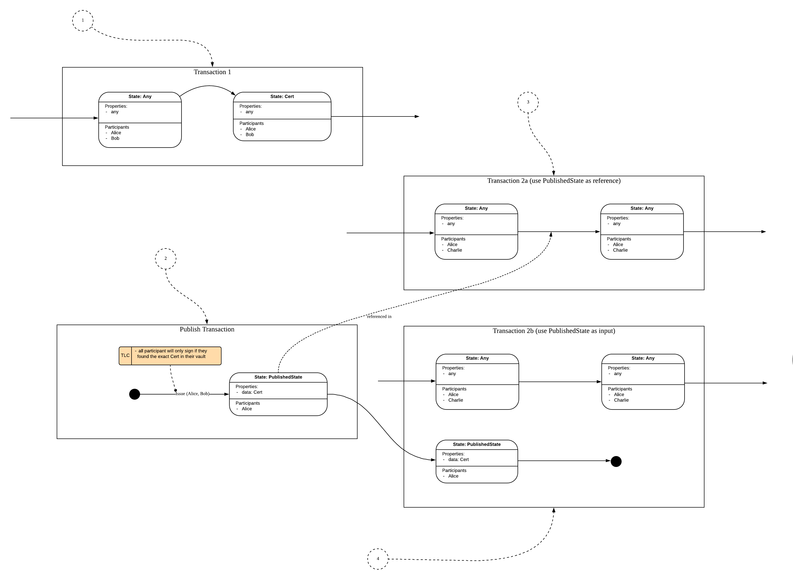

================
Publisher Pattern
================

:Status: Draft
:Implemented: Yes

-------
Summary
-------

Publisher pattern can be used when users want to involve some state as reference without revealing the historical chain behind it. A wrapper state of original state would be issued for using so that:

 - The privacy is preserved because other party cannot trace back how this reference state was issued

-------
Context
-------

Publisher pattern would be helpful when a transaction involves reference state. Instead of using the state as reference directly, the published state could be used as normal input or reference state.

-------
Problem
-------

The straight forward way to use some state as reference in some transaction would be adding it as reference state, but that enables all participants to walk down the chain. There would introduce privacy issue when the participants in new transaction (use the state) are not participants in old transaction (issue the state), which is normally the case.

---------------
Salient Factors
---------------

The salient factors:

 - publishing state would involve the participants of original state, which could lead to dependency on other parties
 - how to ensure the published state is valid, since there is no history to trace back to

------------------------
Solution Walkthrough
------------------------

The Publisher pattern is used to publish a state so that it could be consumed or referenced by other transactions. And the publishing has no impact on original state or transaction chains.
Think of a certificate. The owner of the certificate would like to provide it as evidence for transactions with other parties. The common practice is to provide photocopy (issuing PublishedState), and the photecopy (PublishedState) would participant in required transaction.

The pattern can be illustrated as follows, using a State Evolution diagram with Privacy overlay (the Corda Modelling Notation section for details on how to read the diagram):

1. the transaction which outputs the original state
2. the publish transaction which issue the PublishedState without consuming any inputs
3. transaction 2a is a sample of using PublishedState as reference
4. transaction 2b is a sample of using PublishedState as input

.. list-table:: Using PublishedState
    :widths: 20 25 50
    :header-rows: 1
    :text-align: left

    * -
      - As reference
      - As input
    * - issue new PublishedState whenever needed
      - - always get the latest info  
        - Dependency on participants of original state 
        - Duplicate on PublishedState
      - - always get the latest info 
        - Dependency on participants of original state 
        - Less but possible duplicate on PublishedState
    * - use existing one first, otherwise issue new PublishedState
      - - outdated info possible 
        - No duplicate PublishedState 
        - Less dependency on participants of original states 
        - Revoke for PublishedState is needed
      - - outdated info possible 
        - No duplicate PublishedState
        - Significant dependency on participants of original states 
        - Revoke for PublishedState is needed

----------------
Privacy Analysis
----------------

The crux of the pattern is it's privacy characteristics. There are two important characteristics:

1) Privacy between Transactions 1 and 2:

 Transaction 1 and 2 are completely isolated in this case. The participants in transaction 2 could trace back to the publish transaction, but not to transaction 1. And participants in transaction 1 only know to the extend that the original state has been published for other use.

2) Participants in Publish Transaction

 The participants of publish transaction should be restricted to whoever is initiating the flow (and using the PublishedState later). In this case, the irrelevant party would not get involved when PublishedState is used in another transaction later.

----------
Extensions
----------

1. is it possible to publish only selected fields of state? If so, how to mask private fields? And primary key fields cannot be masked, for verification purpose.
2. reissuance of state

--------------------------------------------------
Things to Consider when using the Publisher pattern
--------------------------------------------------

  - Who has the right to issue the PublishedState?
  - Who has the right to be the owner of the PublishedState?
  - Use PublishedState as input or reference?
  - Issue new PublishedState whenever needed or using existing ones first?
  - Revoke process should be considered when original state has changed

----------------------
Related Anti-patterns
----------------------

1. The holder of original state could publish the state in advance. And later if revoke is not handled properly when the original state is updated or cancelled, the PublishedState could still be used.
2. If PublishedState is issued whenever needed, the malicious node could request the PublishedState repeatedly, which would consume the resources and keep participants of original state busy.
